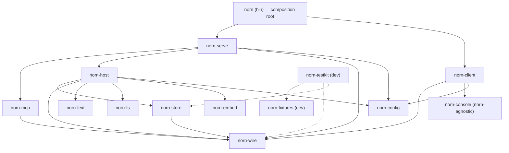
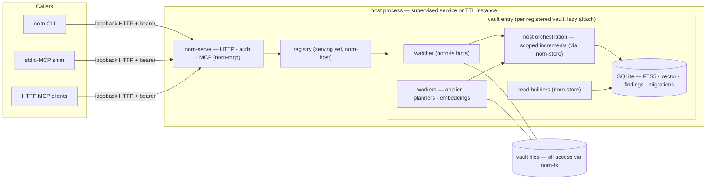

# Architecture

`norn` is a Markdown-vault engine: it derives queryable state from a directory of Markdown
files, keeps that state current as the files change, and applies planned mutations back to
them.

This document is the invariant spine and the crate map, and it is the **authoritative form
of both** — the contract reviews enforce against.

The design passes that derived this content are recorded as Mimir artifacts: **NORN-a1**
(the decisions taken before this repository existed), **NORN-a4** (the crate-boundary
pass), and **NORN-a6** (the Layer 1 substrate pass). Those are evidence about how the shape
was reached, consultable and citable; they are not authority. Where they and this document
differ, this document governs. Decisions taken from here are recorded as ADRs only when they
pass the admission bar in [`AGENTS.md`](../AGENTS.md); implementation cadence creates no
documentation obligation. The qualifying durable rationale is indexed in
[`decisions/README.md`](decisions/README.md).

---

## Part I — The invariant spine

These invariants bind the whole system. Each section below names its own gates where it has
them, and marks the judgments that are review acts instead. When a gate arrives is not this
document's concern; the comments in `.github/workflows/` are the in-repo operational marker.

Where a gate exists, its lane depends on what it measures: **counters and structure gate per
PR; clocks and trends live in the soak lane and never fail a pull request.** [ADR
0004](decisions/0004-two-tier-measurement-and-authored-baselines.md) records why evidence
kind, rather than observed runtime, owns that division. A review-held judgment has no lane
at all, which is why each section says so where it applies — a review-held invariant rots
quietly.

### 1. The memory invariant

**Peak memory is a function of the working set, not of vault size.** A request that touches
ten documents costs the same whether the vault holds one thousand or one hundred thousand.
Nothing streams a whole vault through RAM — not a walk, not a query, not a mutation plan.

The invariant is *measured*, not asserted:

- Per-PR CI asserts peak memory at a realistic ~2k-document profile, alongside
  size-independence pairs expressed as counts rather than clocks.
- The scheduled soak lane records the peak-memory reading each run and bars it
  against an authored baseline. Under [ADR
  0007](decisions/0007-authored-measurement-thresholds.md), the baseline moves
  only by a reviewed edit, and the downward direction of that movement is
  review-held rather than mechanized — nothing here fails a raised baseline,
  so this is a place this section's own rule applies: a review-held invariant
  rots quietly. The mechanized form, a flat-slope requirement over a nightly
  mixed load, arrives with the Layer 2 lockdown work.

Superlinear payloads are defects, and bounded ones stay bounded on the wire and at rest
alike — see the [bounded candidate head of 5](#the-crates) in the `norn-wire` membership
rule.

### 2. The heal ladder

Derived state is always rebuildable, and the system reaches for the cheapest rung that
restores trust. Three rungs, cheapest first:

1. **Scoped increment** — the watcher reports filesystem facts; the increment touches only
   the changed set. This is the warm steady state.
2. **Full tree heal** — `attach = heal-then-ready`: add missing, update changed, prune
   deleted. "Update changed" is decided by a content hash, never by a stat comparison — see
   [the trust model](#5-the-trust-model). Deliberately unoptimized, and billed once to the
   first request under a framed `Warming` progress display. Its resumable-friendly shape is
   carved for a later stat-prioritized, progressive-verification evolution; nothing measures
   it today.
3. **Rebuild from zero** — the derived database is discarded and rebuilt.

Vault files are never the thing being healed; they are the source of truth. The ladder
splits across the two effect seams: tree-walking rungs orchestrate through `norn-fs`,
database-side rungs (store schema fingerprint, rebuild-from-zero) live in `norn-store`. A rung
may be subdivided; a fourth escape hatch may not be added.

**Rung 3 has two triggers, with different lifetimes.**

- **A DDL change during development.** Store schema version is pinned at **1** and does not move
  through the pre-release build. A DDL edit is detected as a fingerprint mismatch in the
  meta table and resolved by rebuilding from zero, consuming no version numbers. This is
  the development-time path and it exists because version numbers are worth more than the
  churn they would absorb.
- **Corruption, or any state the lower rungs cannot resolve** — at any time, before or after
  release.

At the first release, version 1 freezes as the first migratable baseline. From then on the
**migrations pillar is the store schema evolution path**, and rebuild-from-zero narrows to the
second trigger alone.

**Every rung is reached by a test, across two suites.**

Rung 1 is exercised continuously by the **churn suite** — bursts, atomic replaces, branch
flips, mid-mutation edits — whose bar is convergence-to-equivalence with a from-scratch
build and a settle bound proportional to the changed set. It is the warm path, so it is
tested by ordinary operation rather than by injected failure.

Rungs 2 and 3 are reached by the **induced-failure suite**, which injects each of the
following:

| Injected failure | Required outcome |
|---|---|
| Process killed mid-increment | **Handled at rung 2.** Nothing partial is ever at rest: the increment is one transaction, so a process that dies inside one leaves the previous generation whole and there is nothing to detect. The work the tear lost returns through the attach heal's ordinary content-hash comparison. |
| Disk full | **Refused at rung 2.** The increment cannot complete, the entry stays untrusted, and the request refuses saying so. |
| Permission loss on vault paths | **Refused at rung 2.** An unreadable path is an error, never evidence of deletion: the heal refuses rather than prunes. |
| A document norn cannot decode | **Quarantined at rung 2.** The document yields no facts, a finding names it and the cause class, the heal keeps going, and the entry reaches `Ready` serving every other document. |
| Corruption injection | **Handled at rung 3.** The database is discarded and rebuilt. |
| Stale store schema (DDL fingerprint mismatch) | **Handled at rung 3.** Pre-release — which is what the suite asserts today — a fingerprint mismatch means the DDL was edited, and the database is discarded and rebuilt. Once version 1 freezes as the migratable baseline, store schema *evolution* becomes the migrations pillar's job, and rung 3 is reached by a store schema that is damaged rather than merely out of date. |

**Refusal is resolution.** Rung 3's second trigger reads "any state the lower rungs cannot
resolve", and a transient environmental failure does not qualify. When the disk is full or a
permission was revoked, refusing and leaving the entry untrusted *is* the lower rung
resolving the situation correctly: the environment is broken, the stored state is not, and
discarding a sound database would destroy work to fix nothing. **Rung 3 is for damaged
state, never for a hostile environment.**

**Quarantine is per document; refusal is per vault.** See
[ADR 0013](decisions/0013-quarantine-is-per-document.md). A document norn cannot decode —
path bytes that are not UTF-8, a path spelling the document-path grammar refuses, or a body
that is not UTF-8 — is a fact about one document rather than about the vault, so it never
withdraws the vault. The rung-2 heal skips its facts, records a finding naming the path and
the cause class, and keeps going; the entry reaches `Ready` and serves every other document.
Every rung-2 path answers the three cause classes the same way: the full tree heal, a scoped
subtree heal, and the warm scoped increment. A dirty **directory** whose own spelling the
grammar refuses splits by what it still addresses, because naming no document and holding no
document are different things. A spelling refused only for the stem its leaf reduces to —
`..md` — names no document and is where ordinary documents such as `..md/note.md` are
stored, so it addresses every row beneath it as a segment-aligned prefix range: the warm path
merges its walk against that range and derives, quarantines and **prunes** there, converging
a deletion under it without a vault-wide heal. A spelling refused for anything else — a
backslash, a control byte, bytes that are not UTF-8 — spoils every path beneath it too, so no
document under it is storable and there is no row to prune; the warm path reads what is under
it and quarantines what it finds.

The store holds only representable truth, so a document that stops decoding **loses its
store row**, and the finding is where its absence is stated. The row's death is recorded
with the quarantine provenance, which says the derived row died and the file did not; a
prune or a removal would say the path left the vault. A quarantined path is filed under the
path the vault spells it, and under a rendering of that spelling where the grammar admits no
such path. **A rendering names a place, never an identity**: no document is *derived* under
one, though the vault may genuinely hold a document whose own name is that place. That
collision is one key holding one row, and the **document wins**: while it stands there, the
quarantined document's finding is withheld rather than filed over a readable document, so
for as long as the collision lasts nothing records that the quarantined document cannot be
read. The trade is deliberate — a finding at that place would call a document that derived
unreadable — and it clears when the colliding document leaves. Recovery needs no second
mechanism: a document that reads again is an ordinary derivation, and the increment's own
findings discard takes the finding with it.

Refusal stays for failures of the environment rather than of one document — a schema that
will not read, a store that will not open, a walk that cannot list a directory, a path whose
permissions were revoked. Widening quarantine past the undecodable-document class would turn
a broken environment into silent data loss, which is the hazard refusal exists to prevent.

**Cold is a state of a vault entry, not a code path.** There is exactly one attach seam and
both host lifecycles use it, so "cold" names rung 2 running on first touch — not a separate
code path with its own behavior.

### 3. Raw-SQL acceptance

**The store schema is the domain model at rest.** Reads compile wire params to SQL and let SQLite
answer. There is no repository tier and no domain-object hydration between the query and
the rows.

The acceptance contract is a fixed set of query shapes, each carrying timing bars, an
`EXPLAIN` assertion **against the builder's actually-emitted SQL**, derivation counters, and
memory:

- count-by-field
- suffix / stem resolve
- links-to
- predicate + sort + page
- findings-for-path
- full-text match
- vector-nearest (via the deterministic stub model)

Warm requests assert **zero** derivation counters. `EXPLAIN` gates run against emitted SQL
specifically, because a gate against hand-written SQL tests a string nobody executes.

### 4. One obvious path

**A second spelling of an existing operation is a defect even when its output is correct.**
This is the strongest of them, because it rejects working code.

It binds concretely: one plan vocabulary and one applier; one document parser; one render
seam; one resolution grammar across every target surface; one invocation path to the host;
one owner for machine-local state. Where a new capability looks like an existing one, the
resolution is sharply bounded jobs — not two overlapping surfaces that each mostly work.

No mechanical check carries this. Whether a change is a second spelling is a judgment made
in review, and it stays that way until a rule can express it.

### 5. The trust model

**The vault filesystem is a shared surface.** People arrive through editors and sync tools,
never through norn's own surface, so every change norn learns about late is a stretch of time
in which the derived database answers from a stale world. High-fidelity change detection is
therefore what buys the right to read SQLite and answer, with no filesystem check on the
request path. The heal ladder is why imperfect detection cannot corrupt derived state;
detection fidelity is why that state is worth reading at all.

Two mechanisms carry trust, and both are contract:

- **The proactive watcher** — immediate detection, over a fidelity ladder across
  filesystems: native notification where the platform provides it. Warm trust is contracted
  for local filesystems today; backend selection at registration is the carved extension
  point for coarser detection elsewhere. Its contract is directional — **over-report freely,
  under-report never.** A redundant re-derivation costs work; a missed change costs a wrong
  answer, so every tuning choice biases toward the safe direction, and a lost-notification or
  overflow signal marks the entry untrusted for a rung-2 re-heal rather than being absorbed.
- **Background just-in-time drift scans** — idle-time, iterative, progressive
  re-verification of derived state against the files. This mechanism is not built yet, which
  makes it no less a contract: an absent mechanism binds here for the same reason an absent
  crate does.

Their pairing is what will make fidelity **empirical instead of asserted** rather than
leaving it a review-held claim: once the scans run, every drift a scan finds that the
watcher missed is a counted defect, trended in the soak lane.

**Hash authority.** Only a content hash concludes "unchanged" — anywhere in the system. A
stat fingerprint may prioritize work or raise suspicion; it may never conclude. The asymmetry
is why: a false "unchanged" destroys work or backs a wrong answer, while a false "changed"
costs a re-derivation. Reading and hashing a file is **one atomic act against one file
descriptor**, so the bytes hashed are provably the bytes read. Progressive verification
changes *when* a hash happens, never *what* concludes.

Fidelity telemetry and hash authority sit in different lanes. Detection-to-convergence is
the [churn suite](#2-the-heal-ladder)'s bar: convergence-to-equivalence with a from-scratch
build, so a watcher that under-reports fails it. Fidelity telemetry —
scan-caught misses per run — is a **soak-lane trend** and never fails a pull request. Hash
authority itself is **review-held**: no lint or suite yet forbids a stat comparison from
reaching a conclusion, so the invariant holds by review until one binds it, which is exactly
the case this part's own rule warns about — a review-held invariant rots quietly.

---

## Part II — The crate map

**Governing law: a crate boundary is earned** — by an effect seam, an enforced invariant,
heavy-dependency isolation, or a standalone future. Anything else is a module. This is the
crate-level face of one-obvious-path.

Twelve product crates (including the composition root), two development crates, one shipped
binary. Every crate carries a one-line **membership rule**. *The rule, not the current
content list, is what reviews enforce against* — a crate's contents are evidence about the
rule, never a substitute for it.

This document describes the whole target shape. The workspace holds only the crates that
have been earned so far; a crate's absence from `Cargo.toml` is not an absence from this
contract.

### The crates

| Crate | Owns | Earned by |
|---|---|---|
| `norn-wire` | **The vocabulary** — request params, reports, typed plans, findings, trust states. Pure types: no I/O, no logic. A finding's `candidates` is a **bounded head of 5** in deterministic resolution-ladder order plus `candidates_total`; the bound is wire shape and holds at rest in the findings table too. | Params and reports are defined exactly once; CLI flags and MCP tool schemas are derived renderings of these types. |
| `norn-text` | **The syntax of a vault document, never its semantics** — frontmatter parse / lossless edit / serialize, headings, sections, both link families (wikilink and inline Markdown, one fact shape carrying family, protocol and title, from which the resolution mode derives — protocol first, family second), `#tag` syntax (body tokens with code-span exclusion, plus the frontmatter tags shape). Frontmatter string values are scanned for wikilinks only. Pure functions over strings; answers "what does this document say", never "what does it mean" or "is it right". The `#tag` family is committed to graduate past syntax: a vault schema facet enforced through `norn-store`, and a query surface the verb charter decides. | The one-parser invariant — every consumer reads documents through one grammar. Carve-out future: the serde-based frontmatter path can be replaced by a purpose-built parser without surgery elsewhere. |
| `norn-fs` | **Everything that touches the vault filesystem, and nothing that doesn't** — walk, read, stat/fingerprint, the atomic-write protocol (fingerprint → shadow → verify → swap), the per-vault flock primitive, the watcher as a subscribable stream of typed filesystem facts (debounced, coalesced, atomic-replace aware), and **the one path-spelling normalization point** — case, dot-prefix, redundant separators — so every consumer compares normalized identity instead of deriving its own. **A vault's own mechanism files are part of "everything that touches the vault filesystem"**: the per-vault maintainer lock file and the per-vault shadow home live in the norn data root rather than among documents, and creating, reading, writing and sweeping them is `norn-fs`'s — no other crate reaches them. Watcher coverage for an entry is the vault root tree plus that entry's configured schema-source path. Filesystem facts only; not a general event bus. | The second effect seam; heavy-dependency isolation for the platform watcher backend; churn semantics unit-testable in-crate against a temp tree. Which backend wins is invisible outside the crate: no other crate learns it. |
| `norn-store` | **An SDK for talking to SQL** — DDL, migration machinery, the DDL fingerprint, the four pillars (FTS5, vector, findings, migrations), write-through increments, database-side heal rungs, derivation counters, and the read builders (wire params → emitted SQL). Its verbs translate cleanly to SQL; no business logic beyond how queries are composed. | The first effect seam. Read builders live here because the `EXPLAIN` gates test the builder's emitted SQL — store schema and queries co-evolve or they drift. |
| `norn-embed` | **Text in → vector out, model identity explicit** — the embedding trait with `(model id, version)` first-class in the API; the deterministic stub is the default build; the real pinned runtime compiles only behind the release/soak feature. Never touches the vault or the database, never decides anything. Its one permitted effect is the opt-in machine-local weight fetch/load, at a path the host injects **from `norn-config`**; fetched weights are integrity-pinned by a static manifest compiled into the crate, mapping `(model id, version)` to a sha256 digest and a source URL. A blob's on-disk name carries its digest, and verification happens at fetch, so an unverified blob never appears under a name anything loads. A fetch failure or a digest mismatch refuses with a structured reason: semantic search stays un-enabled, and nothing else degrades. Acquisition is eager, at the explicit enable act, never lazy inside a query. A model upgrade is a release-time manifest change plus a migration of derived vector state, never ambient upstream drift. | Heavy-dependency isolation (the model runtime stays out of every development build), and a structural guarantee that inference cannot reach findings or plans. |
| `norn-config` | **Machine-local state, one owner** — the machine-local layout (config directory, data directory, the machine-local schemas directory, the weights directory, and the per-vault derived-state directory, keyed by vault name), the registry file read/write, the bearer token read/write, and the loopback endpoint convention. The token file holds a **set of tokens keyed by label**, not one token: rotation is adding a second label and removing the first, and every stored secret is a credential the serving side verifies against. The endpoint is a convention rather than a discovery — a per-channel default port, with an explicit port override the one way past it. Every machine-local path is channel-qualified, and no API takes a channel. Never touches a vault. | The one state surface both sides of the client/host seam must read — the serving side to authenticate, the client to find the host at all. Hand-sharing that convention in two crates is a drift class on a security-relevant file. |
| `norn-host` | **The protocol-blind orchestrator** — registry semantics (the serving set; file access via `norn-config`), vault entries and lazy attach, vault schema (resolved through the registry entry's schema-source — default: a path inside the vault — read via `norn-fs` as one atomic read-and-fingerprint act, and pinned at attach), the worker pool (the one applier, mutation planners, the repair planner, embedding workers), and the first-run janitor. The pinned schema is projected into the store's meta (bytes, fingerprint, generation) as derived state; the file remains its sole authority. **Wire in, wire out**: a plain library with no sockets, composing `fs` + `text` + `store` + `embed` (+ `config`). Never touches vault bytes; its one direct effect is the one-shot legacy-cache janitor. | The composition seam: sole subscriber of filesystem facts, sole caller of store increments, sole executor of plans — reachable only as wire types. |
| `norn-mcp` | **MCP semantics, no transport** — derives tool schemas from `norn-wire`, translates MCP requests to wire params and wire reports to MCP responses. Pure functions, unit-testable like `norn-text`. | The derived-renderings owner for the MCP surface; protocol shape quarantined from both orchestration and plumbing. |
| `norn-serve` | **The HTTP surface** — the serving socket, routing, auth middleware (bearer verification via `norn-config`), and whatever accretes above the protocol later (TLS when a real remote consumer exists, rate limits, request logging). Routes to `norn-mcp`, dispatches wire types to `norn-host`. | The serving effect seam; it keeps HTTP-layer growth out of the orchestrator. |
| `norn-console` | **The CLI presentation kit** — clap *extensions*, never clap re-implementations; render conventions (palette and colors, records display, table/list projection, error-output envelope); input conventions (stdin handling, confirm prompts). **norn-agnostic**: generic over record types via traits, with no dependency on any other workspace crate. | Single source of truth for how output looks and input behaves, plus a standalone future — it is designed for extraction as an independent reusable crate. |
| `norn-client` | **Everything outside the host** — argv → wire params, loopback routing with endpoint discovery and token read via `norn-config`, TTL auto-launch (connect-or-spawn of the same artifact's host entry point, always a separate process), projections of wire reports onto `norn-console` conventions, the stdio-MCP shim (JSON-RPC framing only; the MCP rendering lives in `norn-mcp`), and the machine-local verbs: self-update, service install, `completions`, `manpage`. Leans on `clap` for everything clap can express — derive API, parsing, completions generation, error surfaces. | The always-routed enforcement seam (see boundary invariant 1). |
| `norn` (bin) | **Composition root only** — wires `norn-serve` and `norn-client` into the single shipped artifact. | Distribution: one artifact for self-update, service install, and TTL auto-launch alike. |
| `norn-fixtures` (dev) | **The deterministic vault generator** — the same `(profile, seed)` produces the same tree, byte for byte, up to the filesystem's own filename normalization. Six realism knobs: body-length distribution, ambiguity-class size `k`, link density, directory shape (tree depth and fan-out, root placement, placement skew, leaf-name shape), non-Markdown clutter, symbolic links by species (in-vault file, in-vault directory, dangling, outbound); heading density is a field of body shape, and document count is the profile's own scale. A profile asking for symbolic links **refuses to generate** where one cannot be created — asked of the build before the target is touched, and of the filesystem under the output directory before the tree is written — rather than emitting a tree without them. Self-contained leaf; its writer is its own. See [ADR 0002](decisions/0002-fixture-determinism-and-calibration.md). | Shared by tests, per-PR gates, and the soak lane; never ships. Writing temp trees is its job, so (with testkit) it holds use-site allows for the filesystem rule. |
| `norn-testkit` (dev) | **Assertion helpers and harness scaffolding** — counter, `EXPLAIN`, and size-independence assertions; churn and induced-failure drivers; corpus activation gating; regression-registry loading and its dormancy gate; the architecture gate. Suites execute as integration tests in the crates they exercise, and a suite whose subject is workspace-wide data lives with that data in the `norn` bin package: the argv corpus, which additionally needs the built binary cargo only makes reachable there, and the regression registry. | Enforcement machinery lives once: helpers here, suites with the subjects they exercise. |

Two membership rules deserve emphasis because they are the ones most often eroded by
convenience:

- **`norn-client` is deliberately excluded from `init`.** A verb that scaffolds
  configuration inside a vault is making a vault request, so its disposition belongs to
  the **verb charter** — not to the machine-local verb set.
- **`norn-console` extensions are earned case by case.** The bar is doing *more* than clap
  allows, never a preference for our own code. Re-rolling a clap-native capability
  (parsing, completions generation, error surfaces) is a defect. The custom help renderer
  and the short/long help stance are the exemplars, and the class stays open on those
  terms — new exceptions are judged by the verb charter, which owns help doctrine.

### Dependency allowlist

Arrows point at the dependency. Leaves at the bottom; nothing points up. **This graph is the
allowlist** — the complete set of permitted workspace normal-dependency edges.

The allowlist is exhaustive, and that is the contract: **a new edge is a deliberate edit to
this table, never a side effect of adding an import.** An edge that is not here fails the
architecture gate whether or not it points somewhere sensible.



Written out, the permitted edges are exactly:

| From | To |
|---|---|
| `norn` (bin) | `norn-serve`, `norn-client` |
| `norn-serve` | `norn-mcp`, `norn-host`, `norn-wire`, `norn-config` |
| `norn-mcp` | `norn-wire` |
| `norn-host` | `norn-store`, `norn-wire`, `norn-text`, `norn-fs`, `norn-embed`, `norn-config` |
| `norn-client` | `norn-wire`, `norn-console`, `norn-config` |
| `norn-store` | `norn-wire` |
| `norn-testkit` (dev) | `norn-fixtures`, `norn-wire`, `norn-store` |
| `norn-wire`, `norn-text`, `norn-fs`, `norn-embed`, `norn-console`, `norn-config`, `norn-fixtures` | *(none)* |

Seven crates are leaves with zero workspace dependencies. `norn-store` depends on
`norn-wire` alone — parsing happens in host orchestration, so the store's API takes typed
facts, never raw documents.

### Boundary invariants

Thirteen invariants. They are not all carried the same way — some by an absent dependency
edge, some by a lint, some by review until a rule can express them. The
[enforcement posture](#enforcement-posture) section describes those three postures; the
authoritative mapping of invariant to mechanism is the harness's code, not this document.

1. **`norn-client` never depends on `norn-store`, `norn-host`, or `norn-serve`.**
   Always-routed is therefore true by construction: no client-side code path can open a
   database or serve in-process. The two crates meet only inside the composition root, and
   the only channel between them is loopback HTTP speaking `norn-wire`. Always-routed's
   scope is **vault requests**; the machine-local verbs (self-update, service lifecycle,
   `completions`, `manpage`) are the named exception class — they touch no vault and no
   database, and the absent edges are what makes that permanent.
2. **`norn-host` drives the substrate; `norn-store` implements it.** These are separate
   claims, about different things:
   - **Driver calls live in `norn-store`.** No other crate's code opens a SQLite connection;
     that is the lint's subject. The harness is no exception: `norn-testkit`'s `EXPLAIN` and
     counter assertions run through `norn-store`'s own API, which exposes what they need, so
     testkit opens no connection itself.
   - **Among product crates, `norn-host` alone links `norn-store` into a running process**,
     so in the shipped artifact one crate reaches the substrate. `norn-testkit` also depends
     on `norn-store`, but it never ships.
   - The host is likewise the plan executor: one applier, per invariant 4.
3. **`norn-wire` has zero workspace dependencies and zero effects.** Nothing crosses the
   client/host seam that is not a wire type — no untyped JSON value, no JSON-in-a-string.
4. **One plan vocabulary, one applier.** Mutation verbs and the repair planner both compile
   to `norn-wire` plan types; the host's single applier executes all of them. A second
   execution path is a defect.
5. **Surface-specific parameters are defects.** `norn-client` renders wire types to flags
   and stdout; `norn-mcp` renders them to tool schemas. Neither defines vocabulary.
   Surface-specific *presentation* is fine.
6. **One render seam, owned by `norn-console`.** Verbs return data; `norn-console` owns the
   mechanisms (help rendering, palette, records display, error envelope); `norn-client`
   owns only the projections of wire types onto those mechanisms. A verb or client module
   that writes stdout or resolves color/tty itself is a defect.
7. **`norn-console` never depends on a workspace crate.** The reverse edge
   (`client → console`) is the only legal contact. This keeps the crate extraction-ready
   and keeps norn semantics out of presentation mechanics.
8. **Two vault-effect seams, and only two.** In the shipped product, `norn-fs` and
   `norn-store` are the only crates that touch a vault — its files and its derived
   database. Derivation is
   `fs.walk → text.parse → store.upsert`; application is
   `text.compose → fs.write_atomic → store.increment`. The seam governs *vault* effects
   specifically, so a crate having some other effect is not a violation of it — serving
   sockets, loopback routing and process spawn, tty, machine-local config-directory state
   and machine-local filesystem writes are each their owning crate's business. The
   filesystem table in the enforcement section maps where effects live; it, not this
   sentence, is the place that list is maintained.
9. **The fs event stream carries filesystem facts only**, from a single producer (the
   watcher). Domain eventing, if it ever earns existence, is a separate host-internal
   concern — never a rider on the fs bus.
10. **One parser.** All document syntax — frontmatter, headings, sections, links (both
    families), tags — is read and written through `norn-text`. A second interpretation of
    document text anywhere else is a defect.
11. **Machine-local state has one owner.** `norn-config` owns config-directory bytes —
    registry file, bearer token, endpoint conventions — and every read and write of them
    flows through its API. Registry *semantics* (the serving set and its mutation verbs)
    stay host-side; config owns shape and storage. The shared dependency is not a channel:
    client–host coordination still flows only over loopback HTTP. Config's API splits along
    that seam — the **registry surface is host-only**, which a crate edge cannot express and
    which therefore carries a named symbol lint, while the machine surface (endpoint
    discovery, token read) is shared. Token *generation* at service install is the client's
    action, executed through that API — the client decides the write happens, `norn-config`
    performs it, and no second byte-writer appears. **The per-vault mechanism files under the
    data root are `norn-fs`'s, not config's** — the maintainer lock file and the shadow home
    are vault-effect mechanisms that happen to be stored outside the vault, so they follow the
    seam that owns their meaning rather than the directory they sit in.
12. **`norn-embed` is blind.** No `embed → store` and no `embed → fs` edge exists; the host
    mediates every vector write. Semantic search stays a query surface and never a
    correctness input, because the inference crate structurally cannot reach findings or
    plans.
13. **The orchestrator is protocol-blind.** `norn-host` depends on no protocol or serving
    crate; requests reach it only as `norn-wire` types. Dependencies point downward
    (`bin → serve → {mcp, host}`), never the reverse. A protocol type in orchestrator code
    is a defect, and the missing edges make it a compile error.

### Enforcement — the graph is a gated contract, not a convention

The edge set above is asserted by an **architecture gate in `norn-testkit`**: a per-PR test
that reads `cargo metadata` and asserts the workspace **normal-dependency** graph is
*exactly equal* to the allowlist above, restricted to crates currently present and evaluated
under pinned default and all-features selections. When a workspace crate first declares a
target-specific dependency, the matrix also gains a pinned `--filter-platform` selection
for that target. [ADR 0008](decisions/0008-present-crate-dependency-equality.md) records why
exact equality is restricted to crates currently present.

- A forbidden edge fails.
- **A new edge not deliberately added to the allowlist also fails.** Absence from the table
  is a rejection, not a gap to be filled by whatever compiles.
- Development-dependency edges (every crate's tests reaching testkit) are documented but
  ungated: they inherently cycle. They are omitted from the graph above, whose dotted edges
  are testkit's own normal dependencies.
- **A crate declared isolated links nothing under the default selection**, registry crates
  included. Heavy-dependency isolation — the `norn-embed` guard, keeping a model runtime out
  of every development build — is not a property of one manifest: a feature belongs to the
  dependent, so a consumer naming `features = [..]` or forwarding one of its own defaults
  pulls in whatever it reaches. The crate's own manifest test states what it asks for; this
  gate reads what the workspace resolves.

Symbol-level rules the dependency graph cannot express **escalate to lint tooling**. Which
tooling expresses them is an implementation detail, not a fixed part of this contract —
clippy's `disallowed-types` and `disallowed-methods` are the starting point, with custom
lints if configuration-level lints prove insufficient. A rule no configuration-level lint
can express yet is review-held: the wire-seam rule is today, because `disallowed-types`
cannot tell a signature crossing the seam from legitimate test and helper use. The rules:

- no `serde_json::Value` crossing the wire seam
- no SQLite connection opened outside `norn-store`
- `std::fs` disallowed workspace-wide
- no `norn-config` registry-surface use outside `norn-host`
- no direct stdout writes outside `norn-console`

Where clippy carries the ruleset, one workspace-root `clippy.toml` holds all of it, because
that configuration file does not merge per-crate. The crate that legitimately owns an effect
carves it out with an explicit `#[allow]` **at the use site**, which doubles as an audit
marker.

Two rules carry a carve-out set. The tables below record the effect sites known today, and
are kept accurate as effects are added — they are a map of where effects legitimately live,
not the enforceable list. **The enforceable ruleset is the harness's code**; a site missing
from a table is a gap in the table, and a site the ruleset rejects is rejected whatever the
table says.

**Filesystem (`std::fs`)** — effect sites:

| Site | Effect |
|---|---|
| `norn-fs` | The vault filesystem seam itself: walk, read, stat, atomic write, flock. Plus the per-vault mechanism files it owns under the norn data root — the maintainer lock file (created once, never unlinked) and the shadow home (created, staged into, swept). This is the rule's home, not a carve-out |
| `norn-store` | The parts of the derived database's file lifecycle the driver does not cover: deleting the database at heal rung 3, tearing down the throwaway store behind disposable derivation, and preparing its parent directory |
| `norn-config` | Config-directory bytes, and the whole protocol around them: the registry file and the token file, the `0700` creation of the config directory, the `.lock` file each data file is guarded by, the temporary file every write lands in and the sweep that clears a dead writer's, and the directory fsync that makes a rename durable |
| `norn-embed` | The opt-in weight fetch and load |
| `norn-host` | The one-shot legacy-cache janitor |
| `norn-client` | Machine-local effects only: self-update binary replacement and service-unit install |
| `norn-fixtures`, `norn-testkit` (dev) | Temp trees and harness scaffolding |

Two notes on that table:

- **Most of `norn-store`'s disk contact is driver-mediated.** Queries and increments reach
  disk through SQLite; so does creating the file (SQLite creates on open) and rebuilding it
  (that is DDL). What is left over — removing a file, tearing a throwaway store down,
  preparing a parent directory — is where a `std::fs` allow would be needed. Fixing the
  precise allow-set is the harness's job, not this table's. The lifecycle sits in
  `norn-store` rather than `norn-fs` because the database is store's to own: rung 3 is a
  database-side rung, and the host chooses the mode while store performs the operation.
- **The dev crates are not outside the rule.** One workspace-root `clippy.toml` binds
  workspace-wide and does not merge per-crate, so `norn-fixtures` and `norn-testkit` write
  temp trees under ordinary use-site `#[allow]`s. That is precisely why they appear in the
  table rather than in a sentence exempting them.

`norn-serve` is a deliberate non-entry: it binds a loopback socket, which is not a
filesystem effect.

**Stdout** — write sites:

| Site | Why |
|---|---|
| `norn-console` | The render seam; this is the rule's home, not a carve-out |
| `norn-client` stdio-MCP shim | JSON-RPC frames are the protocol; they cannot route through a record renderer |
| `norn-client` `completions` and `manpage` | Generated artifacts consumed by other programs, not rendered records |
| `norn-fixtures` (dev) | Its command line reports what it generated and what it measured. Routing a dev generator's output through the product's render seam would give a leaf a dependency the allowlist forbids |

Everything a person reads as *output* still goes through `norn-console`. The carve-outs
cover machine-consumed byte streams and the dev crates' own command lines only.

### Enforcement posture

Three postures are in play, and which one carries a given invariant changes as the lint set
grows:

- **The dependency graph is gated.** The architecture gate asserts exact equality against
  the allowlist, so an edge that would let a violation compile cannot be added silently.
- **Symbol-level rules escalate to lints**, adopted one at a time as each invariant becomes
  real.
- **Invariants no rule can yet express are review-held** until one can. That is a real gap,
  not a formality — a review-held invariant rots quietly.

**This document carries no authoritative per-invariant ledger.** Where an invariant's own
statement names what carries it — absent edges in 1, 12 and 13, the SQLite lint in 2, the
filesystem table in 8, the named symbol lint in 11 — that statement stands and is
load-bearing. What does not exist here is the complete mapping: **the authoritative mapping
is the harness's code, not this document.** Enforcement mechanics become true by being
executable, and a prose ledger of them here would be a second, unexecuted spelling of that
ruleset — drifting from the code the moment either moved. See [ADR
0003](decisions/0003-boundary-enforcement-harness.md).

---

## Part III — Runtime

### Topology

**One host process serves all registered vaults**, with two lifecycles: a supervised
service, or an auto-launched TTL instance (supervisor off, TTL on). Same binary, same attach
seam — the one described in [the heal ladder](#2-the-heal-ladder).

The registry is the host's serving set. Registration gates durability — durable database,
watcher, warm trust — while unregistered roots get disposable derivation over a throwaway
store. Lazy attach bounds file-descriptor and watch usage against a measured budget, not an
assumed one.



Placement notes:

- The per-vault flock primitive lives in `norn-fs`; the host applies it lazily
  per entry, **flock-then-attach**. A contended vault refuses without preventing
  the process from serving unrelated registry entries. The channel-scoped
  listening socket is `norn-serve`'s independent process-level concern; a
  per-vault maintainer lock never gates it.
- Disposable derivation for unregistered roots is a host attach mode over a throwaway store.
- The first-run janitor that clears orphaned legacy cache directories is a host startup task
  over machine-local paths.
- The endpoint and bearer conventions on both ends of the loopback edges come from
  `norn-config`.
- **A build has a channel identity, and it is what keeps two installations apart.** The
  channel is fixed at compile time by `norn-config`'s `channel-live` feature and reaches
  everything two ways: the app-directory name, so a development build and a released build
  have two config directories, two data directories, two registries and two token files;
  and the default port, so their hosts listen on two sockets and coexist on one machine. A
  dev build cannot reach live state through a path, because no path it can build names
  one; the port is a default rather than a wall, since an explicit port override may name
  any socket. **The release artifact must be built with `channel-live` enabled** — a
  released binary built without it serves the development tree under the development port,
  which is the failure this separation exists to prevent and the one place it depends on
  the build rather than on the code.
- Auth binds loopback with a static bearer token generated at service install, and stays
  middleware-shaped. TLS, multi-user, and remote access are explicitly out of scope until a
  real remote consumer exists.

### Request flows

**Read — SQL-native.** Params arrive through `norn-serve` as wire types (protocol shape is
shed at the `norn-mcp` boundary); the host resolves the vault entry; a `norn-store` builder
emits SQL; SQLite answers; rows become a wire report. No repository tier, no domain-object
hydration. Warm requests assert zero derivation counters.

The suffix-resolution ladder follows the same split. Targets resolve by **right-to-left,
segment-aligned path suffix** — `glossary` matches any `**/glossary.md`; `norn/glossary`
matches only `**/norn/glossary.md`; stem resolution is the one-segment case. This is *the*
grammar across every target surface: CLI, MCP, wikilinks, filters. It is expressed as
`norn-wire` resolution types; `norn-text` parses link *syntax* only; execution is a store
builder with its own `EXPLAIN` bar and index support. Candidates emit as minimal
disambiguating suffixes, and the findings pillar indexes full candidate enumeration so the
wire's bounded head stays a head rather than becoming the query surface.

The links table stores **syntactic facts only** — raw target, family, protocol, title, span —
and resolution runs at query time through this one grammar; resolved edges are never stored,
and a materialized projection could only ever arrive as keyed, invalidated derived state.
Backlinks are an indexed suffix join over those facts. How a target resolves **derives from
the fact, protocol first and family second**: a written `protocol://` prefix shadows the
family, because the family says which grammar the author wrote and the protocol says what
the address is. A protocol-free wikilink target resolves as a suffix address, while a
protocol-free inline Markdown target resolves as a relative filesystem path against the
containing document — vault-root-relative when the path is rooted, and containment-bounded
either way.

**Derivation — attach, heal, watch.** Pure host composition. Cold attach walks
`fs.walk → text.parse → store.upsert`. Warm operation is watcher facts from `norn-fs`
driving scoped `norn-store` increments; the heal ladder splits across the same two seams
(see [the heal ladder](#2-the-heal-ladder)).

Full-text search is maintained transactionally inside the increment. Embeddings are
eventually consistent via async workers, and the surface says so. Vectors are versioned,
derived, rebuildable state — pure functions of (model id, version, content) — so a model
upgrade is a migration of derived state.

**Vault configuration is two files, split by whether it shapes derivation.** The schema file
carries everything derivation- and validation-shaping, exclusion paths included, and its
fingerprint is the invalidation key for the schema-dependent derived tables. The operational
config file carries the rest, and a change to it may never require re-derivation. Every
schema change converges on one path — re-read, atomic re-pin, re-derivation of exactly the
schema-keyed tables — whether it arrives as a hand edit the watcher observes or through a
future verb.

**Mutation — everything is a plan.**

```mermaid
sequenceDiagram
  participant C as norn-client
  participant S as norn-serve
  participant H as norn-host
  participant W as worker (applier)
  participant F as vault files (via norn-fs)
  participant D as SQLite (via norn-store)
  C->>S: HTTP (bearer; protocol shape)
  S->>H: verb params (wire)
  H->>H: compile to typed plan (wire vocabulary)
  H->>W: plan
  W->>F: fingerprint → shadow → verify → swap (protocol owned by norn-fs)
  Note over W,F: drift detected → refuse-and-refresh (fresh forecast, hash-CAS confirm)
  W->>D: write-through increment, scoped to blast radius
  Note over W,D: mark-invariant — the same counters under either mark
  W-->>H: outcome
  H-->>S: report (wire)
  S-->>C: HTTP response
```

`apply` is the same flow entered with an externally supplied plan. Repair is a planner over
the findings table feeding the identical applier; its plans cite the finding generation they
were planned against, and repair reads the live ambiguity class rather than a finding's
snapshot.

Two contracts inside that flow carry weight:

- **Write-through.** The worker composed the post-state, so the increment writes it —
  database updates scoped to the blast radius, composing supplied facts and re-deriving
  nothing. The bar is **mark-invariance**: the same changeset reads the same derivation
  counters whether it is marked derived or composed. The one counter that names a
  computation is the canonical-JSON projection of supplied frontmatter, which is storage
  encoding rather than recomputation and runs the identical code path under both marks — so
  the bar binds on the counters that could differ.
- **Refuse-and-refresh.** Detected drift refuses and returns a fresh forecast whose content
  hash rides the confirmation as an implicit compare-and-swap. Auto-rebase on drift is
  deliberately rejected: a changed world deserves a re-plan.

---

## Where the contracts live

- **This document** — the invariant spine, the crate map and its membership rules, the
  dependency allowlist, the boundary invariants, and the runtime topology and flows.
- [`decisions/`](decisions/) — qualifying durable decisions and their rationale, indexed in
  [`decisions/README.md`](decisions/README.md). Admission and lifecycle are governed by
  [`AGENTS.md`](../AGENTS.md); task evidence and current system contracts live elsewhere.
- [`glossary.md`](glossary.md) — canonical project-specific language, organized by concept
  rather than by the task, ADR, or contract that introduced it.
- `.github/workflows/` — the two CI lanes: counters gate per PR, clocks trend in soak. The
  job comments are the in-repo marker for which gate is filled and which is still a
  placeholder.
