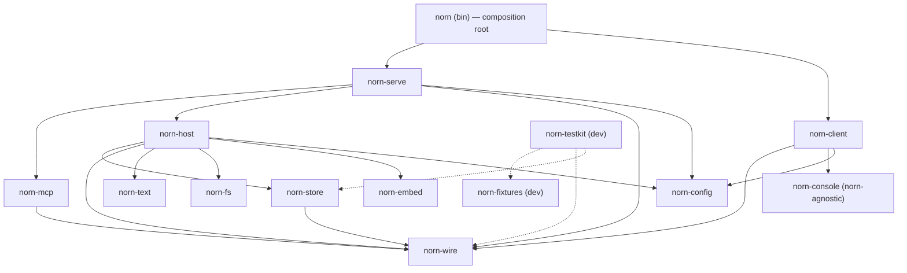
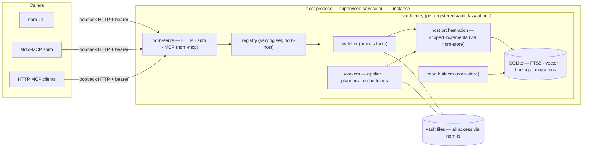

# Architecture

`norn` is a Markdown-vault engine: it derives queryable state from a directory of Markdown
files, keeps that state current as the files change, and applies planned mutations back to
them.

This document is the invariant spine and the crate map, and it is the **authoritative form
of both** — the contract reviews enforce against.

The design passes that derived this content are recorded as Mimir artifacts: **NORN-a1**
(the decisions taken before this repository existed) and **NORN-a4** (the crate-boundary
pass). Those are evidence about how the shape was reached, consultable and citable; they are
not authority. Where they and this document differ, this document governs. Decisions taken
from here land as individual ADRs at the layer where they bind — see
[`decisions/README.md`](decisions/README.md).

---

## Part I — The invariant spine

Five invariants bind every layer. They are not aspirations — each is, or becomes, a
mechanical check. The check's lane depends on what it measures: **counters and structure
gate per PR; clocks and trends live in the soak lane and never fail a pull request.**

### 1. The memory invariant

**Peak memory is a function of the working set, not of vault size.** A request that touches
ten documents costs the same whether the vault holds one thousand or one hundred thousand.
Nothing streams a whole vault through RAM — not a walk, not a query, not a mutation plan.

The invariant is *measured*, not asserted:

- Per-PR CI asserts peak memory at a realistic ~2k-document profile, alongside
  size-independence pairs expressed as counts rather than clocks.
- The scheduled soak lane carries the peak-memory trend line, whose only permitted
  direction is down, plus a flat-slope requirement over a nightly mixed load.

Superlinear payloads are defects, and bounded ones stay bounded on the wire and at rest
alike — see the [bounded candidate head of 5](#the-crates) in the `norn-wire` membership
rule.

### 2. Default-EXCLUDE

**Nothing enters except by passing a contract.** This governs three things at once:

- **The tree.** Files arrive as fresh authorship or as an import listed in the carry-over
  inventory (NORN-a5). An unlisted import needs a ruling before it lands.
- **The dependency graph.** The workspace dependency allowlist below is exhaustive. A new
  edge fails the architecture gate whether or not it points somewhere sensible; adding it
  is a deliberate edit to the allowlist.
- **Legacy behavior.** Recorded material from the previous line enters inert, with zero
  authority. Activation is an explicit approval act, per command, and it is a judgment
  about whether the behavior is *good* — never about whether it matches what shipped
  before.

### 3. The heal ladder

Derived state is always rebuildable, and the system reaches for the cheapest rung that
restores trust. Three rungs, cheapest first:

1. **Scoped increment** — the watcher reports filesystem facts; the increment touches only
   the changed set. This is the warm steady state.
2. **Full tree heal** — `attach = heal-then-ready`: add missing, update changed, prune
   deleted. Deliberately unoptimized, billed once to the first request under a framed
   `Warming` progress display.
3. **Rebuild from zero** — the derived database is discarded and rebuilt.

Vault files are never the thing being healed; they are the source of truth. The ladder
splits across the two effect seams: tree-walking rungs orchestrate through `norn-fs`,
database-side rungs (schema fingerprint, rebuild-from-zero) live in `norn-store`. Layer 1
may subdivide a rung; it does not get to add a fourth escape hatch.

**Rung 3 has two triggers, with different lifetimes.**

- **A DDL change during development.** Schema version is pinned at **1** and does not move
  through the pre-release build. A DDL edit is detected as a fingerprint mismatch in the
  meta table and resolved by rebuilding from zero, consuming no version numbers. This is
  the development-time path and it exists because version numbers are worth more than the
  churn they would absorb.
- **Corruption, or any state the lower rungs cannot resolve** — at any time, before or after
  release.

At the first release, version 1 freezes as the first migratable baseline. From then on the
**migrations pillar is the schema-evolution path**, and rebuild-from-zero narrows to the
second trigger alone.

**Every rung is reached by a test.** The induced-failure suite injects each of the following
and asserts the named rung handles it:

| Injected failure | Rung that must handle it |
|---|---|
| Process killed mid-increment | 1 → 2: the torn increment is detected and the entry re-heals |
| Disk full | 2: the increment cannot complete; the entry stays untrusted until a heal succeeds |
| Permission loss on vault paths | 2: an unreadable path is an error, never evidence of deletion — it must not prune |
| Corruption injection | 3 |
| Stale schema (DDL fingerprint mismatch) | 3 |

**Cold is a state of a vault entry, not a code path.** There is exactly one attach seam,
and both host lifecycles use it.

### 4. Raw-SQL acceptance

**The schema is the domain model at rest.** Reads compile wire params to SQL and let SQLite
answer. There is no repository tier and no domain-object hydration between the query and
the rows.

The acceptance contract is a fixed set of query shapes, each carrying timing bars, an
`EXPLAIN` assertion **against the builder's actually-emitted SQL**, derivation counters, and
memory:

- count-by-field
- suffix / stem resolve
- links-to
- predicate + sort + page
- findings-for-path
- full-text match
- vector-nearest (via the deterministic stub model)

Warm requests assert **zero** derivation counters. `EXPLAIN` gates run against emitted SQL
specifically, because a gate against hand-written SQL tests a string nobody executes.

### 5. One obvious path

**A second spelling of an existing operation is a defect even when its output is correct.**
This is the strongest of the five, because it rejects working code.

It binds concretely: one plan vocabulary and one applier; one document parser; one render
seam; one resolution grammar across every target surface; one invocation path to the host;
one owner for machine-local state. Where a new capability looks like an existing one, the
resolution is sharply bounded jobs — not two overlapping surfaces that each mostly work.

---

## Part II — The crate map

**Governing law: a crate boundary is earned** — by an effect seam, an enforced invariant,
heavy-dependency isolation, or a standalone future. Anything else is a module. This is the
crate-level face of one-obvious-path.

Twelve product crates (including the composition root), two development crates, one shipped
binary. Every crate carries a one-line **membership rule**. *The rule, not the current
content list, is what reviews enforce against* — a crate's contents are evidence about the
rule, never a substitute for it.

Crates arrive with the layer that earns them (see the [layer landing map](#layer-landing-map)).
This document describes the whole target shape; the workspace holds only what has landed.

### The crates

| Crate | Owns | Earned by |
|---|---|---|
| `norn-wire` | **The vocabulary** — request params, reports, typed plans, findings, trust states. Pure types: no I/O, no logic. A finding's `candidates` is a **bounded head of 5** in deterministic resolution-ladder order plus `candidates_total`; the bound is wire shape and holds at rest in the findings table too. | Params and reports are defined exactly once; CLI flags and MCP tool schemas are derived renderings of these types. |
| `norn-text` | **The syntax of a vault document, never its semantics** — frontmatter parse / lossless edit / serialize, headings, sections, wikilink syntax, `#tag` syntax (body tokens with code-span exclusion, plus the frontmatter tags shape). Pure functions over strings; answers "what does this document say", never "what does it mean" or "is it right". | The one-parser invariant — every consumer reads documents through one grammar. Carve-out future: the serde-based frontmatter path can be replaced by a purpose-built parser without surgery elsewhere. |
| `norn-fs` | **Everything that touches the vault filesystem, and nothing that doesn't** — walk, read, stat/fingerprint, the atomic-write protocol (fingerprint → shadow → verify → swap), the per-vault flock primitive, and the watcher as a subscribable stream of typed filesystem facts (debounced, coalesced, atomic-replace aware). Filesystem facts only; not a general event bus. | The second effect seam; heavy-dependency isolation for the platform watcher backend; churn semantics unit-testable in-crate against a temp tree. |
| `norn-store` | **An SDK for talking to SQL** — DDL, migration machinery, the DDL fingerprint, the four pillars (FTS5, vector, findings, migrations), write-through increments, database-side heal rungs, derivation counters, and the read builders (wire params → emitted SQL). Its verbs translate cleanly to SQL; no business logic beyond how queries are composed. | The first effect seam. Read builders live here because the `EXPLAIN` gates test the builder's emitted SQL — schema and queries co-evolve or they drift. |
| `norn-embed` | **Text in → vector out, model identity explicit** — the embedding trait with `(model id, version)` first-class in the API; the deterministic stub is the default build; the real pinned runtime compiles only behind the release/soak feature. Never touches the vault or the database, never decides anything. Its one permitted effect is the opt-in machine-local weight fetch/load, at a path the host injects **from `norn-config`**; fetched weights are integrity-pinned against `(model id, version)`. | Heavy-dependency isolation (the model runtime stays out of every development build), and a structural guarantee that inference cannot reach findings or plans. |
| `norn-config` | **Machine-local state, one owner** — config-directory layout, the registry file read/write, the bearer token read/write, host endpoint discovery conventions, weights-directory location. Never touches a vault. | The one state surface both sides of the client/host seam must read — the serving side to authenticate, the client to find the host at all. Hand-sharing that convention in two crates is a drift class on a security-relevant file. |
| `norn-host` | **The protocol-blind orchestrator** — registry semantics (the serving set; file access via `norn-config`), vault entries and lazy attach, vault doctrine config (bytes via `norn-fs`, pinned at attach), the worker pool (the one applier, mutation planners, the repair planner, embedding workers), and the first-run janitor. **Wire in, wire out**: a plain library with no sockets, composing `fs` + `text` + `store` + `embed` (+ `config`). Never touches vault bytes; its one direct effect is the one-shot legacy-cache janitor. | The composition seam: sole subscriber of filesystem facts, sole caller of store increments, sole executor of plans — reachable only as wire types. |
| `norn-mcp` | **MCP semantics, no transport** — derives tool schemas from `norn-wire`, translates MCP requests to wire params and wire reports to MCP responses. Pure functions, unit-testable like `norn-text`. | The derived-renderings owner for the MCP surface; protocol shape quarantined from both orchestration and plumbing. |
| `norn-serve` | **The HTTP surface** — the serving socket, routing, auth middleware (bearer verification via `norn-config`), and whatever accretes above the protocol later (TLS when a real remote consumer exists, rate limits, request logging). Routes to `norn-mcp`, dispatches wire types to `norn-host`. | The serving effect seam; it keeps HTTP-layer growth out of the orchestrator. |
| `norn-console` | **The CLI presentation kit** — clap *extensions*, never clap re-implementations; render conventions (palette and colors, records display, table/list projection, error-output envelope); input conventions (stdin handling, confirm prompts). **norn-agnostic**: generic over record types via traits, with no dependency on any other workspace crate. | Single source of truth for how output looks and input behaves, plus a standalone future — it is designed for extraction as an independent reusable crate. |
| `norn-client` | **Everything outside the host** — argv → wire params, loopback routing with endpoint discovery and token read via `norn-config`, TTL auto-launch (connect-or-spawn of the same artifact's host entry point, always a separate process), projections of wire reports onto `norn-console` conventions, the stdio-MCP shim (JSON-RPC framing only; the MCP rendering lives in `norn-mcp`), and the machine-local verbs: self-update, service install, `completions`, `manpage`. Leans on `clap` for everything clap can express — derive API, parsing, completions generation, error surfaces. | The always-routed enforcement seam (see boundary invariant 1). |
| `norn` (bin) | **Composition root only** — wires `norn-serve` and `norn-client` into the single shipped artifact. | Distribution: one artifact for self-update, service install, and TTL auto-launch alike. |
| `norn-fixtures` (dev) | **The deterministic vault generator** — the same `(profile, seed)` produces the same tree, byte for byte. Realism knobs: body-length distribution, ambiguity-class size `k`, link density, heading density, directory-tree shape, non-Markdown clutter. Self-contained leaf; its writer is its own. | Shared by tests, per-PR gates, and the soak lane; never ships. Exempt (with testkit) from the vault-effect lints — writing temp trees is its job. |
| `norn-testkit` (dev) | **Assertion helpers and harness scaffolding** — counter, `EXPLAIN`, and size-independence assertions; churn and induced-failure drivers; corpus activation gating; the architecture gate. Suites execute as integration tests in the crates they exercise; the argv corpus lives in the `norn` bin package, the one place cargo makes the built binary reachable. | Layer 0 is enforcement machinery: helpers live once, suites live with their subjects. |

Two membership rules deserve emphasis because they are the ones most often eroded by
convenience:

- **`norn-client` is deliberately excluded from `init`.** A verb that scaffolds
  configuration inside a vault is making a vault request, so its disposition belongs to
  the **Layer 3 verb charter** — not to the machine-local verb set.
- **`norn-console` extensions are earned case by case.** The bar is doing *more* than clap
  allows, never a preference for our own code. Re-rolling a clap-native capability
  (parsing, completions generation, error surfaces) is a defect. The custom help renderer
  and the short/long help stance are the exemplars, and the class stays open on those
  terms — new exceptions are judged by the Layer 3 verb charter, which owns help doctrine.

Three implementation questions are **registered open** against Layer 1 rather than settled
here:

- **Watcher backend.** Default posture is buy over build (`notify`). Rolling our own
  requires demonstrated advantages with isolated costs, judged against the churn-fidelity
  bars — convergence-to-equivalence with a from-scratch build, and a settle bound
  proportional to the changed set. Either way it is an implementation detail *inside*
  `norn-fs`; no other crate learns which backend won.
- **Model-weight fetch mechanics.** The enabling verb, the storage location, and how
  downloaded weights are integrity-pinned against `(model id, version)`. The pinning
  requirement is fixed (see the `norn-embed` rule); the mechanism is not.
- **`#tag` graduation.** The syntax family lands in `norn-text` at Layer 1 and graduates in
  two steps: a **schema facet in `norn-store` at Layer 1**, and a **query surface at the
  Layer 3 verb charter**. Both steps are committed; their shape is not.

### Dependency allowlist

Arrows point at the dependency. Leaves at the bottom; nothing points up. **This graph is the
allowlist** — the complete set of permitted workspace normal-dependency edges.



Written out, the permitted edges are exactly:

| From | To |
|---|---|
| `norn` (bin) | `norn-serve`, `norn-client` |
| `norn-serve` | `norn-mcp`, `norn-host`, `norn-wire`, `norn-config` |
| `norn-mcp` | `norn-wire` |
| `norn-host` | `norn-store`, `norn-wire`, `norn-text`, `norn-fs`, `norn-embed`, `norn-config` |
| `norn-client` | `norn-wire`, `norn-console`, `norn-config` |
| `norn-store` | `norn-wire` |
| `norn-testkit` (dev) | `norn-fixtures`, `norn-wire`, `norn-store` |
| `norn-wire`, `norn-text`, `norn-fs`, `norn-embed`, `norn-console`, `norn-config`, `norn-fixtures` | *(none)* |

Seven crates are leaves with zero workspace dependencies. `norn-store` depends on
`norn-wire` alone — parsing happens in host orchestration, so the store's API takes typed
facts, never raw documents.

### Boundary invariants

Thirteen invariants, held by two different mechanisms. **Five (1, 7, 12, 13, and the
dependency half of 3) are held by the absence of an edge**, which makes their violation a
compile error rather than a review finding. The rest escalate to lint tooling, adopted as
each invariant becomes real; a few — notably 3 and 11 — are held partly by each. The
enforcement section below states which mechanism carries what.

1. **`norn-client` never depends on `norn-store`, `norn-host`, or `norn-serve`.**
   Always-routed is therefore true by construction: no client-side code path can open a
   database or serve in-process. The two crates meet only inside the composition root, and
   the only channel between them is loopback HTTP speaking `norn-wire`. Always-routed's
   scope is **vault requests**; the machine-local verbs (self-update, service lifecycle,
   `completions`, `manpage`) are the named exception class — they touch no vault and no
   database, and the absent edges are what makes that permanent.
2. **`norn-host` is the sole opener of durable databases** and the sole plan executor.
   `norn-store` exposes the substrate API; only the host links it into a running process.
3. **`norn-wire` has zero workspace dependencies and zero effects.** Nothing crosses the
   client/host seam that is not a wire type — no untyped JSON value, no JSON-in-a-string.
4. **One plan vocabulary, one applier.** Mutation verbs and the repair planner both compile
   to `norn-wire` plan types; the host's single applier executes all of them. A second
   execution path is a defect.
5. **Surface-specific parameters are defects.** `norn-client` renders wire types to flags
   and stdout; `norn-mcp` renders them to tool schemas. Neither defines vocabulary.
   Surface-specific *presentation* is fine.
6. **One render seam, owned by `norn-console`.** Verbs return data; `norn-console` owns the
   mechanisms (help rendering, palette, records display, error envelope); `norn-client`
   owns only the projections of wire types onto those mechanisms. A verb or client module
   that writes stdout or resolves color/tty itself is a defect.
7. **`norn-console` never depends on a workspace crate.** The reverse edge
   (`client → console`) is the only legal contact. This keeps the crate extraction-ready
   and keeps norn semantics out of presentation mechanics.
8. **Two vault-effect seams, and only two.** `norn-fs` and `norn-store` are the only crates
   that touch a vault — its files and its derived database. Derivation is
   `fs.walk → text.parse → store.upsert`; application is
   `text.compose → fs.write_atomic → store.increment`. The seam governs *vault* effects
   specifically: serving sockets (serve), loopback and spawn (client), tty (console), and
   machine-local config-directory state each belong to their owning crate and are not
   violations. Development crates are exempt.
9. **The fs event stream carries filesystem facts only**, from a single producer (the
   watcher). Domain eventing, if it ever earns existence, is a separate host-internal
   concern — never a rider on the fs bus.
10. **One parser.** All document syntax — frontmatter, headings, sections, wikilinks, tags —
    is read and written through `norn-text`. A second interpretation of document text
    anywhere else is a defect.
11. **Machine-local state has one owner.** `norn-config` is the sole reader and writer of
    config-directory bytes — registry file, bearer token, endpoint conventions. Registry
    *semantics* (the serving set and its mutation verbs) stay host-side; config owns shape
    and storage. The shared dependency is not a channel: client–host coordination still
    flows only over loopback HTTP. Config's API splits along that seam — the **registry
    surface is host-only**, which a crate edge cannot express and which therefore carries a
    named symbol lint, while the machine surface (endpoint discovery, token read) is
    shared. Token *generation* at service install is the client's one legitimate
    config-directory write.
12. **`norn-embed` is blind.** No `embed → store` and no `embed → fs` edge exists; the host
    mediates every vector write. Semantic search stays a query surface and never a
    correctness input, because the inference crate structurally cannot reach findings or
    plans.
13. **The orchestrator is protocol-blind.** `norn-host` depends on no protocol or serving
    crate; requests reach it only as `norn-wire` types. Dependencies point downward
    (`bin → serve → {mcp, host}`), never the reverse. A protocol type in orchestrator code
    is a defect, and the missing edges make it a compile error.

### Enforcement — the graph is a gated contract, not a convention

The edge set above is asserted by an **architecture gate in `norn-testkit`**: a per-PR test
that reads `cargo metadata` and asserts the workspace **normal-dependency** graph is
*exactly equal* to the allowlist above, evaluated under a pinned feature and target matrix
(default features plus the release feature set; the platform watcher backend per target).

- A forbidden edge fails.
- **A new edge not deliberately added to the allowlist also fails** — default-EXCLUDE
  applied to the dependency graph itself.
- Development-dependency edges (every crate's tests reaching testkit) are documented but
  ungated: they inherently cycle. They are omitted from the graph above, whose dotted edges
  are testkit's own normal dependencies.

The gate lands with the Layer 0 drift-prevention harness (**NORN-12**) and runs in per-PR CI
**from the first scaffold** — it is one of the first things the workspace gets, not
something retrofitted once the graph is worth defending.

Symbol-level rules the dependency graph cannot express **escalate to lint tooling**
(clippy's `disallowed-types` / `disallowed-methods`, or custom lints if configuration-level
lints prove insufficient):

- no `serde_json::Value` crossing the wire seam
- no SQLite connection opened outside `norn-store`
- `std::fs` disallowed workspace-wide
- no `norn-config` registry-surface use outside `norn-host`
- no direct stdout writes outside `norn-console`

One workspace-root `clippy.toml` holds the whole ruleset, because that configuration file
does not merge per-crate. The crate that legitimately owns an effect carves it out with an
explicit `#[allow]` **at the use site**, which doubles as an audit marker.

Two rules carry a defined carve-out set. The carve-outs are the whole permitted list — an
`#[allow]` anywhere else is the violation the lint exists to catch.

- **Filesystem** (`std::fs`): `norn-fs`, `norn-config`, the `norn-embed` weight fetch, and
  the `norn-host` janitor.
- **Stdout**: the `norn-client` stdio-MCP shim, which necessarily writes JSON-RPC frames to
  stdout, and `norn-client`'s `completions` and `manpage` generation, which emit artifacts
  rather than rendered records. Everything a user reads as *output* still goes through
  `norn-console`; the carve-out covers machine-consumed byte streams only.

Vault-effect lints bind product crates only; `norn-fixtures` and `norn-testkit` are exempt.

Rules are adopted one at a time, as each invariant becomes real. Tooling choice is an
implementation detail of NORN-12, not a fixed part of this contract.

---

## Part III — Runtime

### Topology

**One host process serves all registered vaults**, with two lifecycles: a supervised
service, or an auto-launched TTL instance (supervisor off, TTL on). Same binary, same attach
seam. Cold is a state of a vault entry, not a code path.

The registry is the host's serving set. Registration gates durability — durable database,
watcher, warm trust — while unregistered roots get disposable derivation over a throwaway
store. Lazy attach bounds file-descriptor and watch usage; the fd budget is a measured
Layer 1 acceptance item.



Placement notes:

- The per-vault flock primitive lives in `norn-fs`; the host applies it per entry,
  flock-then-bind.
- Disposable derivation for unregistered roots is a host attach mode over a throwaway store.
- The first-run janitor that clears orphaned legacy cache directories is a host startup task
  over machine-local paths.
- The endpoint and bearer conventions on both ends of the loopback edges come from
  `norn-config`.
- Auth binds loopback with a static bearer token generated at service install, and stays
  middleware-shaped. TLS, multi-user, and remote access are explicitly out of scope until a
  real remote consumer exists.

### Request flows

**Read — SQL-native.** Params arrive through `norn-serve` as wire types (protocol shape is
shed at the `norn-mcp` boundary); the host resolves the vault entry; a `norn-store` builder
emits SQL; SQLite answers; rows become a wire report. No repository tier, no domain-object
hydration. Warm requests assert zero derivation counters.

The suffix-resolution ladder follows the same split. Targets resolve by **right-to-left,
segment-aligned path suffix** — `glossary` matches any `**/glossary.md`; `norn/glossary`
matches only `**/norn/glossary.md`; stem resolution is the one-segment case. This is *the*
grammar across every target surface: CLI, MCP, wikilinks, filters. The grammar is specified
by its own ADR and expressed as `norn-wire` resolution types; `norn-text` parses link
*syntax* only; execution is a store builder with its own `EXPLAIN` bar and index support.
Candidates emit as minimal disambiguating suffixes, and the findings pillar indexes full
candidate enumeration so the wire's bounded head stays a head rather than becoming the query
surface.

**Derivation — attach, heal, watch.** Pure host composition. Cold attach walks
`fs.walk → text.parse → store.upsert`. Warm operation is watcher facts from `norn-fs`
driving scoped `norn-store` increments. The heal ladder splits along the same seam:
tree-walking rungs orchestrate through `fs`, database-side rungs (schema fingerprint,
rebuild-from-zero) live in `store`.

Full-text search is maintained transactionally inside the increment. Embeddings are
eventually consistent via async workers, and the surface says so. Vectors are versioned,
derived, rebuildable state — pure functions of (model id, version, content) — so a model
upgrade is a migration of derived state.

**Mutation — everything is a plan.**

```mermaid
sequenceDiagram
  participant C as norn-client
  participant S as norn-serve
  participant H as norn-host
  participant W as worker (applier)
  participant F as vault files (via norn-fs)
  participant D as SQLite (via norn-store)
  C->>S: HTTP (bearer; protocol shape)
  S->>H: verb params (wire)
  H->>H: compile to typed plan (wire vocabulary)
  H->>W: plan
  W->>F: fingerprint → shadow → verify → swap (protocol owned by norn-fs)
  Note over W,F: drift detected → refuse-and-refresh (fresh forecast, hash-CAS confirm)
  W->>D: write-through increment, scoped to blast radius
  Note over W,D: re-derivation of composed state counter-guarded to zero
  W-->>H: outcome
  H-->>S: report (wire)
  S-->>C: HTTP response
```

`apply` is the same flow entered with an externally supplied plan. Repair is a planner over
the findings table feeding the identical applier; its plans cite the finding generation they
were planned against, and repair reads the live ambiguity class rather than a finding's
snapshot.

Two contracts inside that flow carry weight:

- **Write-through.** The worker composed the post-state, so the increment writes it —
  database updates scoped to the blast radius, with re-derivation of composed state
  counter-guarded to zero.
- **Refuse-and-refresh.** Detected drift refuses and returns a fresh forecast whose content
  hash rides the confirmation as an implicit compare-and-swap. Auto-rebase on drift is
  deliberately rejected: a changed world deserves a re-plan.

---

## Part IV — Landing

### Layer landing map

Build order is bottom-up. Crates arrive with the layer that earns them.

| Layer | Lands in |
|---|---|
| 0 — contract scaffolding | `norn-fixtures` (self-contained leaf), `norn-testkit` harness skeleton (substrate-facing helpers arrive with Layer 1), `norn-wire` skeleton, `norn` bin skeleton (stub composition root housing the dormant argv corpus), CI skeleton |
| 1 — substrate | `norn-store` (DDL, the four pillars, heal rungs, counters, the `#tag` schema facet), `norn-fs` (walk, watcher, atomic write), `norn-config` (config-directory layout, registry file, token), `norn-host` (process, registry semantics — mutation verbs arrive at Layer 3 — attach), `norn-text` (including the `#tag` syntax family), `norn-embed` (trait plus stub; real runtime behind a feature) |
| 2 — lockdown | No new crates — gates over Layers 0 and 1 (churn, induced failure, soak) |
| 3 — queries | `norn-store` read builders, verb charter → `norn-wire` params and reports, `norn-host` wire surface (no network; serving lands at Layer 6). The charter decides help doctrine, the `#tag` query surface, and the disposition of every verb whose place is open |
| 4 — mutations | `norn-wire` plan vocabulary, `norn-host` planners and applier |
| 5 — repair | `norn-host` repair planner (findings-table consumer) |
| 6 — surfaces | `norn-serve` + `norn-mcp` (HTTP MCP first); `norn-console` mechanisms and `norn-client` CLI rendering last, rendering the help doctrine the Layer 3 charter decided |

The `norn-wire` skeleton starts **empty**. Types arrive with the layer that earns them; the
verb vocabulary is re-derived from callers × jobs at the Layer 3 charter.

### Deliberate absences

Named here so nobody reintroduces them by reflex:

- **No middle domain tier.** Reads go from wire params to emitted SQL. The tier that would
  hydrate domain objects between them is what SQL-native reads delete.
- **No per-vault process, no summon ladder.** One host serves N vaults; there is no socket
  naming scheme, no spawn claim, no reap race, no orphan garbage collection.
- **No in-process serving mode.** There is one invocation path for vault requests.
- **No comparison-harness crate and no comparison binary.** Correctness is pinned by
  properties and counters; bytes pin rendering only, and only at Layer 6.
- **No cache *document*.** Derived state is a durable, rebuildable database with a heal
  ladder, and no page of documentation describes it as a cache. Whether a `cache` verb
  exists at all is the Layer 3 charter's question, not a settled absence.

### Where the contracts live

- [`decisions/`](decisions/) — the ADRs, indexed in
  [`decisions/README.md`](decisions/README.md). ADRs are written at the layer where their
  decision binds, as that layer lands.
- [`glossary.md`](glossary.md) — domain terms, entering with the layers that earn them.
- `.github/workflows/` — the two CI lanes: counters gate per PR, clocks trend in soak.
