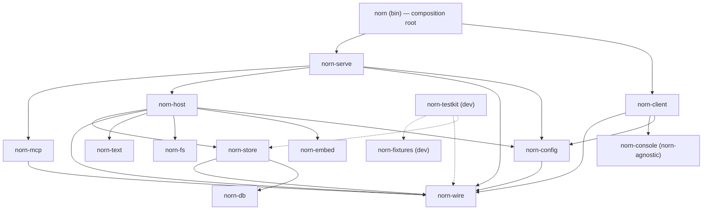
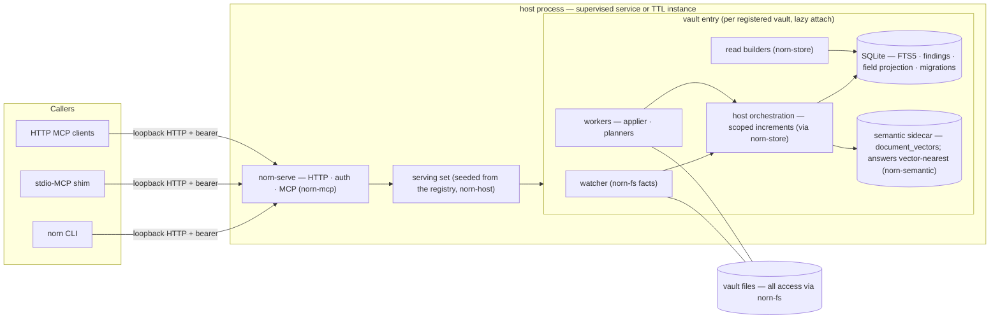

# Architecture

`norn` is a Markdown-vault engine: it derives queryable state from a directory of Markdown
files, keeps that state current as the files change, and applies planned mutations back to
them.

This document is the invariant spine and the crate map, and it is the **authoritative form
of both** — the contract reviews enforce against.

The design passes that derived this content are recorded as Mimir artifacts: **NORN-a1**
(the decisions taken before this repository existed), **NORN-a4** (the crate-boundary
pass), and **NORN-a6** (the Layer 1 substrate pass). Those are evidence about how the shape
was reached, consultable and citable; they are not authority. Where they and this document
differ, this document governs. Decisions taken from here are recorded as ADRs only when they
pass the admission bar in [`AGENTS.md`](../AGENTS.md); implementation cadence creates no
documentation obligation. The qualifying durable rationale is indexed in
[`decisions/README.md`](decisions/README.md).

---

## Part I — The invariant spine

These invariants bind the whole system. Each section below names its own gates where it has
them, and marks the judgments that are review acts instead. When a gate arrives is not this
document's concern; the comments in `.github/workflows/` are the in-repo operational marker.

Where a gate exists, its lane depends on what it measures: **counters and structure gate per
PR; clocks and trends live in the soak lane and never fail a pull request.** [ADR
0004](decisions/0004-two-tier-measurement-and-authored-baselines.md) records why evidence
kind, rather than observed runtime, owns that division. A review-held judgment has no lane
at all, which is why each section says so where it applies — a review-held invariant rots
quietly.

### 1. The memory invariant

**Peak memory is a function of the working set, not of vault size.** A request that touches
ten documents costs the same whether the vault holds one thousand or one hundred thousand.
Nothing streams a whole vault through RAM — not a walk, not a query, not a mutation plan.

The invariant is *measured*, not asserted:

- Per-PR CI asserts peak memory at a realistic ~2k-document profile, alongside
  size-independence pairs expressed as counts rather than clocks.
- The scheduled soak lane records three peak-memory readings each run, and they
  are separate gates with separate ceilings. One is what generating the ≥5k
  profile's tree costs, and its ceiling is authored. The second is the host's
  own: the highest resident set the load's process reaches while working that
  tree, sampled from the moment the attachment is ready, so it is the peak the
  hour sustains and not the attach's. **The third covers the attach and the
  heal**, which are ahead of that first sample and which the per-PR attach
  ceiling bars only at 2k: the kernel's high-water mark for the whole run, read
  once when the load ends, so it answers for the run from its first instruction
  rather than for the ticks a sampler happened to take — the first attach, its
  heal, and the deliberate recovery's re-attach alike. That third reading is
  the Linux measurement lane's, which is the lane that gates, because the mark
  is published there beside the resident set the samples come from. Each
  ceiling is authored off calibration runs of the scheduled lane per [ADR
  0007](decisions/0007-authored-measurement-thresholds.md), and the
  qualification ledger refuses a qualifying verdict while any named exit bar
  sits unauthored — so a lane running under an unauthored ceiling records its
  readings without its green runs counting toward lockdown's five. Every named
  exit bar is authored: the high-water ceiling is 40 MiB, read off three
  hour-long hosted runs whose mark equalled the sampled peak in each. A
  baseline moves only by a reviewed edit, and the downward direction of that movement is
  review-held rather than mechanized — nothing here fails a raised baseline, so
  this is a place this section's own rule applies: a review-held invariant rots
  quietly.
- The mechanized form is a flat-slope requirement, and it runs in the same
  lane: a host attaches the ≥5k profile's vault and works it under a nightly
  mixed load while sampling its own resident set, and the run compares the
  first quartile's mean against the last. That comparison is one the run makes
  against itself, so no recorded history decides it.

Superlinear payloads are defects, and bounded ones stay bounded on the wire and at rest
alike — see the [bounded candidate head of 5](#the-crates) in the `norn-wire` membership
rule.

### 2. The heal ladder

Derived state is always rebuildable, and the system reaches for the cheapest rung that
restores trust. Three rungs, cheapest first:

1. **Scoped increment** — the watcher reports filesystem facts; the increment touches only
   the changed set. This is the warm steady state.
2. **Full tree heal** — attach and recovery establish watcher coverage, heal, drain the
   filesystem facts accumulated during the heal, then publish `Ready`. The coverage boundary
   and drain are defined by [ADR 0017](decisions/0017-watcher-synchronization-gates-readiness.md).
   The heal adds missing, updates changed and prunes deleted. "Update changed" is decided by a
   content hash, never by a stat comparison — see [the trust model](#5-the-trust-model).
   Deliberately unoptimized, and billed once to the first request under a framed `Warming`
   progress display. Its resumable-friendly shape is carved for a later stat-prioritized,
   progressive-verification evolution; nothing measures it today.

   **The prologue comes before the heal, and the display says which of the two an entry is
   in.** Before a document is read, an entry takes sole maintainership of its own derived state,
   resolves and sweeps its shadow home, establishes change detection over the tree, and
   opens the derived state a read answers from. The first request is billed for all of it,
   and none of it counts a document — which is why `Warming` carries a typed phase beside
   its counters rather than counters alone. An entry that has not finished that prologue
   and an entry whose heal is not advancing are different waits, and zero healed against an
   unknown total is the whole truth of both.
3. **Rebuild from zero** — the derived database is discarded and rebuilt.

Vault files are never the thing being healed; they are the source of truth. The ladder
splits across the two effect seams: tree-walking rungs orchestrate through `norn-fs`,
database-side rungs (store schema fingerprint, rebuild-from-zero) split across the substrate
seam the same way every database-side act does: `norn-db` runs the open ceremony and types what
it found — the fingerprint and the schema digest it is read from, the file removed, the database
opened again — and `norn-store` reads that outcome as which rung the state is at and owns what
its own pinned keys mean. A rung may be subdivided; a fourth escape hatch
may not be added.

**Rung 3 has four triggers, with different lifetimes.**

- **A DDL change during development.** Store schema version is pinned at **1** and does not move
  through the pre-release build. A DDL edit is detected as a fingerprint mismatch in the
  meta table and resolved by rebuilding from zero, consuming no version numbers. This is
  the development-time path and it exists because version numbers are worth more than the
  churn they would absorb.
- **A root proving a case behaviour the store was not derived under** — at any time. The
  store records the path order its rows were derived under in `meta`, beside the store
  fingerprint, as a rebuild input: document identity — which spellings are one row — and the
  key space a finding's classes are filed in both follow it, and no later derivation converges
  either. An attach proves the order through its new coverage before it opens the store and
  opens it under that order, and the open rebuilds from zero where the recorded order differs,
  none is recorded, or the recorded value is one no build writes, reported as the store's own
  rebuild reason naming what the store records and the order the root proves. A recovery
  installs new coverage over a store opened under the old coverage's proof, so it judges the
  store against the new proof before it pins or derives anything, whatever its declaration
  reads as, and a moved order is routed to the host's rung-3 leg, which rebuilds the store
  under the proven order and derives the vault again where the declaration is one this build
  reads. A reload installs no coverage, so the store it holds was opened, judged or rebuilt
  under the standing proof; after it refuses a declaration this build cannot read, it judges
  the order again as a guard ahead of its pin.
- **A derivation that writes different rows for the same bytes** — at any time. The host names
  the derivation its build writes rows by with a version, and the store records it in `meta`
  beside the store fingerprint and the path order, as a rebuild input: an increment derives a
  file again only when its bytes move, so no later derivation converges rows an earlier one
  wrote. Every open is under the build's version — an attach's, and the reopen rung 3 makes —
  and it rebuilds from zero where the recorded version differs, none is recorded, or the
  recorded value is one no build writes, reported as the store's own rebuild reason naming what
  the store records and the version the build derives under; where the order moved too, the one
  reason names both. A running build's version does not move, so a store already open is not
  judged against it again. A digest holds the version honest: a pinned corpus is derived from
  zero, every derived column of every lane-1 table is digested, the full-text index digested as
  its vocabulary, and the digest is pinned beside the version it was taken under, so a digest
  that moves while the version does not fails. See
  [ADR 0026](decisions/0026-a-derived-store-records-the-derivation-that-wrote-it.md).
- **Corruption, or any state the lower rungs cannot resolve** — at any time, before or after
  release.

At the first release, version 1 freezes as the first migratable baseline. From then on the
**migrations pillar is the store schema evolution path**, and rebuild-from-zero narrows to the
other three triggers.

**The substrate types damage; the store reads the rung; the host routes it.** An open
resolves the damage it can see for itself, and it can see only the store schema — so a page
that reads corrupt under a warm increment, a full-text index that stopped agreeing with the
column it indexes, or a value outside a closed vocabulary is damage a *later* operation meets.
Every such refusal is typed as damaged state at the operation that met it, and the driver
codes that qualify are `norn-db`'s judgment to make because SQLite is `norn-db`'s to own: the
substrate performs the operation and types what it met, and `norn-store` reads that verdict as
which rung the state is at. An open splits the same way: whether the file is a database this
build wrote at all is the substrate's verdict, and what the store's own pinned keys mean is the
store's. What the host does with the verdict is the rung: trust is
withdrawn under a reason of its own, the store is consumed and its file discarded, a database
is created in its place, and the vault is derived into it by the same heal an attach runs.
**A damaged verdict never re-enters the lower rungs** — a retry, or coverage re-installed
over the same database, meets the same page again — so the requirement damage sets dominates
the one a broken environment sets wherever both stand.
Watcher coverage and the maintainer lock stand through the rung: neither is what was damaged.

**An attach runs the rung inline, and publishes no verdict for it.** An entry holding no
coverage owes an attach before it owes a rung, so a verdict published from an attach would
be answered by a second attach against the same file and the same page. The attach that
meets damage in its own heal therefore resolves it where it stands, and a rung-3 run reached
that way is not observable in the trust stream — the same silence a rebuild-from-zero at open
time already carries. What a client sees is Warming, then Ready. Every other route publishes
the verdict, because every other route is an entry that holds the store the rung will replace.

**Silent damage is asked about on a schedule.** The verification that compares the database
against itself is the only thing that meets damage no read fails on, so it runs as bounded
lifecycle maintenance beside the shadow sweep — off the request path, never per request.

**Every rung is reached by a test, across two suites**, and both are built: the churn suite
reaches everything it states, and the induced-failure suite reaches every row of its table.
Each suite below says how.

**What the suites hold is a record, not a count somebody keeps.** `norn-testkit`'s
certification module is that record, and the suite in the `norn` bin package is what holds
it true. The **case inventory** names every case this layer requires — an id, the suite it
belongs to, the capability lane a run has to schedule it in, the obligation it discharges,
the test that carries it and the feature that test compiles behind — and is reconciled in
both directions against cargo's own list of what compiled: a case deleted, renamed, left
behind a feature nothing turns on, or `#[ignore]`d fails, and so does a case a certification
suite holds and the inventory does not name. Three lanes in it are the reason one machine
cannot certify the layer: a case whose required answer is the volume's own about case, and a
case whose required refusal is the watcher backend's, are each covered only by a run of
each, and a case stated only over a volume that folds case is covered only by a run on one.
Beside the inventory is the committed table of **trust-transition arms nothing reaches
at the production path**, each naming what it awaits — arms nothing carries at all, and arms
carried only against the fake entry operations a host is generic over. The reconciliation
does not read that table: the certification suite's own unreached-arm case prints it under
the run and holds each row to naming its obstacle, and nothing fails on it, because an arm
with no carrier is an ownership ruling owed rather than a broken reference. **The table
stands empty**: every arm it held is now carried by a production-path row of the inventory,
and it is kept as the shape the next such arm arrives in rather than retired. An empty table
is itself a claim — that every arm the contract names is met over a real backend — so the
case that prints it asserts the two facts together, and an empty table beside a
trust-transition suite with no real-watcher case fails there. Where a production row carries
part of what a fake-carried row states — a rescan delivered after coverage ended, the alias
reclassification a lost root raises — each row of the pair says in its own words which half
sits where. The
**suite-manifest digest** is one value over everything that decides what a run *is* — the
lane definitions, the toolchain, the resolved dependency graph, the inventory, the
qualification rules themselves, the comparator, the instrument a work reading is taken
through, the injected-failure seams, every certification suite's own source and the recorded
baselines — and deliberately not over the product's own source, which is what the candidate
SHA answers for. It is a reading of the working tree, so a qualifying run is one over a
clean checkout; neither it nor the record answers for the image a runner label resolved to
on the day. The **qualification ledger** is what one run leaves behind: the candidate, the
suite-manifest digest and the dispatcher's own reading of it, the inventory digest, the
platform, the environmental preflight's verdict, an outcome per required case,
the named exit bars the build had unauthored, and a classification whose non-qualifying
reasons are a closed vocabulary — unknown candidate, digest disagreement, suite change,
product failure, harness failure, timeout, manual dispatch, cancellation, unauthored exit
bar, environment. **A run is qualifying when it names the candidate it certified, its digest
and the dispatcher's agree, it ran the required suite, passed it, a
preflight admitted the host, every named exit bar was armed, and it came off the
schedule**; anything else is non-qualifying with one typed reason, and the check that a record's stated verdict is the one its contents imply is what
a campaign counts through. The scheduled lane writes a record every run and uploads it —
except after a `timeout-minutes` kill, which stops the step that writes one, so a scheduled
run with no record is how the campaign reads a timeout. Counting five consecutive
qualifying scheduled runs over one frozen candidate is read off those records, and manual
runs never advance it. Every certification run is a dispatch, so **which a run was is decided
from who made the dispatch** — only the dispatcher's own workflow token carries the app's
identity — rather than from the assertion the dispatch carried, which anybody with write
access can type. A run that asserts the schedule and was started by a person is recorded
`scheduled: false` with the actor named and `manual-dispatch` as the reason.

**The candidate is pinned, and the run happens at the pin.** A workflow's steps come from the
ref it was triggered on and a schedule only ever triggers the default branch, so the two
concerns are two files. `.github/workflows/soak.yml` on the default branch is the
**dispatcher**: it holds the nightly cron, reads `.github/soak-candidate` for the commit the
campaign is certifying, fetches it, verifies its tree carries the certification workflow,
computes the suite-manifest digest there, tags it `soak-candidate/<sha>` and dispatches
`.github/workflows/certify.yml` at that tag. The pin must be an ancestor of the default
branch: the dispatcher builds the pinned tree, and GitHub serves any reachable sha, so the
reviewed-ness the candidate is assumed to have is checked rather than assumed. The job that
builds that tree is its own, holding `contents: read` and no credential, because building a
tree runs its build scripts. `certify.yml` carries the two lanes and nothing
resolves a pointer inside it: the run stands in the candidate, so its own commit is the
candidate and the record reads it off the checkout. The dispatcher carries no lane behaviour,
which `norn --test certification` holds it to — anything deciding what a run does would
otherwise sit outside the digest the candidate is certified under. The pointer is outside the
trees the suite manifest sweeps, because what a run is and which commit it is run against are
two values — folding one into the other would restart the count whenever the candidate
advanced.

**Two attesters, one digest.** The dispatcher's reading of the suite-manifest digest at the
pin travels to the run as an input, and the record refuses to qualify where its own reading
differs — or where nothing dispatched it from the pointer at all. So the value five records
have to agree on is one two readers of two checkouts arrived at. A pin nothing can fetch, or
one off the default branch, or one predating the mechanism, fails **the dispatcher**, which
is a different workflow: no certification run is started at all, so no state of the pointer
can produce a certification run with no record. A missing record therefore means a run that
was killed for time or one that never got its tree, both of which break a run of five.

**Two scheduled lanes run the certification cases**, and each leaves a record of what its
own machine did. The Linux lane carries the measurements and the hour-long load; the macOS
lane carries the same certification suites on the other watcher backend, because one case's
required outcome is the backend's own and a campaign that ran a single platform would
certify one of the two answers. Each lane runs every target the inventory's carriers compile
into — the integration suites and the library whose unit tests carry the rest — keeps each
run's harness output, and reads the case lines off those logs rather than off a wrapper's
verdict of the suite. A scheduled run is one entry in the five, and it counts when every
record that run uploaded qualifies.

**The macOS lane runs on a machine the campaign controls.** Its jobs take
`macos-norn-soak`, a runner registered to this repository alone inside a pinned macOS 15
virtual machine, and the qualification record's platform fields carry that runner label
beside the operating system, the architecture, the watcher backend and the volume's
case-folding answer — so a reader of a record knows which class of machine produced it.
The lane carries no measurement bar: every ceiling in `norn-host/tests/baselines/` is
authored against the Linux lane's hosted runner, and a second platform reading them would
judge one machine's numbers on another's. What the two lanes share is the suite, which is
what makes the pair one obligation's coverage on two backends.

**Every soak run trips exactly one recovery, deliberately.** The load's child arms the
watcher seam so a single watch establishment fails, and the run asserts that the arm fired
once — budgeted to the one establishment its attach makes — before it reads the count the
arm explains, so a run that recovered from a hiccup rather than from the arrangement fails
instead of meeting the bar. The recovery is a window, and the load is judged across it at
its own rate: the stretch between losing service and getting it back is measured in wall
clock, and the churn turns and warm reads the load owes over it are charged at the mean
tick period it achieved in the ticks before the window opened, not at a nominal one. A
uniformly slow loop therefore owes proportionally less and cannot fail the term, and a
window that reports no measured baseline period fails the run rather than passing on an
uncharged comparison. The resident-set slope is taken over the samples outside every
recovery window, so a re-attach's walk never enters the trend it would otherwise tilt. The
count itself is an armed exit bar — `soak-host-recovery-dose`, a floor of one — and a run
that arranged no recovery is a run whose other readings are of a load nothing ever
disturbed.

**The host-health preflight decides which machines are evidence sources.** The suites'
authored work bounds are bounds on work, sized for a machine with a core free for the work it
is given; a machine that does not have one measures its own queue at the bound, and a run
that ends there leaves the case's claim unproven rather than failed. The bounds stand and the
evidence is gated instead: each lane reads its host before it builds anything — how much of
the machine is already busy, sampled over a window rather than read off a decayed load
average, and on Darwin the processor share and resident set of the event daemon every
real-watcher case subscribes to — classifies the reading against a closed set of refusal
reasons, and the verdict is what fills the record's preflight slot. A refused host is
non-qualifying for the environment however green the cases went, and the same probe run
locally is what classifies a local suite failure as noise rather than signal:
`cargo test --locked -p norn-testkit --lib certification::preflight -- --ignored --nocapture`,
run on its own after the failing suite rather than beside it, because a probe sampling the
machine while a suite runs on it reads that suite.

Rung 1 is the **churn suite**'s — bursts, atomic replaces, branch flips, mid-mutation
edits — whose bar is convergence-to-equivalence with a from-scratch build. Its settle
budgets, proportional to the changed set, are runaway bounds rather than bars: a settle
that reaches one is stuck, and how long one really takes is a clock the per-PR lane does
not read. It is the warm path, so it is reached by ordinary
operation rather than by injected failure. **That suite is built**, and it is two halves:
`norn-testkit`'s churn driver holds the workload families as seeded scripts, each step
saying in words what it does to a tree, and `norn-host`'s churn suite applies them to a
live vault a production attachment is maintaining. Five families run — ordinary editing
across nested directories; atomic replacement, movement, and the case flip whose meaning
the volume decides; burst and coalescing pressure; transitions between readable,
quarantined and degraded documents under a schema replacement; and what external tools do,
which is editor saves, a sleep's catch-up batch, and edits landing during an active heal.
**Every family runs in phases with a settle between them.** A modification is only a
modification against a row a host already holds, so a workload whose creations and its
edits land inside one poll window asks a host for nothing but new files; each family
therefore puts its content in the tree, is settled over, and only then edits, moves and
removes it. One case lands that changing phase while no host is attached at all, which is
the lane where the attach heal rather than a watcher report is what has to converge it.
Each settles on a **census** — every markdown place holding the row its bytes
imply, keyed by identity so a volume that folds ASCII case is judged the way it resolves those names, and the
vault's schema declaration agreeing with the pin the store holds — and is then compared
with a second derivation built from zero over the same final tree. Two claims stand between
a phase's acts and its settle, because a phase that changed nothing satisfies every bar
after it: **a non-empty script whose census reads exactly as the one it opened against
fails there**, and every place that held a row before the phase and holds none after it is
a death the store is then required to hold a tombstone for. That second claim is the churn
suite's alone — deaths are outside the two-store comparator by construction, since a
derivation from zero records none, so the per-store leg reads the pillar's shape and the
suite that took the documents away reads its membership. The window between one
heal's enumeration and its opens is not reachable from outside a host, so the workloads are
staged through the same seams in `norn-host`'s own suite; what the churn suite does reach
is the coarser overlap, by racing an attachment until it catches a heal already half way
through its walk and then witnessing the result in the provenance the store recorded its
deaths under. Beside the convergence bars are
**cost bars**, read off the account a host's jobs write: each is a bracket, under a ceiling
stated over the changed set and over the floor stated for no changes at all. A third claim
is asserted beside every reading in that same lane — that the ceiling the reading passed
under is below half the vault's documents — so a bound wide enough to admit re-reading the
vault fails where it is read rather than in an arithmetic identity check that attaches no
host. What says those counters move at all is a seeded control: one document, settled over,
edited once, and the account required to show it. What the suite does not state is a
wall-clock ceiling on settling — its budget grows with the changed set and is a runaway
bound, and a ceiling tight enough to fail a slow convergence stays the scheduled lane's.

**What reads that clock is an instrument in the scheduled lane under an authored ceiling of
5 seconds — one vault walk with headroom — and every reading carries the resolution it was
taken at, per leg.** `norn-host`'s settle suite runs the churn driver's whole roll of families
at the ≥5k profile, including family 4's schema-replacement leg, and times each leg from
its own final act to the derived store holding what a build from zero over the same tree
holds. The stopping condition is that full comparator and not a cheaper stand-in: a
flush's findings commit with its changeset, but the walk's prune takes stale findings only
at job end, so a clock stopped when paths and hashes agreed would systematically
under-report by that findings tail. Each poll
therefore asks the cheap census first and, once it agrees, reads the whole projection; a
read whose next read finds nothing moved is the confirming one, and what the clock stopped
on is then held to the projection the equivalence bar is taken over. **The clock stops
where that read began, not where it returned**, because a read observes the store as of
its start — so the several hundred milliseconds it takes to materialise a ≥5k projection
are the instrument's and not the subject's. The settle then lies between the start of the last
poll that found the store unsettled and that instant, and the reading is the top of that
window; how wide the window was is measured per leg and recorded beside the reading. **There is no second clock.** The entry leaves `Ready` for each polled
batch it takes in and returns to it when that batch drains, so it is already back at `Ready`
by the confirming poll and a duration to it would measure a `state()` call; what is recorded
beside each reading is the boolean that the attachment was publishing `Ready` at the poll
that confirmed the reading, one projection read and one poll gap after it — the churn left
no trust withdrawn at the settle. Readings are recorded as each family lands, and compared against
`SOAK_SETTLE_CEILING` only where one is authored. It stands at 5 seconds, three times the
widest leg of the calibration series rounded up to a whole second. **What that bar is, is
one census walk**: the instrument walks the whole tree to build the census its polls
compare against, and that walk is inside every reading, so the ceiling says the settle
finishes inside one vault walk with headroom: at 5 seconds the smallest regression it
catches is about 3.5 seconds on the slowest observed runner and about 4.2 on the fastest.
The constant's safety rationale states why three times the widest leg is the multiple. Deriving the census from the workload script instead of walking it is what sharpens
the bar, and re-authoring the value is part of that change. Un-authoring a ceiling back to
`None` is the recalibration state, and the ledger's exit-bar registry names every bar, which
types every run taken under an unauthored one non-qualifying so a calibration window never
counts toward lockdown's five.

Rungs 2 and 3 are the **induced-failure suite**'s, whose lane runs per PR. The table below
is its contract — each row an injection and the outcome required of it — and **every row of
it is reached**. Each condition is met by the production path it is stated over rather than
described to it: a **full disk** is the derived store's connection held to the page count
its database already has, so the heal's own increment meets `SQLITE_FULL` from the engine; a
**revoked permission** is a real mode taken away between two attaches, in the two shapes the
machine tells apart. A **document** whose mode is taken away is read by the heal and by
nothing else, so the heal's own open meets `EACCES` at a path the walk enumerated, on every
platform. A **subtree** whose mode is taken away is read by the heal's walk *and* by the
watcher backend that has to cover it, so which of the two meets `EACCES` first is the
backend's: a backend that covers a tree without reading each directory under it (FSEvents)
leaves the walk to meet the denial, while one that adds a watch per directory (inotify)
fails to install coverage over the revoked subtree before the heal walks. Both are refusals,
so each is followed by its recovery: the condition is cleared, the vault is demanded again,
and what converges is compared against a derivation built from zero over the same tree.

**A condition met by a process that dies is judged by the process that spawned it.** An
abort is the only thing that leaves a database the way a killed process leaves one — no
unwinding, no rollback through a destructor — so a tear is a child process that arms one
boundary through the fenced seam, attaches through the same production entry operations
every other case does, and never returns. Each arm **records the boundary it fired at**
before it ends the process, and the parent asserts on that record beside the state at rest:
what is left on disk cannot tell a hook that fired from a hook that was deleted, since a
heal with no tear point in it converges and satisfies every outcome the row states by not
having failed. The same discipline carries the effect surfaces `norn-fs` owns, where **three
sibling fault seams are each widened once, at their own boundary** — the write protocol's at
its five public entry points (stage, publish, confirm a landing, discard, empty folders), the
watcher's at watch establishment, the walk's at a walk's construction — under one feature,
read from the environment a process is started with. The write seam names every position apart: staging's
shadow create, write and sync, and publication's swap, unlink, respell, folder make, folder
removal, folder sync and cleanup. An arm selects a publication by ordinal — one count per
publish call in the process, across kinds, which confirming a landing, emptying folders and
discarding do not advance — and a foreign stage, armed only by ordinal, edits, removes or
takes the target through its folder handle after the root check and before re-verification,
so a foreign writer inside a publication is arranged rather than raced for. So process death
at each named position of a staged publication has a bar over what is at rest afterwards,
and refused watch
registration, a backend stream that fails or reports its path set lost, and a
synchronization boundary that never arrives each have a bar over what the subscription
reports. **The walk's seam carries the paging window's two outcomes at the production path**:
the lockdown suite starts a child armed at it and attaches a real host, so an entry that
vanishes between the listing and its stat is dropped from the page while the heal completes
and every other document derives, and a stat the machine refuses withdraws the entry naming
the path, prunes nothing, and leaves every committed row standing. The pair is one boundary
read twice, which is why neither half is stated without the other. **The watcher's bars are not rows of the table below**: what the *subscription*
reports is stated in `norn-fs`'s own suites — the in-crate cases over a real backend, and the
environment round trip that spawns a child armed through the variable — the way the write
kernel's full-disk row states where its own filesystem half is reached. What a host does with
the entry afterwards is the trust-transition suite's, and **every arm of it is now met at the
production path rather than against a fake, with two halves still resting on fake carriers**
— named at the end of this paragraph, and named again by the inventory rows that split them.
Four arms are met through the seam: `norn-host`'s lockdown suite starts a child armed at the
watcher seam and attaches a real host over a real backend, so a refused registration leaves an
attach that acquired nothing and waits for a new demand, a stream that ends withdraws trust
naming the backend and resumes only through a recovery demand, that same published cause
stands unchanged across hundreds of the dispatcher's own ticks — hundreds by the cadence,
with the host's own account of the polls it took required to show scores of them across the
stretch — with nothing scheduled against the coverage it says is gone, a backend reporting
its path set lost publishes the overflow and rereads the whole vault under coverage
that stays installed, and a synchronization boundary that never arrives leaves the attach
untrusted under an expired synchronization holding a store it opened and derived nothing
into. A stream that ends carries two of those rows because one condition owes two different
outcomes — the way back, and the way the entry stays — and an arm is a condition rather than
a case. **The fifth needs no arm at all**, so it is behind no feature and runs wherever this
crate's suites run: `norn-host`'s coverage suite removes a live vault's root directory, and
the real backend reports the root's own name vanishing, which withdraws trust naming that
root and prunes nothing — every derived row stands at rest with no tombstone beside it, where
a host reading the removal as ordinary editing would prune all of them; the tree is then put
back and demanded again, and the entry reaches ready over the recreated root and converges on
a derivation built from zero over it. **The two halves the fake rows keep** are a rescan
delivered after coverage ended — the production seam holds one stream answer per
establishment, so a second answer on one establishment is unreachable there — and the alias
reclassification a lost root raises, whose duplicate-root park stands in front of the trust
state the production case reads. Both seams append to one record file, told apart by the
`seam` field a record carries, and **that file sits outside every watched tree**: it is
written while coverage is live, so a record file inside a
vault or in a vault's own parent is a filesystem change the watcher reports back into the
batches a case is judging.

| Injected failure | Required outcome |
|---|---|
| Process killed mid-increment | **Handled at rung 2.** **The changeset is the unit of atomicity**, and an increment is one or more of them: a changeset lands whole or not at all, so a process that dies inside one leaves the store holding no part of it. A heal-scale increment is chunked into separately atomic changesets, so a tear between two of them leaves every chunk that committed and no part of the one in flight — each generation whole, the vault's coverage short. Either way the work the tear lost returns through the attach heal's ordinary content-hash comparison. One flush is a changeset and the findings its act derived, in one transaction, so no tear lands between a row and what is wrong with it: a tombstone where a quarantined path had a row, and the derived row where a document read without its frontmatter, commit with the finding beside them or not at all. Link-health re-decision rides that same transaction ([ADR 0027](decisions/0027-link-health-rides-the-changeset.md)): the store re-decides every link the changeset reaches after its entries are written, so a tear anywhere inside the re-decision rolls back with the rest of the changeset and leaves the findings that stood before it. **The state a tear leaves is the pending maintenance, at rest in the rows themselves**: no pending-work table stands beside the store and none is owed, because what the tear leaves demands its own re-derivation and the next heal that reaches it converges the pair. What a tear leaves is recovered by that content-hash comparison; two further signals in the rows' own state cover what a committed quarantine or a schema re-pin's discard leaves, and both are read without an edit to the file: a markdown place inside the vault's membership holding no row is re-derived unconditionally, which is every quarantined path the vault still holds; and a row asserting an absent frontmatter projection beside a nonzero count of frontmatter-scoped diagnostics, with no document-scoped finding standing at it, is re-derived on an unchanged content hash — which is every degraded document standing bare. A tear before commit rolls the changeset back to the committed state that preceded it: a path the lost act would have created keeps no row and no finding, and a document it would have updated or killed keeps its previous row and findings. Until the next heal over those paths the store trails the vault's files across that window — bounded by heal cadence, never permanent. The subject-axis prune of [ADR 0023](decisions/0023-a-walk-refusal-that-stands-is-a-reading.md) runs at the job end that follows, and a tear before it leaves exactly the state a heal that never pruned leaves — reached, as every stale finding is, by the next walk whose clean scope covers the place. All three tears are injected: inside one changeset, at a chunk boundary, and the instant a flush's act commits. The last is stated over both finding scopes — a tombstone where a quarantined path had a row, and a degraded row — and asserts that each finding committed beside its row, and that the next heal, with no edit to either file, commits no changeset and upserts no document, leaving the degraded row's content hash and generation where they stood. |
| Disk full | **Refused at rung 2.** The increment cannot complete, the entry stays untrusted, and the request refuses saying so. The row is stated over the **derived store's own writes**, which is where a rung meets a full disk; a disk that fills under the write kernel is the same condition with a different required outcome — while staging, or in publication before the rename or the unlink, refuse and leave the target alone; after it, report the target landed with its folder sync not durable, never as a write that did not happen — and is reached in `norn-fs`'s lockdown suite rather than here. |
| Permission loss on vault paths | **Refused at rung 2.** An unreadable path is an error, never evidence of deletion: the heal refuses rather than prunes. A document the heal cannot open is refused rather than quarantined for the same reason — nothing was read, so nothing is known about what the document holds. **A revoked directory is also a directory watch coverage is installed over**, so on a backend that adds a watch per directory the install meets the denial before the heal walks, and trust is withdrawn as a lost watcher rather than as a refused heal. Either door leaves the entry untrusted naming the path, every committed row standing, and nothing pruned, so the row holds whichever the platform takes. |
| A document norn cannot decode | **Quarantined at rung 2.** The document yields no facts, a finding names it and the cause class — withheld while a readable document stands at its rendered spelling — the heal keeps going, and the entry reaches `Ready` serving every other document. |
| A document whose frontmatter block is read by nothing | **Degraded at rung 2.** The document keeps the row the act could derive — identity and body facts, no frontmatter projection — and a document-scoped finding naming the cause stands beside that row until an ordinary re-derivation finds the block readable. |
| Corruption injection | **Handled at rung 3.** The database is discarded and rebuilt — by the open where the corruption is in the store schema, and by the host's rung-3 leg where a warm read, a warm write or the scheduled verification is what met it. **A rung 3 that cannot write the database it discarded to is the one state above the top of the ladder**, and the required behavior there is to give the entry back rather than to climb again: the store schema's own statement list types a corrupt database as damage at the statement that met it, the rung releases coverage, the store and the maintainer lock in that order, and a later attach is free to take the vault on. |
| Stale store schema (DDL fingerprint mismatch) | **Handled at rung 3.** Pre-release — which is what the suite asserts today — a fingerprint mismatch means the DDL was edited, and the database is discarded and rebuilt. Once version 1 freezes as the migratable baseline, store schema *evolution* becomes the migrations pillar's job, and rung 3 is reached by a store schema that is damaged rather than merely out of date. |

**Refusal is resolution.** Rung 3's last trigger reads "any state the lower rungs cannot
resolve", and a transient environmental failure does not qualify. When the disk is full or a
permission was revoked, refusing and leaving the entry untrusted *is* the lower rung
resolving the situation correctly: the environment is broken, the stored state is not, and
discarding a sound database would destroy work to fix nothing. **Rung 3 is for damaged
state, never for a hostile environment.**

**Enumeration and open are two observations of a moving vault.** A heal walks the tree and
then opens what the walk named, and a foreign edit can remove or replace an enumerated path
in between. That window is ordinary churn rather than a broken environment, so it converges
instead of refusing: the answer is the one a walk begun now holds, and it is one answer for
a name that was deleted and for a name that a directory, a link or a pipe took — no document
is there, so the row standing at it is pruned and nothing is derived for it. Only the
machine's own failures — a denied directory, an exhausted descriptor table, a failing device
— still refuse at that window, which is what keeps the permission-loss row above true.

**The walk's own windows converge on the same answer, and there is more than one of them.**
A walk observes a name several times before it is done with it: the listing that names it,
the stat of the name that listing returned, and the open or the link read that follows that
stat. Another writer can act inside any of those pairs, and one doctrine answers all of them
— this walk read nothing at that name, which is what a walk begun now holds there too. An
entry unlinked between a listing and its stat reaches it, an entry whose *kind* changed there
reaches it, a directory removed or replaced between the page that listed it and the descent
that would enter it reaches it, and so does a link that stopped being one before it was read.
The descent is the widest of them: a page is stat'd whole and hands its entries out one at a
time, so a directory late in a page is opened only after every earlier entry — whole subtrees
included — has been read.

**A name reached that way is stated, never passed over in silence.** The walk yields it as a
root it read nothing under, the same notation it yields for a root it deliberately does not
enter, and the heal reads the reason rather than the notation alone. The two axes part
there: the rows stored beneath it converge on what a walk begun now holds — no document is
at that name, so they are pruned — while the findings under it stay **withheld**, because
nothing in this job read a place under a name it never entered, what is at that name now is
a question this walk never asked, and a job that took them would be claiming an enumeration
it never made. **A root the walk deliberately does not enter is the other answer**, and the
two axes converge together there: an exclusion root, a mechanism subtree, a shadow basename,
a link, a device-like entry, a name below an entry the walk reads rather than descends into —
each is a fact about an entry that stands, so a derivation begun from zero over the same
tree refuses it the same way and holds nothing beneath it. The findings under such a root go
the way the rows go, on the job's own schedule: the rows die inside the prune's increment and
the findings are taken once every scope of the job has run, so a process killed between the
two leaves rows pruned and findings standing — which the next walk that enumerates their
places takes, by this same rule. What stands at the name now, where an edit
replaced it rather than removing it, is a change of the vault's own and nothing here
describes it. A page holding a vanished name still covers the run of names it listed, so the
rest of the directory is paged exactly once and no name between that one and the page
boundary is hidden by it.

**The refusal that stands at these windows is the machine's alone**: a stat or an open the
machine will not answer says nothing about whether an entry is there, and reading it as one
that left would let a revoked permission prune every row the page covers. The one observation
with no earlier one behind it — the open of the vault root itself — refuses too, because a
root that is not there is the vault gone rather than one name inside it changing. The pair at
the paging stat is pinned at the production path from a third fault seam, described with the
other two below.

**Quarantine is per document; refusal is per vault.** See
[ADR 0023](decisions/0023-a-walk-refusal-that-stands-is-a-reading.md), which
supersedes ADR 0020. A document norn can derive nothing from — path bytes that are not
UTF-8, a path spelling the document-path grammar refuses, or a body that is not UTF-8 — is
a fact about one document rather than about the vault, so it never withdraws the vault.
The rung-2 heal skips its facts, records a finding naming the path and the cause class —
withheld while a rendering collision stands, as below — and keeps going; the entry reaches
`Ready` and serves every other document.
Every rung-2 path answers the three cause classes the same way: the full tree heal, a scoped
subtree heal, and the warm scoped increment. A dirty **directory** whose own spelling the
grammar refuses splits by what it still addresses, because naming no document and holding no
document are different things. A spelling refused only for the stem its leaf reduces to —
`..md` — names no document and is where ordinary documents such as `..md/note.md` are
stored, so it addresses every row beneath it as a segment-aligned prefix range: the warm path
merges its walk against that range and derives, quarantines and **prunes** there, converging
a deletion under it without a vault-wide heal. A spelling refused for anything else — a
backslash, a control byte, bytes that are not UTF-8 — spoils every path beneath it too, so no
document under it is storable and there is no row to prune; the warm path reads what is under
it and quarantines what it finds.

**A document whose frontmatter block is read by nothing degrades rather than quarantining.**
A block that never closes, a block that is not well-formed, and a block past the authored
`FRONTMATTER_MAX_BYTES` bound are one situation under three causes: the block is unread, so
the document's fields are unknown rather than empty. The act derives what it could — identity,
body, headings, links, body tags — the frontmatter projection is absent, and a
**document-scoped finding** naming the cause stands at the document's own path, beside its
row. Where the body starts differs by cause: a closed block bounds its own bytes, so an
oversized or unreadable one is skipped and contributes nothing, while an unclosed one bounds
nothing and the document is body from its first byte — the links, headings and tags written in
the lines that opened like a block are read as the document's own. The bound still refuses
the block whole and nothing is truncated; what the refusal produces is that row and that
finding rather than a removal. The finding closes on the ordinary derivation that finds the
block readable again, so a document edited across the bound or across a typo moves its
finding and never its row.

The store holds only representable truth, so a document that stops decoding **loses its store
row**, and the finding is where its absence is stated. The row's death is recorded with the
quarantine provenance, which says the derived row died and the file did not; a prune or a removal
would say the path left the vault. A quarantined path is filed under the path the vault spells it,
and under a rendering of that spelling where the grammar admits no such path. **A rendering names
a place, never an identity**: no document is *derived* under one, though the vault may genuinely
hold a document whose own name is that place. That collision is one key holding one row, and the
**document wins**: while it stands there, the quarantined document's place-scoped finding is
withheld rather than filed over a readable document, so for as long as the collision lasts nothing
records that the quarantined document cannot be read. The trade is deliberate — a finding at that
place would call a document that derived unreadable — and **the heal that removes the colliding
document is the one that clears it**: the deaths that free rendered places send the heal back,
after its last increment, to read the roots those places sit under, and every refused spelling
those readings meet is quarantined then. Waiting for a demand or for unrelated work to reach the
quarantined path is what that revisit exists to prevent.

**Findings carry two scopes, and one thing separates them: whether a document row at the subject
withholds the finding.** A **place-scoped** finding — every quarantine — says nothing is derived
at its subject, so a readable document standing there withholds it, as the collision above does. A
**document-scoped** finding — every unread block — is about the document derived at its subject,
so the row standing there is what it describes and nothing withholds it. A kind says which it is,
in the same registry that spells it, so a producer recording one and a client reading one read one
answer. **A finding a producer records replaces the findings it re-derives and no others, and the
unit that carries that scope is the finding rather than the job.** What a quarantine replaces at
the place it is filed at is decided by what the act that derived it read. An act that read a path
and opened no bytes — the revisit, the sweep of a root the grammar poisons, a dirty path the
grammar refuses — concludes what a spelling alone decides, so a quarantine about the document
standing at that place is left where it is. An act that opened a document's bytes and refused them
concludes what those bytes say, so the findings about the refused spellings rendering onto the
same place are left where they are. Each side is the causes it can conclude, read off the cause
the finding states, so neither side can take the other's work without re-deriving it. **One
discard still takes a place whole, and what licenses it is one reason per scope**: the increment
runs it once per changed path, because a change that writes a row there ends every place-scoped
finding at that place — none of which anything could read for as long as that row stands — and
takes the document-scoped ones the act that wrote the row concluded by reading the document.
Recording follows the increment inside one flush, so concluding and refiling is one act: a block
still unread is stated again where it stood, and a block that reads is stated nowhere. **A finding
whose subject the vault no longer holds is reached by neither side, so the walk that enumerated
its place is what takes it.** Nothing reads a path that left, so no act re-derives at its place
and no discard reaches it — and a walk that enumerated a scope cleanly knows something no act at a
path does: that nothing under that scope stands there at all. So a walk ends by taking, on each
side, the findings whose subject its own scope holds and that nothing it read concluded — the same
scope, in the same job-end recording that files what it did read, on the axis the rows are pruned
on. **What licenses that is enumeration, or a refusal that stands, rather than absence.** Three things
withhold it, and each of them leaves the finding standing: a walk that refused ends its job ahead
of its own prune; a root the walk read nothing at and cannot state a standing refusal for — a name
that vanished inside one of the walk's own windows — covers the places beneath it, so a finding
under a withheld subtree survives whatever else the walk read, and covers every marker-carrying
place in the job where the vanished root's own spelling the directory grammar refuses, since such a
root addresses no range of stored paths and which of the places it hid is unknowable from outside
it; and a place is named by every spelling that renders onto it,
so a walk rooted below that place's deepest unrendered ancestor read some of those spellings and
never the rest and concludes nothing there. That last one is what keeps a scoped leg off the places
its own refused root hides: the leg read one of the spellings rendering there and the vault heal
reads them all, so the two legs agree on authority and the heal is what converges the places. It
bites twice — on the rendered place a refused root stands at where the document grammar refuses its
spelling, and on every marker-carrying place beneath a refused root whose spelling no prefix admits,
which the leg has no range of stored paths to register for at all. Both are bounded by the next
heal, and until it runs the maintained store holds findings a build from zero does not. The collision is where the sides tell apart most
clearly — the document whose bytes were refused can leave while a refused spelling still renders
onto its place, and the walk that still reads that spelling ends the content findings there and
leaves the spelling ones. **A
document-scoped finding is converged as a pair with the row it stands beside**, because a
hash-authoritative walk reaches it no other way: a place-scoped finding sits where no row does and
so is read on every walk, while a document-scoped one sits where a row does and would be reached
only when that document's bytes moved. A vault-schema re-pin discards it, which would leave a
row asserting an absent frontmatter with nothing saying the fields were never read. So the row states
its own defect — an absent frontmatter projection beside a nonzero count of frontmatter-scoped
diagnostics is a block nothing read — and the walk re-derives such a document when no
document-scoped finding stands at it. That is one indexed findings lookup per defective document
per heal, and a converged vault re-derives nothing. **The revisit
is opportunistic, and it is owed once per heal rather than once per removal**: its increments are
already committed, so a directory it cannot open ends that root's reading rather than refusing the
heal, and a place left unread that way keeps its finding withheld until a later heal reads it
again — the same honesty the paging window above states, for the same reason. Recovery needs no
second mechanism: a document that reads again is an ordinary derivation, and the increment's own
findings discard takes the finding with it.

Refusal stays for failures of the environment rather than of one document — a schema that
will not read, a store that will not open, a walk that cannot list a directory, a path whose
permissions were revoked. Widening quarantine past the undecodable-document class would turn
a broken environment into silent data loss, which is the hazard refusal exists to prevent.

**Cold is a state of a vault entry, not a code path.** There is exactly one attach seam and
both host lifecycles use it, so "cold" names rung 2 running on first touch — not a separate
code path with its own behavior.

### 3. Raw-SQL acceptance

**The store schema is the domain model at rest.** Reads compile wire params to SQL and let SQLite
answer. There is no repository tier and no domain-object hydration between the query and
the rows.

The acceptance contract is a fixed set of query shapes, each carrying timing bars, an
`EXPLAIN` assertion **against the builder's actually-emitted SQL**, derivation counters, and
memory:

- count-by-field
- suffix / stem resolve
- links-to
- predicate + sort + page
- findings-for-path
- full-text match

Vector-nearest is not in this contract: vector state is a lane-2 engine's sidecar
concern ([ADR 0027](decisions/0027-link-health-rides-the-changeset.md)), so
semantic search is answered by the engine over its own database, not by a store
read builder.

Warm requests assert **zero** derivation counters. `EXPLAIN` gates run against emitted SQL
specifically, because a gate against hand-written SQL tests a string nobody executes.

The contract is stated whole and filled shape by shape, as each builder lands. The seam an
`EXPLAIN` bar is taken through exists — `norn-store` hands out the plan SQLite reported for
a statement it emitted, because a plan cannot be taken by a crate that may not reach the
database, and beside the plan every column the statement reads, which SQLite's authorizer
reports while the explain is prepared and a plan never names — and, beside the statements
the read builders below name, forty-one named statements carry a plan bar through it:
suffix candidates, findings in a class, the path- and subject-scoped findings
discards — the path discard an equality seek of the path-key index, and the subject discard
in both the whole form and the form narrowed to the kinds a producer re-derives — the clear a schema pin runs over the field projection's typed values, the page
a walk reads its scope's unaccounted finding subjects through, the ordered document page a
heal merges its walk against, the four enumerations a caller drains a whole pillar through —
the findings table, the tombstones, every row's stored suffix keys, raw and folded, beside
the path that has to produce them, and the vocabulary the full-text index holds — and the
two drains a lane-2 consumer
([ADR 0027](decisions/0027-link-health-rides-the-changeset.md)) reads change through:
the live document rows, and the recorded deaths — and the twelve keyed point reads: the
document row a path stands at, the row a facts snapshot opens on and the six fact reads
keyed by the row id it found, the death recorded for a path, the findings recorded about
one, the pinned vault-schema projection, and the store's last committed write generation —
and the three chunked reads every findings read collects each finding's candidate head,
class memberships and path keys through, a chunk of finding ids at a time — and the twelve
statements the link-health judgment runs, eleven of them inside every changeset's
re-decision: the links it judges beside their keys, selected five ways — by the documents
holding them (the read door's selection, which no changeset runs), by the write that
stamped their documents, by a class their suffix keys fall in, by the path key they spell,
and by the row ids of the links a page of discarded findings was about, the write's, the
class's and the path key's a page at a time off a driver that runs once as the outer loop
and is never materialized — the head of what each distinct key names and the total
of each head that filled, the suffixes naming the candidates its findings carry, whether
the one document a link names holds the place its anchor names, which of a chunk of the
changed classes and path keys a link or a finding is held under, a page of the findings
standing under a class beside the link each was about, and the discard of such a page by
finding id. Each chunked read is barred at every chunk width a read emits, as an equality
seek of its table's primary key on the finding id, with no full scan and no sorter, taken of
the statement that binds exactly that many ids. The forty-first name carries the write path:
a registry of the statements the write path prepares — the increment's document upsert, fact
discards and inserts, document delete, tombstone record and row probe, the findings writes,
the write generation's increment, the pinned-scalar upsert and the discard a schema pin runs
over findings stamped under another fingerprint — which is the one place those statements'
text is spelled, so a bar over one is a plan of the SQL the increment executes, and the census
a bar walks is declared with the enum, so a variant cannot be left out of it. The registry holds
the write statements no other explained statement names; the increment's remaining statements
(the findings discards, the pinned-scalar read, the link-health re-decision statements) are
explained through their own variants, and the increment prepares its findings discards from a
closed set rather than from text. Each is barred to scan no table, and each keyed one (the fact
discards, the document delete and probe, the generation increment, the stale-finding discard
as two open ranges over the fingerprint) to seek its table by the constraint it binds, with a
negative control for each half. The first-level foreign-key actions a plan reports are searches
of the child tables and sit under the no-scan bar, so a cascade that falls to reading a child
table end to end fails it; their seeks are not asserted positively. Most inserts report no
search, so for them the bar is the universal one and cannot fail. A plan does not report
trigger work or a cascade below the first level, so neither is covered. The verification reads
that scan by design (the integrity check and the derived-rows digest) are not write-path
statements and carry no bar.

A point read is barred harder than a page, because a search is not a point read on its
own: a range over the same index reports the same step, so each of the twelve is judged on
the **equality constraint** its seek carries as well as on the index it runs through. Four
assertions hold all twelve: it never reads its table end to end, it searches that table, and
the step that searches it runs through the named access and carries the equality
constraint. Nine name a declared index. The pinned-schema read, the write-generation read
and the field-row read each seek the primary key of a `WITHOUT ROWID` table, which SQLite
reports with no index name, and the bar names that access as the primary key. A fifth
assertion, that it builds no temporary B-tree, holds the other eleven and not the findings
read, because the findings read states an order — generation, then row key — that no index
over that table holds; the other eleven state an order their own index already gives them.

The typed-value clear is stated over the typed index's own partial predicate, so that index
holds exactly the rows the clear touches, and the bar is that the clear reads that index and
never the table: a pin costs the typed values the store holds, not every field row.

The document page and the finding-subject page are barred in the same terms, because a page
is judged by what it reads before it returns its first row: the cursor is a bound on an
index rather than a test applied to rows already read. The document page seeks the index
that holds the order it states — the unique path index where the vault compares bytes, and
an index declared under the same ASCII fold where the vault folds case — in all three
scopes and both orders, and never sorts. The finding-subject page carries the weaker bar its shape admits: one ordered
pass over the findings index per prune, never a read of the table, never a sorter, and an
indexed seek per row for the document the place may hold. A scope the vault spells as it
stores it narrows that pass to a seek of the scope's own range; a vault that folds ASCII
case bounds the scope under the folding while that index orders bytewise, so the fold reads
as a filter over the one pass the cursor seeks into.

The four enumerations carry the bar their shapes admit. Each reaches its first row without
a full scan and without a sorter, over a column whose order is total, so a drain of a whole
pillar is a walk of an index rather than a re-read of the table per page. The three over
ordinary tables also name what they seek: the findings page searches `findings` by the row
key its cursor is, the tombstone page seeks the unique path index that orders that pillar,
and the suffix-key page seeks the unique path index over `documents` and reads the key
column off the row it reached. The vocabulary page reads a virtual table, where a module
reports the index it chose by number and never by name, so what is barred there is that a
bound reached the module at all — an unconstrained module reports the pair `0:` and is a
read of everything.

The two change-feed drains carry the strongest bar of the set, because their indexes were
declared to admit it. Each is a generation-ordered walk of an index that carries every
column the page projects — the fingerprints on the document side, the last content hash on
the death side — so the plan is a search of that covering index with no read of the row
behind it and no sorter, and a consumer draining the whole feed walks the index once rather
than once per page. A covering index read end to end is still a read of the pillar, and the
scan bars say so, so a drain that lost its seek fails whether or not it kept its index.
Their cursor is composite — `(generation, path)` — because one changeset stamps every row
it writes with one generation: a generation alone names a set of rows rather than a place
inside it, and a drain that stopped inside a changeset would repeat it or skip the rest of
it.

A plan does not say which of two candidate bounds a seek took — a scope's floor and a
cursor report the same plan text — so every paged statement carries one further bar, taken
over the emitted SQL rather than its plan: the cursor is the coalesced floor's first
argument. A composite cursor is the same rule over a pair — the floor is a row value and
each half of it coalesces, so the cursor's generation is the first `COALESCE`'s first
argument and its path is the second's. It pins a spelling rather than a cost. A find page
reports a per-statement work count — `FindWork`'s full-scan, sort and VM-step readings,
summed over the page statements it ran — but the change-feed drains report none, so for a
drain this bar is the strongest one available.

None of those is a query shape's bar. **The predicate + sort + page shape has a builder**:
the find builder compiles a request's conjunction, order and page bound into statements a
read snapshot runs, and names them in an enumeration of its own under the same discipline —
twenty statements and thirteen filter shapes, each explained as the find ran it (the text and
values the one site that runs a find's statements recorded) on the read-only connection,
each carrying a plan bar with a negative control run against it, and a census that holds
every statement slot and every filter slot to exactly one bar. The statements are the
active-fingerprint point read; the path page, a seek of the case-insensitive path index in
either direction; a field sort's two sections — the valued section, a seek of the raw or the
typed order's least-value marker index from a `(value, path)` position, and the missing
section, a walk of the case-insensitive path index from a path position that probes each
document's marker row; the known-key probe and the field-universe walk, both reading the
presence rows alone;
the bare-directory probe, two seeks of the path index the root's order selects —
`documents_path`, or `documents_path_nocase` where the root folds ASCII case; the match probe, one read of the
full-text index through its `MATCH` selection, which is where a query the engine cannot
parse is met before the page runs; and the hydration of the rows a page returns — the
document rows by id, each projected nested collection's head and total by its
`(document, ordinal)` index, and the findings column's head and total by `findings_path` at
each row's path and the active fingerprint, the head in `(position, kind, id)` order, with the candidate heads and classes of the
findings it kept by their primary keys and the rule sets they cite by the sets' row ids; and the reads that resolve targets — a class's head
and, where the head filled, its total, each a seek of the suffix key the root probes, run
for a get's target and a links-to part's target; what every link a page carries names, one
statement over the link index's keys, each distinct key read once, a suffix key's class a
seek of the suffix key the root probes and a path key's documents a seek of the path index
the root orders by; and every candidate's minimal disambiguating suffix, one statement whose
each spelling's range is the same seek stopping at its second member — so a page's links
and candidates cost a fixed number of statements, however many there are; and the
offset-spelling probe, two seeks of `document_fields_offset`, one at each spelling, run once
for each key with a dated order the request sorts, groups or compares by. **A comparison
that read an unstated offset as zero against a stated one is advised**: an answer carries a
mixed-offset advisory, once per key and place, where its order, its grouping or a comparing
part met both spellings. The advisory speaks for every value the key holds in the snapshot,
not for the page, so it may stand beside rows that all write one spelling, and it is never
silent where such a comparison decided the answer; a part that matches nothing empties the
answer without comparing, and no advisory is raised beside it; and it costs one probe per
compared dated key. Every builder that compiles a conjunction raises it through the one read
machinery. **A part on a predicate key outside the field universe matches no document**, on
every builder that compiles a conjunction, as a part that cannot be applied does: a key neither
declared nor carried by any document is read as a likely misspelling and not applied, so a typo
never widens an answer, an absence or an inequality included, which over such a key would
otherwise match every document; the answer matches no document (a page holds no row, an
ungrouped count tallies zero) beside an in-band report naming the key and the keys near it. A page with no filter reads its order index in page order, and
sorts nothing: the path page and a field sort's valued section seek it and stop at the
page's bound. A field sort's missing section passes every document that carries the key to
reach one that does not, so an ascending first page, which reads the missing section first,
costs a walk proportional to the documents carrying the key where few or none miss it. A
drain pays that walk at most twice, because a page reads one row past its bound and the next
page resumes from the row it kept, and it is the price of ordering a document missing the
sort field as `NULL` orders: first ascending, last descending. A page with a filter drives
from the filter's seek and sorts the matched set: its cost is bounded by the match count,
which is what a narrowing part narrows. Inequality and absence seek the documents a page
must not hold, so a page they alone narrow seeks its order index as a page with no filter
does and tests each row against them. Two bars hold this, one on the plans and one on the
work SQLite counted running the page: no page statement reads `documents` end to end or
steps through a full scan, no page without a filter builds a temporary B-tree or sorts, and
a page driven by a filter's seek for the rows it keeps reaches them by that seek's keys
handed it and sorts at most once per page statement. Each filter is one index seek, judged
on the rows its own subquery reads: equality, inequality and membership on `(key, raw)`, or
on `(key, typed)` where the key carries a typed order; presence and absence on the presence
rows; a `before` or `after` bound on the order's value column; full text through the index's
own `MATCH` selection; a path glob on the range its literal prefix opens in the path index,
`documents_path` where the root tells spellings apart and the folded prefix's range of
`documents_path_nocase` where it folds ASCII case;
a resolution target on each suffix range its class opens, over the raw suffix key where the
root tells spellings apart and the folded one where it folds ASCII case; a tag by its folded name,
on the folded-name index; a finding by
kind under the active fingerprint; and a links-to part on the link index, below. The full-text match shape is barred as that filter, and
suffix/stem resolve and findings-for-path are read through statements the seam above bars;
findings-for-path is also a validate narrowed by a path part, below. Suffix/stem resolve to
one document is the get builder's too, below. A find's cursor names the order its page was
read in — the sort key and direction, and the path ascending where the sort key is outside
the field universe — and refuses in another.

**The count-by-field shape has a builder** beside it: the count builder compiles a
request's conjunction through the one compilation every read builder shares — so a part
narrows a count exactly as it narrows a find, and is reported the same way where it cannot be
applied, except that a `resolves` part is reported as not applicable and filters
nothing — and groups the matched documents into tallies. A key holding a set groups a
document once per element, a tag grouping once per tag under the tag fold, and several keys by their cross
product, so a tally counts documents and one document may stand in several groups; a
key the declaration gives a typed order groups by typed equality. A member is `null`
where the document carries no scalar value under its key — and, under a key with a typed
order, where no scalar it carries reads as that type. A grouping by a key with a dated
order is advised as a grouping where the key holds both offset spellings, since it decides
which dates are one tally. It names three
statements under the same discipline, each carrying a plan bar with a negative control
and held by a census to exactly one bar: the ungrouped total, the count of `documents`
or of the rows a filter's seek reaches by row id; the tallies whose leading member is
`null`, a walk of the documents that probes each for a value under the leading key by
the document; and the tallies whose leading member holds a value, a seek of the leading
member's value index — `(key, raw)`, `(key, typed)` or the tag's folded name — from the page's
position, where a filter that keeps what it seeks instead drives the statement from the
matched documents. Every trailing member is reached by the document. A work bar reads
the same statements' SQLite counters over two vault sizes: a count narrowed to the same
documents costs the same at both and steps through no full scan, and an unfiltered
grouped count is linear in the vault — its `null` section walks every document once. A
second pair holds the documents and their groups fixed and grows their bodies from 64 bytes
to 16 KiB: every count costs the same over both, and none runs a page of document rows or a
hydration to count it. The counters count steps and not the bytes a step reads, so a payload
bar holds the bytes: over every grouping the work bar reads, under every part a count
applies, and at each continuation the plan bars resume, no statement a count runs — tally or
compilation probe — reads a document's body, its frontmatter or the full-text body column,
judged on the columns the plan handout reports each statement reads.

**The findings-for-path shape has a builder** too: the validate builder reads the findings
standing under the active fingerprint — every finding recorded under the schema the
snapshot pins — and runs no rule and emits no plan. It answers a page of finding rows in
`(kind, path, position, id)` order, one kind after another, with paths in `(path COLLATE NOCASE, path)`
order on every root — the order a find answers paths in — and a path's findings by their
position, the ordinal of the link each is about with a finding about the document ahead of
every link's; or a summary of one tally per kind and severity, which is one aggregate and is
not paged. The position is a generated column, the ordinal with `NULL` read as `-1`, because a
row-value seek that reaches a `NULL` passes no row. A link holds at most one finding under one
fingerprint, a partial unique index refusing a second, so only findings about the document
share a position at one path. Its conjunction is compiled by the same
compilation, with a `resolves` part reported as not applicable and a mixed-offset comparison
advised as a find's is, and one rule decides what a
part judges: a path part judges the path a finding stands at, so a finding where no document
row stands is found by the path naming it, and every other part judges the document row at
that path, which a finding with no row beside it never satisfies. A finding row carries the
candidate head and total the pillar stores, and an ambiguous link's finding a hint naming the
`find` that enumerates its class, read through the one accessor a find's findings column reads through, so a finding
is the same row on either verb. A finding judged against the schema rules also carries the
identity of the rule set it cites and the bounded head of the value it judged, and every
response carrying finding rows — a validate page, a get's record and page of findings, a
find's and a search's page — carries each rule set its rows cite exactly once, beside them,
as the names of its rules, resolved by the one statement a validate page resolves them by, so
a row's bytes grow with neither. A set's identity resolves only against the sets of the
response carrying it: it is where the store filed the set, stable across neither responses
nor schema pins. No finding cites a rule until rule judgment in derivation files one
(NORN-358), so today a validate selecting by rule answers from rows derivation does not yet
write, and every response's rule sets are empty outside the store's own suite. **A validate may select the findings citing one rule**: the rule
composes with the kinds, a severity floor, a path part, a document part and paging, a
summary tallies only the findings citing it, and a rule the pinned declaration does not
declare is refused as `vault/unknown-rule` naming it rather than answered with an empty page.
It names five statements under the same discipline, each
carrying a plan bar with a negative control and held by a census to exactly one bar: a
kind's page, a seek of `(fingerprint, kind)` in `(path COLLATE NOCASE, path, position, id)` order past
the page's position on all four — of `(fingerprint, kind, severity)` where a severity floor admits one
severity — over the indexes that hold the path under `NOCASE` with a bytewise tie-break, that
a path part's folded range bounds on every root, and that a document part keeping what it
seeks drives instead from the documents it matched; and the summary, a covering seek of
`(fingerprint, kind, severity)` per
cell it admits grouped in the index's order, or, where a document part keeping what it seeks
drives it, one covering seek per matched document and cell, its groups sorted; a rule's
page and a rule's summary, the same two seeks one column further in — `(fingerprint, rule,
kind[, severity])` over the finding-to-rule rows, which hold one row per finding and rule it
cites with the finding's key copied beside the rule in the findings' order — each rule row
of a page reaching its finding by row id and a rule's summary reading neither; and the rule
sets a page cites, one primary-key seek per set. A work bar
reads their SQLite counters over two vault sizes: a validate narrowed by kind, severity, a
path part or a document part costs the same at both and steps through no full scan, on
either root, and so does one selecting a rule together with any of those; a page of a range
that matches every finding costs the same at both, by kind and by rule alike, and a page
deep among many findings at one path costs what the page one page in costs. On a
root that tells spellings apart a path part's folded range also reads the findings at paths
spelling its prefix in another case, which its glob rejects. A
payload bar holds that no statement a page or a summary runs, under every narrowing the drain
reads, reads a document's body, its frontmatter or the full-text body column.

**The field universe has a builder** as well: the describe builder answers the vault's content
model, declared and observed, as a page of facets in `(kind, key)` order — the kinds in the
byte order of their codes, as a validate reads its finding kinds, each kind's facets in the
byte order of the text that keys them — narrowed to the kinds a request names. It answers keys and declarations
only. The declared facets — each declared field with its type and the shape it declares,
the declared tags, the tag patterns, the path rules, the stance on an undeclared tag, each
creation rule and the inbox with every template reported as its source text, and each schema
rule as the schema writes it, every part it declares spelled as written — save a
selector's values, each reported in the spelling the selector compares it by, a field row's
spelling of the scalar, so `1.50` reads `1.5` — and every part it does not left out — are
read off the declaration the host hands the store,
which carries the pinned schema's declared fields with their types and shapes, its tag facet, its path
rules, its creation rules and inbox and its schema rules, and is refused unless it names the
schema the snapshot pins; they are a read of memory, drawn from the page's position, and run
no statement. The observed fields are the keys documents carry, one facet per key listing
every container some document holds it in. The order is no schema's, so a cursor is judged
positionally and names no fingerprint. It names one statement under the same discipline,
carrying a plan bar with a negative control and held by a census to exactly one bar: the
observed-field page, the key walk a find's field universe also reads through — one seek of
the presence index for the least key past the page's position, then past each key it
reached, bounded by the page — with one covering seek of the presence index's `(key,
container)` per container at each key, so it reads the index and never a field row. A work
bar reads its SQLite counters over two vaults: a page costs the same over 54 documents of
64-byte bodies as over 1004 of 16 KiB bodies carrying 200 more distinct keys, steps through
no full scan and sorts nothing, so its cost is linear in the keys it pages; a payload bar
holds that no statement a page runs reads a document's body, its frontmatter or the full-text
body column, which the counters cannot see.

**The full-text match shape has a builder** of its own beside that filter: the search
builder answers the lexical floor of `search` — BM25 over the full-text pillar, so it is
transactional with derivation and runs no model. It reads a lexical request of its own,
never the wire's `search` params: that request names no rung set, and its floor, its bound
and its cursor are the lexical rung's own, so the host builds it explicitly; the rungs
above the floor are an engine's, and fusing them, with the fused answer's floor, bound and
cursor, is the host's. A query is plain text: it is
split into terms at whitespace, every character Unicode reads as whitespace, and at NUL.
A term holding no word, as the index's tokenizer reads words, is dropped; each other term
is quoted so that no character of it is match syntax, and a hit is a document holding
every such term, a term holding several words matching them adjacent and in order.
Matching folds case and diacritics as the tokenizer does (`remove_diacritics 2`), and
FTS5 compares a word by its first 32768 bytes, in the index and in a query alike, so two
words sharing those bytes match each other through a search's query and a `matches` part
alike. The word rule is one function over a table of the code points the tokenizer
begins a word at — the bundled FTS5's Unicode tables, which class letters, numbers,
private use and every code point they hold no category for as word characters, so an
emoji newer than those tables (`🙂`) is a word where an older one (`😀`) is not — and a
contract test reads that table back from the store's own full-text index for every code
point. A query holding no word answers no hit, runs no lexical page, and is reported. A
hit's score is FTS5's BM25 negated, so it is higher for the more relevant hit, and hits are ordered by score descending, then by path in byte order; a
floor admits the hits scored at or above it. A page resumes after the `(score, path)` its
cursor carries, compared with each match's score as the page computes it, so a drain on
one snapshot is the whole ranking. Its conjunction is compiled by the same compilation,
with a `resolves` part reported as not applicable and, where a lexical page runs, a
mixed-offset comparison advised as a find's is, and a hit's document row is hydrated
through the hydration a find's rows are read through, only where the request names a
column. It names one statement under the same discipline, carrying a plan bar with
negative controls and held by a census to exactly one bar: the lexical page, whose
searching row is the read of `documents_fts` through its `MATCH` selection — the bundled
FTS5 plans a read as `SCAN <table> VIRTUAL TABLE INDEX <idxNum>:<idxStr>`, a spelling a
SQLite upgrade may change, and the bar holds `idxStr`
to a `MATCH` and `idxNum` to zero, so the module hands back no order of its own — as the
outer loop, each match reaching its document by row id, and one temporary B-tree for the
page's order. Each filter tests a match before it is scored. **Ranking costs the matched
set**: every match the filters keep is scored and sorted before the page's first hit is
known, a continuation included. A work bar reads the page's SQLite counters: beside 50
documents of 64-byte bodies and beside 500 of 16 KiB bodies that the query does not
match, every search costs the same; beside 50 and 500 that it does, a page's work grows
with the matches, and a narrowing part narrows what is scored but not what is matched. A
payload bar holds that no statement a search runs reads a document's body, its frontmatter
or the full-text body column: a `MATCH` and `bm25()` read the index through the column
FTS5 names after its table, never the text the index is over. A full-text match is read
through a find's `matches` part or a search's query, and through no other read.

**The suffix/stem resolve shape has a builder that answers one document**: the get builder
resolves a target through the one resolver — the class a find's `resolves` part reads, under
the snapshot's path order, less the places the schema ignores, the anchor split off first —
and answers exactly one document or refuses: several with the head of the class in the
resolution ladder's order, at most five, each named by its minimal disambiguating suffix,
with the total and the hint naming the `find` that resolves them all; none as an unknown
target. It answers the document's record through the hydration a find's rows are read
through, the section a heading anchor names, the block a block anchor names, or one page of
one nested collection. A collection's cursor names the collection it pages, and refuses on
another. A page of links resolves each link it holds as a find's links column does, below. A section runs to the start of the line holding the heading that ends it,
so a container's prefix on that line is the next section's. The store parses no document, so a section and a block are read
through the reader the caller hands a get — `norn-text`'s one section resolver and its one
block reading — over the one document's heading rows and body. An empty anchor, `note#` or
`note#^`, names no place and answers the record. Any other heading anchor is read as written —
a target's and a wikilink's are literal, and a Markdown link's fragment was percent-decoded
once where the link was parsed — and matched by three readings, each tried only where the one before matched no heading,
and a read and a write match through the same three: the anchor's text with ASCII case and
ASCII whitespace folded, against each heading's text folded the same way; the heading text
past the anchor's `#` markers — an ATX-shaped anchor's (`## X` names the heading `X`), or a
heading chain's last heading (`Top#X` names `X`) — folded the same way; and the anchor against
the heading's slug, exactly. Headings the fold makes one are one anchor's matches, so a write
of `dup` over `## Dup` and `## dup` refuses as ambiguous where a read takes the first. A get
matches an anchor over the document's headings in memory, a pass bounded by the one document;
a get's work counts the heading rows the match was handed, at most that document's headings.
A section or a block the document does not carry is answered in band beside the record of its
path alone.
It resolves its target through the find builder's class statements, the reads every
resolution of a target runs, and names five statements of its own under the same
discipline, each carrying a plan bar with a negative control and held by a census: the
document's headings and its block definition, seeks of their
`(document, ordinal)` indexes at the document; its body, by row id; a collection's page, a
seek of its `(document, ordinal)` index from the cursor's ordinal; and the findings' page, a
seek of `findings_path` at the document's path and the active fingerprint past the cursor's
position, kind and id, in the `(position, kind, id)` order a find's findings column reads a
document's findings in, under a cursor key of its own, since a validate's finding cursor is a
place in the validate's kind-first order. A record's findings column and a findings page each
carry the rule sets their rows cite, read as a validate page reads them. Resolving a target costs its class: the head sorts every document the class's ranges
reach, so the class grows with the vault only where the vault adds documents the target
names. A work bar reads the SQLite counters of every statement a get ran over two vault
sizes whose classes did not grow: every shape costs the same at both, an ambiguous target's
refusal among them.

**Links are resolved at the read, and the links-to shape has a builder.** A link row stores
the link as written; what it names is read at the instant of the read. Which reading a
target takes is the wire's one addressing selector, protocol first and family second: a
link written with a protocol other than `vault`, or a Markdown target opening with a URI
scheme such as `mailto:`, is addressed elsewhere, names no document and is not judged. A
wikilink's target is a suffix address, resolved through the one resolver under the store's
order and the schema's ignored places, whatever its leaf carries. A Markdown link's target
is a path read by URL rules: its query cut off, split into segments and then each
percent-decoded — so an encoded separator is a character inside a segment, and names no
document — joined to its document's directory, or to the vault root where it opens with a
separator, with `.` and `..` folded in and never reduced, so it names one vault path or
none, and a path climbing above the root names none; a segment that decodes to `.` or `..`
is data, which no document path holds. A `vault://` stem is read from the vault root under
its family's own rules: a Markdown one is a path, read the same way, and a wikilink's is a
rooted name, read with nothing decoded or cut off, that names exactly the root path each
reduction of its leaf spells — mirroring a suffix wikilink's own two reductions: the stem as
written, and, where its leaf carries an extension, the stem with that extension stripped,
each with `.md` appended — matched under the store's order and never as a suffix. A
same-document anchor names its own document. A link is
judged by resolving it first: one document is healthy and more are ambiguous, and none is
broken unless the target's last segment carries an extension other than `.md`, which names
an attachment and is not judged. A
heading or block anchor is carried as written and not checked on the row. So a row's links
column and a get's links page carry, for each link, the head of the documents it names now —
at most five, in the ladder's order, each by its minimal disambiguating suffix, with the
total — and the health that gives it. The column is read only where it is named and is cut
at the per-row ceiling with its true total beside it. **A page's links are read as one
set**, from the keys derivation held each link under rather than by re-deriving its address:
one statement reads what every link on the page names, each distinct key once, and one more
names every candidate, so the column and a get's links page cost a fixed number of
statements however many links and rows they carry. A work bar holds that a row of two links
and one of forty, a page of one row and one of eight, and a links page of one link and of
forty run the same statements, and that a row's column costs the same work beside 40 and
beside 400 more documents.

**The link index is what a links-to part seeks.** Each link that can name a document is held
in `link_keys` under the keys a seek finds it by, derived at the write from the link and the
path of the document holding it: a wikilink's under each prefix its suffix probe opens — one,
or two for a dotted leaf, which reduces both ways — beside the segments its target spells,
a path's under the vault path it names, and a rooted name's under each root path its
reductions spell; each raw and with ASCII case folded. A link
addressed elsewhere, or naming no vault path, is held under no key. A
`links_to <target>` part first resolves its own target to one document; a target naming
several documents or none is reported in band, beside the head of an ambiguous one, and
matches nothing. It then matches the documents holding a link whose resolution is exactly
that document: a link naming two or more documents is a backlink of none of them, and a
broken link of none. Backlinks are this part on a find; it composes into the one conjunction
a find, a count and a validate share, where a validate judges the finding's document. The
filter is one of the find builder's thirteen, barred with them: the links that could name
the document are equality seeks of `link_keys_key` — `link_keys_folded_key` where the root
folds ASCII case — at each segment-aligned prefix of the document's suffix key and at its
path, and each link reached is confirmed to name it alone by a seek of its own keys on
`link_keys_link` and of the documents each reaches — a range of the suffix key the root
probes, less the ignored places, or a seek of the path — so the part never reads `links` and
never scans the index. A path key is confirmed as a suffix key is, since a rooted name
reached at the document's path may name another document at its other reduction's path. A
work bar holds a links-to part to the same work beside 40 and beside 400 more documents,
and growing with the target's backlinks; a payload bar holds that
no statement a link's resolution or a links-to part runs reads a document's body or its
frontmatter.

The warm-zero counter bar gates per PR, and the find shape carries four bars of its own. In
the counter lane, a find through a live read hold reads nothing through `norn-fs` on its own
thread and lands nothing in the host's account of its jobs, at a pinned number of statements
a page; and an unfiltered find, paged newest first, counts the same work at 300 documents as
at 2000. Count-by-field, suffix / stem resolve, links-to, findings-for-path and full-text
match carry the same two counter bars, and so do a get's page of a document's links and a
describe page, each asked through its host verb in the bounded form its contract makes flat
and at a pinned number of statements. A shape's work counts the virtual-machine and
full-scan steps of every statement run on its snapshot, and holds them equal across the
pair. These statement counters do not see work a virtual table does inside a statement, so a
full-text match's posting-list walk is not among them; a search's page cost is read off the
matches the module hands back instead. Each pair has a control that grows with the vault and
reads more at the larger scale. The counter lane bars writes through the host as well: an
apply reads each file it touches the per-target read budget for what its plan does to that
file and no other file, commits one changeset, and mints at most one reader; a `set --where`'s
selector costs the same at 300 documents as at 2000; and a mass delete through the host holds
the Layer 3 per-key limit the store's own bar holds. In the memory lane, three `read-` bars
hold one process that attached a per-PR profile and ran the read mix through the host's
read verbs: a find under a predicate, sorted and paged; a count by field; a get with suffix
resolve; links-to and backlinks; a validate narrowed by a path part, which is
findings-for-path; lexical search; and describe. Two bars hold the ~2k-document profile's
process to an absolute peak ceiling and to a ratio over the peak of the same attach
without the reads. The kernel reports one
peak per process, so they hold the highest peak any shape reached rather than each shape's
own. The third reads the most the shapes raised the live heap above the attached host,
counted by the process's own allocator, at the 300-document and ~2k-document profiles, and
bounds in bytes how far the second reading may exceed the first: a shape that keeps an
eight-byte id for every document while the find's pages are held fails it, even where the
whole-process peak absorbs whole rows. The reading is a high-water, so a retention that
stays under the find's pages is not seen. No query shape carries a timing bar. Three `plan-`
bars hold one process that previews a `set --where`, a hub move with its cascade and a
delete, and then applies each as previewed, because a plan's memory is its operations and a
fixed record per target, never the vault. The heap the previews raise above the attached
host, read before the first apply, is bounded in bytes across the two profiles at the read
bar's resolution, so planning that keeps an eight-byte id for every document fails it. The
heap the whole mix raises with its applies is bounded the same way but more coarsely, because
an apply's publications reach the watcher's threads while it commits and move that reading by
about 31 KB: it fails a retention from about 24 bytes a document, or about 43 where that
excursion lands on the 300-document profile alone. The ~2k-document profile's process carries
an absolute peak ceiling. Both heap readings are high-waters: memory planning builds and frees
under its own peak, about 171 KB at these profiles, is not seen, and work proportional to the
vault while planning is the counter lane's to refuse, which holds a `set --where`'s steps flat
across the two scales. NORN-131 watches the high-water limit, as it does the read bar's.

**A plan never holds the bytes of a file it did not author**, and four size bars hold that in
a second process of their own. Each compares a 4 MiB document's stretch with a 4 KiB one's in
the same process, each under its own mark, so it needs nothing from the planning process; it
is a separate process because the 4 MiB documents' freed allocations stay resident at the
allocator's discretion and would set the planning process's peak, so its ceiling would measure
the allocator rather than the plans. **A move that changes no bytes holds no copy of its
document once the vault has indexed it**: the heap the 4 MiB move's preview raises above its
mark may exceed the 4 KiB move's by no more than one 64 KiB chunk of the streamed hash, and a
preview that reads the moved document whole fails it by about four bodies. **Its apply holds
no more than the commit's derivation of the document it lands**: the commit re-reads and
derives that document through the one derivation every heal runs, and that cost is the
derivation's, not the plan's. So the process also renames each document into the vault from
outside it and reads what the live host's own derivation of it raises the heap by, and the
4 MiB move's apply may exceed the 4 KiB one's by no more than that derivation pair's difference
and the same 64 KiB; an apply that keeps a copy of the landed document across its commit fails
it by about one body. That bar sees only what the apply holds above the commit's own
high-water, so an apply that reads the moved document whole while staging and frees it before
the commit passes it: the applier's guarantee that it holds no copy of a carried document is
carried by its seam tests in `applier/tests/carried.rs`, whose counting view asserts the
applier reads such a document whole zero times and observes it streamed, and the write
kernel's streamed copy (`Content::CopyOf`) holds one chunk by the construction of its one
streaming loop, which no test bounds by heap. **The derivation pair is barred at its own
measured floor**, four bodies and 64 KiB — the bytes read whole and pulldown-cmark's
first-pass tree over them, about three bodies — so the apply bar's yardstick cannot grow
unseen. **Watcher echoes are a timing hazard these bars avoid rather than read**: the host
handles an apply's publication and a write from outside on its own threads after the request
answers, and the echo of a large landed document costs about its body, so every size mark is
set once the live heap has stopped moving and every preview runs before the first apply. A
move over a vault whose index does not vouch for the moved document reads it whole once, a
declared limit not barred. **A move that rewrites the moved document's own links is barred at
its measured floor, not at one copy**: its 4 MiB preview may exceed its 4 KiB one by five
bodies and 64 KiB, the three allocations live together while the rewrite verifies itself — the
held before-body, the rewritten bytes, and pulldown-cmark's first-pass tree over them, about
three bodies of the fixture's plain prose lines. The verification re-scans the rewritten
document whole, because a backtick, HTML, a reference definition or the frontmatter reaches
content far from an edit, and pulldown-cmark materialises that tree before it yields an event.
Both floors are regression bars, not targets, and both are this fixture's: the parser's tree
grows with how densely a document packs Markdown nodes, so short-line or list-heavy documents
hold more than these five and four bodies.

### 4. One obvious path

**A second spelling of an existing operation is a defect even when its output is correct.**
This is the strongest of them, because it rejects working code.

It binds concretely: one plan vocabulary and one applier; one document parser; one render
seam; one resolution grammar across every target surface; one invocation path to the host;
one owner for machine-local state. Where a new capability looks like an existing one, the
resolution is sharply bounded jobs — not two overlapping surfaces that each mostly work.

No mechanical check carries this. Whether a change is a second spelling is a judgment made
in review, and it stays that way until a rule can express it.

### 5. The trust model

**The vault filesystem is a shared surface.** People arrive through editors and sync tools,
never through norn's own surface, so every change norn learns about late is a stretch of time
in which the derived database answers from a stale world. High-fidelity change detection is
therefore what buys the right to read SQLite and answer, with no filesystem check on the
request path. The heal ladder is why imperfect detection cannot corrupt derived state;
detection fidelity is why that state is worth reading at all.

Two mechanisms carry trust, and both are contract:

- **The proactive watcher** — immediate detection, over a fidelity ladder across
  filesystems: native notification where the platform provides it. Warm trust is contracted
  for local filesystems today; backend selection at registration is the carved extension
  point for coarser detection elsewhere. Its contract is directional — **over-report freely,
  under-report never.** A redundant re-derivation costs work; a missed change costs a wrong
  answer, so every tuning choice biases toward the safe direction, and a lost-notification or
  overflow signal marks the entry untrusted for a rung-2 re-heal rather than being absorbed.
  **Reporting less and reporting nothing are two states, and they resume differently.** A
  watcher still covering the vault that dropped or overflowed notifications re-heals on the
  host's own dispatch; coverage that *ended* — a failed backend, a vault root that left the
  watch — is terminal, and the entry stays untrusted until a client demands it back. The two
  carry different `norn-wire` reasons, because a state that recovers by itself and a state
  that waits are not one fact. **Damaged derived state carries the same principle twice**:
  the environment refusing and the store being damaged resume differently — one waits for a
  machine to be fixed, the other discards the derived state and builds it from the vault —
  so they are not one word; and damage itself splits by who resumes, because an entry
  holding the damaged database rebuilds it on the entry's own dispatch while an entry that
  met the damage establishing itself holds nothing to discard and waits for a client to
  demand one. Those are two `norn-wire` reasons, not one reason plus a read of what the
  entry is holding: holdings cross no seam, so a distinction a client branches on is a tag
  it can read or it is nothing.

  Watcher registration alone does not establish trust. A subscription first reports control
  state as `Synchronizing`, then `Live` only after its backend proves coverage over every
  registered edge; a synchronization failure is `Terminal(error)`. Attach and recovery wait
  for that boundary, run the hash-authoritative heal, reconcile the filesystem batches that
  accumulated during it, and only then publish `Ready`. Synchronization markers are not
  filesystem facts and never widen a batch to a vault rescan. The barrier does not mutate the
  vault, and a backend that cannot provide it refuses rather than silently changing the
  registration to polling. [ADR
  0017](decisions/0017-watcher-synchronization-gates-readiness.md) records the protocol and its
  trade-offs.
- **Background just-in-time drift scans** — idle-time, iterative, progressive
  re-verification of derived state against the files. This mechanism is not built yet, which
  makes it no less a contract: an absent mechanism binds here for the same reason an absent
  crate does.

Their pairing is what will make fidelity **empirical instead of asserted** rather than
leaving it a review-held claim: once the scans run, every drift a scan finds that the
watcher missed is a counted defect, trended in the soak lane.

**Hash authority.** Only a content hash concludes "unchanged" **about a document** — anywhere
in the system. A stat fingerprint may prioritize work or raise suspicion; it may never
conclude. The asymmetry is why: a false "unchanged" destroys work or backs a wrong answer,
while a false "changed" costs a re-derivation. Reading and hashing a file is **one atomic act
against one file descriptor**, so the bytes hashed are provably the bytes read. Progressive
verification changes *when* a hash happens, never *what* concludes.

The store stamps a second class of hash beside the content hash — a sub-fingerprint per
derived part of a document, the body and the frontmatter projection — and it concludes
about that part alone. It is triage for a lane-2 consumer deciding whether the part it
derives from moved, and it is never fidelity: what says a document is unchanged is its
content hash, and no count of agreeing sub-fingerprints substitutes for one.

Fidelity telemetry and hash authority sit in different lanes. Detection-to-convergence is
the [churn suite](#2-the-heal-ladder)'s bar — convergence-to-equivalence with a
from-scratch build, which a watcher that under-reports fails — and that bar binds today:
the suite runs the warm path per pull request, and a report a watcher never made is a
census that never converges. Fidelity telemetry —
scan-caught misses per run — is a **soak-lane trend** and never fails a pull request. Hash
authority itself is **review-held**: no lint or suite yet forbids a stat comparison from
reaching a conclusion, so the invariant holds by review until one binds it, which is exactly
the case this part's own rule warns about — a review-held invariant rots quietly.

---

## Part II — The crate map

**Governing law: a crate boundary is earned** — by an effect seam, an enforced invariant,
heavy-dependency isolation, or a standalone future. Anything else is a module. This is the
crate-level face of one-obvious-path.

Thirteen product crates (including the composition root), two development crates, one
shipped binary. Every crate carries a one-line **membership rule**. *The rule, not the current
content list, is what reviews enforce against* — a crate's contents are evidence about the
rule, never a substitute for it.

This document describes the whole target shape. The workspace holds only the crates that
have been earned so far; a crate's absence from `Cargo.toml` is not an absence from this
contract.

### The crates

| Crate | Owns | Earned by |
|---|---|---|
| `norn-wire` | **The vocabulary** — request params, reports, typed plans, findings, trust states. Pure types: no I/O and no effects; the logic they hold is the vocabulary's own grammar — parsing a name, a path, a target, a cursor; rendering a cursor; judging a continuation; sorting a candidate list — never a vault's or a store's. **A name a request carries is a grammar here, not a string**: the vault name, whose read path is its constructor, so a name that crossed is a name that parsed, and the attach mode a demand asks its derived state under. **Four path grammars sit beside that name**, each with its read path as its constructor: the vault root, the schema source a vault's schema is read from, the directory a client asks a question about, and the document path. **The document-path grammar is written once, here** (`PathProblem`): every reader of a document path — the wire's `DocumentPath`, the store's index key and directory prefix, a schema's creation-rule target — refuses by it, so a path a request or a plan carries is one the store can hold, and a spelling that names a document only once tidied (`./a.md`, `a//b.md`) is refused rather than tidied. A folder or file path names a place on disk at the spelling the tree lists, which that grammar does not govern, and keeps only its floor: not empty, not rooted, no NUL. **The glob grammar is the wire's too**: the one pattern language a `/`-separated name is matched by, `Pattern`, whose caller names at every match whether a literal ASCII letter folds case, lives beside the path part that carries a glob, so a request's path glob and a schema's path and tag sets are read by one grammar. Matching costs at most the pattern's length times the subject's. A whole-segment named capture `<name>` is read only where a caller asks for it (`parse_capturing`), and binding a subject answers unmatched, one binding, or two bindings that differ, within the same pattern-times-subject bound. Whether several glob sets share a document path is one exact check (`sets_share_a_document_path`): a product of the sets' automata with the document-path grammar's, so a path no document could stand at is no witness, costing a constant times the product of the sets' weights — each set's sum of its globs' lengths plus one — which its caller bounds before asking. **The tag fold is the wire's too**: `fold_tag`, the one per-character Unicode lowercase every comparison of two tag names reads, in the schema's facet, the store's tag rows and a request's tag part alike. **A link's addressing and its health are the wire's too**: the one addressing selector reads a link's family, protocol and target — protocol first and family second, a `vault://` stem read from the vault root under its family's rules (a wikilink's a rooted name, a Markdown link's a path), a Markdown target opening with a URI scheme addressed elsewhere, a Markdown path's query cut off — and the health rule judges a link by resolving it first: addressed elsewhere is not judged, one document is healthy and more are ambiguous, and none is broken unless the target's leaf names an attachment, which is not judged. The document extension a vault file is read as a document by is the one the addressing reads. **The registration is a wire shape too**: the four fields a registered vault is spelled by — name, root, schema source, poll backend — are defined here, and the registry entry `norn-config` projects into its file is that same type rather than a second shape with a conversion between them. A finding's candidate head is **one type**, carried alike by the finding row and the ambiguous-target refusal: at most **5** candidates in deterministic resolution-ladder order, and the total they head. The bound is wire shape, it is checked on the way in as well as on the way out, and it holds at rest in the findings table too. **A finding judged against the schema rules is bounded the same way**: it cites the rules contributing to the constraint it breaches by one rule-set identity, which a validate page resolves once per set, and carries the offending value as a value head — its first **256** bytes cut at a character boundary, its whole length and its `sha256:` hash — checked on the way in and held at rest by the same constant, so its bytes grow with neither the rules it cites nor the value; the combined expectation it breached never rides it. **Every enumerable code lives in one registry here** — refusal codes and finding kinds alike — under one grammar: a flat `namespace/what-happened` string is what a client branches on, a nested typed reason is structure inside a code rather than a code, a note a layer files about its own reading of one document is not a code and does not cross this seam, and an advisory `detail` string is prose no client matches on. The refusal registry holds **four namespaces**, and which one a code sits in is decided by what the fact is about: `host/` is a fact about the host's serving of an entry, `vault/` a fact about the requested vault's content or control files — every outcome of a reload that ran included — `engine/` a fact about that vault's engine, and `request/` a fact about the request's own shape, independent of the vault it names. **Addressing, request scope and a vault address are wire types**: a verb names whether it carries a vault address — required, none, or optional — the scope a request is answered from follows from that addressing and whether an address was carried, and a request names its vault by a registered name or by a root. **A cursor is a typed envelope rendered as one opaque string** and read back through that same type: a client passes it back unchanged and branches on nothing inside it. A finding kind also carries the scope its findings stand at, so whether a document row at a subject withholds a finding is one answer the producer and the client read from the same registry. **A plan is a wire shape too**: the operations a caller authors, each a closed, typed kind and its fields, and the resolved plan a preview answers with — the vault's root identity as an opaque string only the wire's constructor builds, one transition per file between two states, each absent or a `sha256:` content hash, and the conditions its planning read — beside the forecast and report an apply answers with and the codes it otherwise ends in. **A written value is typed, and a frontmatter operation names its documents by `path` or `where`**: the author's value is the plain JSON value of its shape — null, a boolean, an integer, a finite float, a string, a list or an ordered map — written exactly and never coerced by the schema, and a target is exactly one of a path or a non-empty predicate list that planning expands into one operation per matched document. A plan carries a `force` that lets an introduced schema violation through, and the forecast and the applied report list each violation it let through, in the `forced` list, in the shape a refusal carries. A plan refuses a field it does not know, at every depth, where an answer drops one: a plan flows into the host, where a dropped field would weaken a check without a word. | Params and reports are defined exactly once; CLI flags and MCP tool schemas are derived renderings of these types. |
| `norn-text` | **The syntax of a vault document, never its semantics** — frontmatter parse / lossless edit / serialize, headings, sections, both link families (wikilink and inline Markdown, one fact shape carrying family, protocol and title, from which the resolution mode derives — protocol first, family second), `#tag` syntax (body tokens with code-span exclusion, plus the frontmatter tags shape). Frontmatter string values are scanned for wikilinks only. Pure functions over strings; answers "what does this document say", never "what does it mean" or "is it right". **A frontmatter block is read only up to an authored byte bound** (`FRONTMATTER_MAX_BYTES`), because the YAML scanner behind the seam is quadratic in block length on nested flow collections; a block past it is refused unparsed, so what a block costs to read has the ceiling the bound sets rather than growing with the block's own length — a ceiling, not a flat cost: inside the bound a nested block still costs about two orders of magnitude more than an ordinary mapping of the same length. Inside the bound, reading an ordinary mapping is **linear in its key count**, and so is deriving every field's strings back out of it: both places a block's keys are all resolved — the field split, over each scanned key line, and the text derive, over each field — go through a by-key view of the parsed mapping rather than a scan of it, and the soak lane bars both shapes by taking one whole block against four blocks of a quarter its keys. The `#tag` family graduates past syntax in two steps, in that order: the facet belongs to the vault schema's content model and binds with it, which is landed, and the query surface that reads the facet — whose shape the verb charter decides — comes after. Syntax stays here either way: what a document writes is this crate's, and whether the vault declares that name is the content model's. | The one-parser invariant — every consumer reads documents through one grammar. Carve-out future: the serde-based frontmatter path can be replaced by a purpose-built parser without surgery elsewhere. |
| `norn-fs` | **Everything that touches the vault filesystem, and nothing that doesn't** — walk, read, stat/fingerprint, the two-phase write protocol — **stage** each target (an anchored check of its before-state, and a write's content fsynced into a shadow, holding no handle afterward — a create's or a replace's content either held bytes or a streamed copy of another vault file, reached by the same anchored descent and held to the hash the transition names), then **publish** it after checking the root, the shadow and the target again, or **judge** it without staging it — staging's own anchored look at the root, the folders and the target, answering as staging would and writing nothing, which is the look a preview runs; of a copy's source it shares the refusals no byte of the source decides — the name's shape, a linked folder, a link or a non-file at the name — and leaves the source's state, absent or at other bytes, to the plan's own transition on the source — over four transitions (a create published by a rename that never replaces, a replace by a rename, a remove by an unlink, and a respell, a case-only rename on a root proven to fold), a create's missing folders made just before its rename and emptied folders removed on request, and each publication's folder syncs reported as typed durability, the per-entry flock primitive, the watcher as a subscribable stream of typed filesystem facts (debounced, coalesced, atomic-replace aware), and **the one path-spelling normalization point** — case, dot-prefix, redundant separators, and an absolute path's canonical spelling: links taken where the filesystem resolves it, the rest kept as spelled — so every consumer compares normalized identity instead of deriving its own; the watcher alone anchors its roots in the filesystem's strict resolution, where a path that does not resolve is a refusal rather than a spelling. Case-insensitive identity folds ASCII case only, and only where the root proves it folds; a volume's wider fold — Unicode case, or the normalization APFS also ignores — is outside the contract, and on such a root a document's identity is the spelling the tree lists, so a spelling only the volume resolves names no document. **Reaching a caller-supplied path on a folding root costs a directory listing per component**: a stat there answers for every spelling the volume resolves, so each name is confirmed against the listing that renders it and the path is answered at the spelling those listings render — a spelling a case-only rename retired reaches the entry at its rendered name, so what a consumer derives through it lands where a walk lands — and the confirmation reads the parent until it finds the name or reaches the end. That is O(siblings) per component in time — a flat vault pays its own width for each path reached this way — and nothing in memory, since the listing streams and holds one key. A root that tells spellings apart pays neither: the stat is exact and no listing is read. **A vault's own mechanism files are part of "everything that touches the vault filesystem"**: the maintainer lock file and the shadow home — one of each per registration, keyed by data base, channel and vault name, the data base at its canonical spelling so every spelling that takes one lock keys one home — rather than among documents. The lock file is in the norn data root; the home is under the data root too unless the vault is on another filesystem, where it falls back under the vault root carrying that same key, so two registrations over one root stage into two homes and neither sweeps the other's. Whether the vault ignores that fallback is answered here too, by a narrow rule the crate owns and documents rather than by git's matching: the vault's root `.gitignore`, and whether a `.gitignore` stands in any directory along the fallback home, from `.norn` down to the home itself, any of which answers not ignored. Creating, reading, writing and sweeping them is `norn-fs`'s, and so is discarding a registration's shadow homes under its maintainer lock when its maintainership ends — a home is taken only where a directory stands at the home's own path: a link at the home's last component is left, links above it resolve as the path does, and a home that is a registered vault root stands — no other crate reaches them. Whether a home's shadow can be renamed into a folder outside the vault — a data-root home on that folder's filesystem, never the in-vault fallback — is answered here too, for the one write that lands outside a vault root, a schema read from an outside `schema_source` ([ADR 0034](decisions/0034-a-schema-write-lands-where-the-registration-reads-the-schema.md)). Watcher coverage includes the canonical vault tree recursively; its parent non-recursively; the parent of each registration-owned symbolic-link name in the registered root chain; and, when the configured schema source is outside the vault, its parent when no earlier edge reaches it. A link event rechecks the complete registered root and ends coverage only when it no longer resolves to the covered identity. The subscription's canonical root is the operational authority for every attachment read. Filesystem facts only; not a general event bus. Behind an off-by-default feature, so a shipped build has no reader for the variables that arm it and nothing in it can be armed, sit three sibling fault seams and one adequacy switch. The fault seams are each widened once at their own boundary — the write protocol's at its public staging and publishing entry points, never at a judgment, naming the position a change fails at and how, the publication it fails in by ordinal, and a foreign writer acting inside a publication, which is what a child that dies mid-write is arranged through; the watcher's at watch establishment, naming a registration that refuses, an event stream that fails or reports its path set lost, and a synchronization boundary that never arrives; and the walk's at a walk's construction, naming what one entry's paging stat meets between the listing that named it and the stat itself — the name gone, the name holding another kind, or the machine refusing to answer for it. Each reads the arm from the environment the process was started with, each appends to one record file — which belongs outside every watched tree, since it is written while coverage is live — and a record's `seam` field says which of the three fired. The adequacy switch arms no fault and records nothing: it turns off publication's second reading of a replace's or a removal's before-state, so a suite shows that a drift refused after staging is refused by that reading and no other check. Behind a second off-by-default feature, which a crate turns on only in its dev-dependency on this one, a normalizer under a case behavior a test states rather than one a root proved, so another crate's suites judge identity rules on a folding root from any host; a shipped build names identities only under a behavior its root proved. | The second effect seam; heavy-dependency isolation for the platform watcher backend; churn semantics unit-testable in-crate against a temp tree. Which backend wins is invisible outside the crate: no other crate learns it. |
| `norn-db` | **The mechanics of running a SQLite database, and no domain content at all** — connection ownership with the pragmas a schema is designed to be read under, the DDL fingerprint over a statement list the caller hands over, the pinned-scalar `meta` pattern the mechanics keys live in, the store epoch a database carries from creation to discard, the open ceremony every derived database runs over those parts — connect, take the mechanics verdict, and create, adopt or rebuild from zero with a typed reason — changeset transaction discipline, damage typing at the driver seam, the `EXPLAIN` plan handout with the columns SQLite's authorizer reports each explained statement reads, and the database file's own lifecycle — its parent directory, the file, and the sidecars a journal leaves beside it. **No other crate opens a SQLite connection**, harness included, and this is the one crate manifest that declares the driver — the workspace root pins its version and its features. What a statement list means belongs to the crate that hands it over: nothing here reads a document, a vault, a wire type or a lane, and the verdict over a client's *own* pinned keys is taken by the client through the ceremony's adopt hook. Behind the same off-by-default feature its clients carry, so a shipped build carries none of it, the driver-seam arrangements a suite reaches a rung through — the page cap an open applies, and the busy a pinned-scalar read reports. | The substrate seam, earned by the second database consumer: without it either every lane-2 engine re-grows rebuild, fingerprint and damage machinery for its own sidecar, or the lane-1 crate learns the mechanics of lanes it should not know exist. See [ADR 0022](decisions/0022-one-crate-knows-sql.md). |
| `norn-store` | **An SDK for talking to SQL** — the lane-1 DDL, migration machinery, the four pillars (FTS5, findings, field projection, migrations), write-through increments, what the database-side heal rungs mean for derived state, derivation counters, the read builders (wire params → emitted SQL; the find, count, validate, describe and get builders, the links-to shape over the link index, the resolution change set's judgment of what each link a plan reaches resolves to before and after it, the links one document holds beside the content hash they were derived from, read by its path without its body, and the search builder's lexical floor are built, beside the candidates a search's vector rung is restricted to — a find's pages, reading a `resolves` part as a search does — the two bounded statements an unfiltered vector rung reads the snapshot through — which of a set of paths it holds, and how many feed rows stand past a pair of generations — and the hydration of a fused ranking's hits through a find's one hydration) with the snapshot read handles they run on, and the sub-fingerprints a document row is stamped with at the write that derives it, because the canonical frontmatter projection they hash exists nowhere above this crate, the feed-read handle — the read-only surface a lane-2 engine consumes the feed and its fetches through — and, behind an off-by-default feature, so a shipped build carries none of it, the arrangements the induced-failure suite reaches a rung or a refusal through from outside. It is `norn-db`'s first client and owns what the derived database *means*; connection ownership, the DDL fingerprint, the pinned-scalar mechanics, the store epoch, the database file's lifecycle and the open ceremony over them are `norn-db`'s, reached through that API. What the store hands that ceremony is its statement list, the mode its file lifetime depends on, the path order its rows are derived under, and the derivation version the deriver names for the derivation that writes them, each of which an open under another value rebuilds over — the store records and compares the version and knows nothing of what changed; what it reads back is which heal rung the state was at. Its verbs translate cleanly to SQL; no business logic beyond how queries are composed, save the one rule below. [ADR 0027](decisions/0027-link-health-rides-the-changeset.md) rules one rule of its own into it: link-health judgment, run in SQL and filed inside the changeset. Every changeset re-decides the links it reaches and files the link-health findings itself, under the declaration the host hands it beside the entries; every other finding stays the host's to decide. Describe's declared sections are the exception that runs no SQL: they are read from the pinned content model in memory, and run no statement. A finding citing schema rules is filed under the one rule set of its fingerprint holding exactly those names, with one finding-to-rule row per rule copying the finding's key so a validate selects by rule through an index, and keeps its offending value as the wire's bounded head, hashed at the write. A findings row records the kind it was handed, and a link-health finding records a kind `norn-wire` names for it: **finding-kind vocabulary is `norn-wire`'s**, and the store stores it rather than defining it. | The first effect seam. Read builders live here because the `EXPLAIN` gates test the builder's emitted SQL — store schema and queries co-evolve or they drift. |
| `norn-embed` | **Text in → vector out, model identity explicit** — the embedding trait with `(model id, version)` first-class in the API; the deterministic stub is the default build; the real pinned runtime compiles only behind the release/soak feature. Never touches the vault or the database, never decides anything. Its one permitted effect is the opt-in machine-local weight fetch/load, at a path the host injects **from `norn-config`**; fetched weights are integrity-pinned by a static manifest compiled into the crate, mapping `(model id, version)` to a sha256 digest and a source URL. A blob's on-disk name carries its digest, and verification happens at fetch, so an unverified blob never appears under a name anything loads. A fetch failure or a digest mismatch refuses with a structured reason: semantic search stays un-enabled, and nothing else degrades. Acquisition is an explicit installation-scope act, never lazy inside a query and never inside a vault request, and a vault enabled before its weights are present runs its engine self-disabled with a typed reason (both target shape: no fetch exists today, the stub embedder needs no weights, and the carrier arrives with the real-model runtime behind the release feature). A model upgrade is a release-time manifest change plus a migration of derived vector state, never ambient upstream drift. | Heavy-dependency isolation (the model runtime stays out of every development build), and a structural guarantee that inference cannot reach findings or plans. |
| `norn-semantic` | **The first lane-2 engine — semantic search over a sidecar database.** It consumes the store's change feed through consumer-owned cursors recorded in its own sidecar (`norn-db`'s second client), triages a fed row by its body sub-fingerprint before fetching anything, embeds changed bodies through `norn-embed`, retracts deaths, and answers vector-nearest over what it holds — a streaming scan that scores only the paths its caller admits and holds at most its limit's rows, whatever the vault's size; the host names that limit — a search's rung depth, and on an unfiltered search a capped margin of the drain lag in feed rows, which the host counts on its own snapshot, so the engine reads lane-1 through the feed-read handle alone. A moved store epoch is a reconcile and a rescan from the start of the feed — content-addressed rows make the rescan recompute only what changed. The sidecar records its model: an open under a moved model rebuilds from zero, the migration floor, and rows are keyed `(path, model id, model version)`, never by a main-database rowid. Freshness is not identity: each feed records a watermark — the store's write generation read before the page that completed it, qualified by the store epoch — and an answer's freshness is the worse of the two judged against the store reading it was taken beside, rescanning across epochs; every committed sidecar mutation takes the next sidecar revision, and the `(sidecar epoch, revision)` pair is what identifies the state an answer came from. Eventual consistency is the stated contract, and the bar that holds it is exact: a settled drain equals a from-zero recompute over current lane-1 rows, values included, proven with the deterministic stub. | The lane-2 proof ([ADR 0027](decisions/0027-link-health-rides-the-changeset.md)): feed discipline, sidecar lifecycle and the convergence bar exercised end to end with no model runtime. The host composes it: config delivery is the enable act, the post-leg drain is the nudge, and vector-nearest answers through the host's semantic capability. |
| `norn-config` | **Configuration shapes with no vault I/O** — the machine-local layout, the registry file, bearer tokens, the loopback endpoint convention, and the pure parsers for both per-vault control files: the config envelope, and the vault schema's **content model** — the declared fields, each with its type and optional shape (`single` or `list`), the declared tag facet, the path rules including the ambiguity-ignore set, the **schema rules** ([ADR 0035](decisions/0035-a-schema-rule-selects-documents-by-their-frontmatter.md)), and the creation rules and inbox with the template grammar they are written in, whose placement rules are refusals at schema read. The schema declares no folders. A schema rule is named and carries a description and a severity, `error` or `warning`; its selectors — frontmatter values compared by one equality key (a tag key, which is the `tags` carrier whether declared or not or a key declared `tags`, under the tag fold; a typed key by its typed value; any other key exactly as written), a `match.path` glob whose whole-segment `<name>` captures each bind one segment, and excluded globs; and its constraints — required, forbidden, a closed set, a length limit and allowed paths — with the fixes declared on them ([ADR 0036](decisions/0036-a-repair-fix-is-declared-on-the-constraint-it-serves.md)): a required field's default, a forbidden field's rename or removal, a closed set's synonyms and an allowed-paths route, a default or route reading the clock tokens and its own rule's captures through the template grammar's `{{path.<name>}}`. A value that does not read as its key's declared type or shape matches no selector. Rules judge themselves at schema read: a fix that fails its own rule, an allowed-paths neighbourhood whose product automaton could pass a fixed ceiling, and a conflict between rules that select together on every document either selects are each a refusal. The ceiling is judged before any walk over allowed paths, and every such walk — a route against its own rule's allowed paths, or a group of rules that always select together — weighs no more than the ceiling, so a schema read costs at most one bounded walk per route and per such group — a declared limit, since no budget spans walks and globs built of hundreds of wildcards take about a second a walk; allowed paths share a path only where a document could stand at it. Which rules select a document, the combined constraint those rules state together, and the rule defaults a created document takes to a fixpoint are pure functions of a path, a frontmatter, one clock reading and the model. The fill of the templates is a pure function of the variables, one local clock reading the host supplies, a sequence number and a rule's captures, and never reads a clock itself. Beside the parsers stands each control file's **migration ladder**: the version a file states and one text-transform step per version, walking a file up to the version this build reads and refusing a rewrite that would lose a comment of the file it rewrites. Both ladders ship empty. The host supplies both files' bytes to those parsers, and the model is a pure function of the schema bytes, so its identity is the schema fingerprint and two holders of one fingerprint hold one model. The token file holds a **set of tokens keyed by label**, not one token: rotation adds a second label and removes the first. Every machine-local path is channel-qualified, and no API takes a channel. The vault name, root, schema source, and poll backend grammars are `norn-wire`'s and are re-exported here, as is the glob grammar's `Pattern` that the schema's path and tag sets are read by, and so is the registration those four fields make: the registration is the wire's, and the registry file projects it, so a registry entry and a registration are one type rather than two shapes and a conversion between them. | The one owner of configuration shapes that both sides of the client and host boundary use. Vault file access stays in `norn-fs`. |
| `norn-host` | **The protocol-blind orchestrator** — registry semantics (the serving set and its registration verbs `vault register`, `vault unregister` and `vault set`), vault entries, lazy attach, explicit per-vault reload, retained reload diagnostics, config dispatch, and the worker pool. It reads both vault control files through `norn-fs` and parses both through `norn-config`, so no YAML or TOML reader lives here. The default schema is `.norn/schema.yaml`; `schema_source` can select another file, but a schema file belongs to one registration: it lets a vault keep its schema elsewhere, not share one. A `vault register`, or a `vault set` that moves the schema file the registration is served under — by its source, or by its root where it has none — is refused `host/shared-schema` where that file, the `schema_source` or the default beneath the root, is the file another registration uses. The comparison is by file identity, so two spellings, a link or a hard link cannot slip past; a file nothing stands at yet is compared by the spelling its existing ancestors resolve to, a link that dangles now followed to where it will point. A write to a vault's in-vault default rewrites the file any registration sourcing it reads, and `vault migrate` is to rewrite the active schema wherever it lives, so a shared file would let one vault's write rewrite another's. A sharing a hand edit of the registry file already made is `doctor`'s to name, and it does not refuse an edit that leaves the file where it was. Where no `schema_source` is registered and nothing stands at the default, the schema reads as the empty file — the declaration that declares nothing, at the fingerprint of no bytes — and the entry carries the advisory that the schema is absent; a registered `schema_source` that names nothing refuses as a schema that cannot be read. The optional config is `.norn/config.toml`. A schema whose declaration this build cannot read refuses a reload and is never pinned; an attach over one stands, pins nothing, derives nothing, and publishes the cause as the entry's trust. The store retains the active schema bytes, fingerprint, and generation, and a deriving act reads the content model back off that pin, so the declaration a document is judged under and the fingerprint its findings are stamped with come from one set of bytes. The host retains both active control-file fingerprints, and, beside each vault's engine slot, the reading of the engine section its last config delivery carried — absent, disabled, malformed, or enabled — which a refusal that no engine stands carries with it; a status renders a vault the host holds no delivery for as undelivered. `vault status` and `doctor`'s registry half are lifecycle observations rather than reads: each entry is observed under one hold of its gate with no reader, no demand lease and nothing scheduled by the observation itself — the demand it publishes, its retained facts and its engine's report are that one instant — a park is reported in band rather than refused, and the roll-up both answer with is computed once from the same per-entry statuses. Writes another caller left for the gate's next hold — a demand lease going back, a read's pin, a queue slot a refused send gave back, and the verdict on damage a read met, with the rebuild it schedules — run first in whichever hold comes next, an observation's among them, so an observation reads them landed and may be the hold that publishes a read's damage and schedules its rebuild. The roll-up names one cause once: an untrusted state telling the last reload failure is named as that failure, and `doctor` leaves a duplicate-root park to the registry problem that names the duplicate, and the park an entry raises when it cannot read its root's identity to the registry problem that names that root missing or unreadable. Past the gate a status reads only the vault's own files: the two control files of an entry serving active fingerprints, judged against the fingerprints taken in that instant, and the vault's `.gitignore`, with whether one stands along the fallback home, where the entry's last attachment staged shadows in the vault-local fallback, so whether the vault ignores the fallback is read when it is reported and a corrected `.gitignore` clears the warning with no attach between. Nothing of the derived store is read. `doctor`'s registry sanity pass is its one reading of a root's identity, and it names registrations that use one schema file as a shared-schema problem, leaving to the duplicate root the default schema file of a root the names share. The host keeps the advisories an entry's last attachment met — the default schema absent, the vault-local shadow fallback in use, and the first links, bounded, its last walk of the whole vault passed over, recorded again by every reconcile — past that attachment's release. Every leg that commits lane-1 work records the store's epoch-qualified write generation on the entry before it relays its drain, and a reconcile, reload or recovery that fails records it at its end, since work it committed before failing is work no drain reached; a status judges a standing engine's watermarks against that reading, so it reports the engine trailing work a drain has not reached, as a search would. The engine's report is kept beside its slot and updated by every delivery and at the end of every drain, so a status reads it without the slot's lock and never waits behind a drain. A leg delivers config ahead of its publication, so the entry commits what the delivery left — the section reading and the slot's report — in the gate hold that publishes its fingerprints, and a status reads that committed delivery: the fingerprints, the section and the engine it reports are one instant. It names the derivation version a store's rows are written by, and opens every store under it; a digest of the rows a pinned corpus derives from zero, pinned beside that version, fails when derivation output moves and the version does not. **Wire in, wire out**: a plain library with no sockets, composing `fs` + `text` + `store` + `embed` + `semantic` (+ `config`). It never touches vault bytes directly. Every job keeps an account of its filesystem reads — the write kernel's reads of a plan's targets and shadows among them — changesets, and ladder rungs, and of the statements the reader mint of its publication ran under the entry gate; an apply job's account holds what its one snapshot ran as well. It composes one semantic engine per enabled vault: the config dispatch that delivers a section is the enable act, and every leg that ends holding a consistent lane-1 store relays a post-leg drain over the store's feed-read handle — the increments, every heal including the store rebuild whose new epoch a cursor must not sleep through, and the config-only reload, whose drain converges a corpus derived before its engine existed. Vector-nearest answers through the host's semantic capability, which a standing engine slot gates. The `search` verb composes that capability through the read seam, so a search's vector rung answers only for an entry the read seam answers — `Ready`, or the healing of an entry that has derived every fact a settling read met — beside the snapshot its hold established: the vault's enabled set — the lexical floor always, vectors where the delivered section enables them — is resolved against one sample of the engine taken under its slot lock with the answer, and every vector refusal is one typed composition over the engine's refusal and the delivered section. The vector rung never answers a document the snapshot does not hold, on either of its two paths: a filtered search scores only the documents its conjunction admits on that snapshot, drawn first through the store's candidate pages, so its scan holds at most `RUNG_DEPTH` scored rows and the admitted set it is tested against is held whole, in proportion to the documents the conjunction admits; an unfiltered search takes no admitted-set pass — its scan holds `RUNG_DEPTH` rows and a margin of the engine's drain lag in feed rows, counted on the snapshot past the engine's watermarks and capped at the authored `VECTOR_MARGIN_CAP`, each kept row then checked against the snapshot by path, so it holds at most the depth and the cap at any vault size, and a lag past the cap leaves the rung short of its depth, advised in band with how many it delivered; each rung contributes at most `RUNG_DEPTH` candidates, a two-rung ladder is fused by reciprocal rank under the authored constant `RRF_K`, and a fused page's cursor names the ladder and the sidecar revision sampled with it. Engine refusals are retained as the engine's own diagnostic and never fail a leg. Nothing catches a panic at the engine call itself, and what it leaves depends on where it escaped. Inside a nearest answer, on the caller's thread, the engine is borrowed and the panic is the caller's: it stays in the slot and the next answer reaches it again. Inside a drain it unwinds the worker leg that was draining: an engine borrowed for an ordinary drain stays in the slot, and an engine taken out for the sidecar-damage rebuild is abandoned, so every later reading is the self-disabled state. That unwind is caught one frame out, at the worker seam that runs the leg — and a watcher poll's is caught per entry inside the dispatcher tick. One cleanup reconciles the entry from what it is holding: the leg's claim ends, the pin the entry recorded for that leg goes back, coverage the entry still holds reaches `detach` through the release every teardown takes while coverage that went with the unwinding stack is accounted for as released, the per-vault engine slot is given back where no `detach` runs for it, and the identity an attach claimed against the root is given back. The entry then stands untrusted for the unwind, holding nothing — unless a park stands over it, which is the wider fact and is not overwritten. The release answers no demand lease of its own: a re-arm would send the work that just unwound again under the conditions that unwound it, so one `demand` call buys one attempt and the next `demand` is what serves the entry again. A panic inside `detach` itself never reaches any of this: every call site catches it inline and completes the release it is part of in the same call, and the catch calls `discard` on the ops implementation over that same panic, so a failed detach gives its own residue back rather than leaving it for a worker-seam cleanup that never runs, or a slot for a later leg to find still occupied. The one span outside all of this is a panic taken under the entry gate lock, which poisons it: the entry is unreachable from there, and the file's uniform stance is that nothing under that lock panics. Every drop that takes the gate reads through that poison on every thread, unwinding or not; so does every write left for the gate's next hold, a refused send's give-back of its queue slot among them; and so does every drop that reads the serving set, which a removal or replacement meeting a poisoned gate poisons before it changes the map. The host's destruction is one: it tears the poisoned entry down like any other, giving back whatever coverage the state the panic left still holds, and completes for every entry after it. A dispatch gives a refused send's queue slot back only after the job sender's lock is released, so a poisoned gate never poisons the sender. The worker slot and the dispatcher thread both outlive the leg, so one poisoned vault stalls neither the pool nor the polling, reaping and dispatch retries of any other. Each of the dispatcher tick's three steps — the idle reap, the watcher polls and the retry of dispatches a full queue refused or a read left unsent where it found the entry gate held — is caught on its own as well, so an unwind in one skips neither the steps after it in that tick nor any later tick: a detach the reap scheduled and did not send, like a job the retry did not reach, stands as its entry's marker until the first retry to find room in the queue sends it, which is a later tick's where the queue is full, and every step passes an entry whose gate is poisoned by rather than stopping at it. The engine slot's lock tolerates its own poison in every case, and so does the attach gate the cleanup sweeps — a map written one whole entry at a time, whose poison must not kill the cleanup that reads it. Whether a panic should always self-disable the engine is decided when an engine-side induced-failure seam exists to arm one. Every path that gives an entry's resources back gives the engine back with them. The host answers every read verb through one read seam, and a read compiles against the content model its attachment built off the store's pin; a refusal met in the store, the sidecar or the host's data directory is told without its path, and one about the vault's own files names the vault path the caller registered. The write verbs `set`, `edit` and `new` compile their requests to operations and answer through the one `apply` seam, and a planner reads a `where` target through the find builder, in process, on the request's one snapshot rather than through a query of its own. | The composition seam: sole subscriber of filesystem facts, sole caller of store increments, sole executor of plans, sole dispatcher of config sections, and sole composer of engines. |
| `norn-mcp` | **MCP semantics, no transport** — derives tool schemas from `norn-wire`, translates MCP requests to wire params and wire reports to MCP responses. Pure functions, unit-testable like `norn-text`. | The derived-renderings owner for the MCP surface; protocol shape quarantined from both orchestration and plumbing. |
| `norn-serve` | **The HTTP surface** — the serving socket, routing, auth middleware (bearer verification via `norn-config`), and whatever accretes above the protocol later (TLS when a real remote consumer exists, rate limits, request logging). Routes to `norn-mcp`, dispatches wire types to `norn-host`. | The serving effect seam; it keeps HTTP-layer growth out of the orchestrator. |
| `norn-console` | **The CLI presentation kit** — clap *extensions*, never clap re-implementations; render conventions (palette and colors, records display, table/list projection, error-output envelope); input conventions (stdin handling, confirm prompts). **norn-agnostic**: generic over record types via traits, with no dependency on any other workspace crate. | Single source of truth for how output looks and input behaves, plus a standalone future — it is designed for extraction as an independent reusable crate. |
| `norn-client` | **Everything outside the host** — argv → wire params, loopback routing with endpoint discovery and token read via `norn-config`, TTL auto-launch (connect-or-spawn of the same artifact's host entry point, always a separate process), projections of wire reports onto `norn-console` conventions, the stdio-MCP shim (JSON-RPC framing only; the MCP rendering lives in `norn-mcp`), and the machine-local verbs: self-update, service install, `completions`, `manpage`. Leans on `clap` for everything clap can express — derive API, parsing, completions generation, error surfaces. | The always-routed enforcement seam (see boundary invariant 1). |
| `norn` (bin) | **Composition root only** — wires `norn-serve` and `norn-client` into the single shipped artifact. | Distribution: one artifact for self-update, service install, and TTL auto-launch alike. |
| `norn-fixtures` (dev) | **The deterministic vault generator** — the same `(profile, seed)` produces the same tree, byte for byte, up to the filesystem's own filename normalization. Six realism knobs: body-length distribution, ambiguity-class size `k`, link density, directory shape (tree depth and fan-out, root placement, placement skew, leaf-name shape), non-Markdown clutter, symbolic links by species (in-vault file, in-vault directory, dangling, outbound); heading density is a field of body shape, and document count is the profile's own scale. A profile asking for symbolic links **refuses to generate** where one cannot be created — asked of the build before the target is touched, and of the filesystem under the output directory before the tree is written — rather than emitting a tree without them. Self-contained leaf; its writer is its own. See [ADR 0002](decisions/0002-fixture-determinism-and-calibration.md). | Shared by tests, per-PR gates, and the soak lane; never ships. Writing temp trees is its job, so (with testkit) it holds use-site allows for the filesystem rule. |
| `norn-testkit` (dev) | **Assertion helpers and harness scaffolding** — counter, `EXPLAIN`, work-bar and size-independence assertions; the two-store equivalence comparator and the operational-validity leg beside it, with the fidelity seam a comparison's verdict is recorded through; the derived-rows digest a pinned corpus derived from zero is held to beside the derivation version; the churn driver, whose seeded workload families a host suite applies to a live tree; corpus activation gating; regression-registry loading and its dormancy gate; the Layer 2 certification machinery — the case inventory and its reconciliation, the suite-manifest digest, the reader that turns a lane's suite logs into a record's case lines, and the qualification record's type; the architecture gate. It also owns the non-shipping `norn-process` command. That command registers one development process group before it releases the workload and removes the group on every controlled end. Suites execute as integration tests in the crates they exercise, and a suite whose subject is workspace-wide data lives with that data in the `norn` bin package: the argv corpus, which additionally needs the built binary cargo only makes reachable there, the regression registry, and the certification inventory. | Enforcement machinery lives once: helpers here, suites with the subjects they exercise. |

Two membership rules deserve emphasis because they are the ones most often eroded by
convenience:

- **`norn-client` is deliberately excluded from `init`.** A verb that scaffolds
  configuration inside a vault is making a vault request, so its disposition belongs to
  the **verb charter** — not to the machine-local verb set.
- **`norn-console` extensions are earned case by case.** The bar is doing *more* than clap
  allows, never a preference for our own code. Re-rolling a clap-native capability
  (parsing, completions generation, error surfaces) is a defect. The custom help renderer
  and the short/long help stance are the exemplars, and the class stays open on those
  terms — new exceptions are judged by the verb charter, which owns help doctrine.

### Dependency allowlist

Arrows point at the dependency. Leaves at the bottom; nothing points up. **This graph is the
allowlist** — the complete set of permitted workspace normal-dependency edges.

The allowlist is exhaustive, and that is the contract: **a new edge is a deliberate edit to
this table, never a side effect of adding an import.** An edge that is not here fails the
architecture gate whether or not it points somewhere sensible.

```mermaid
graph TD
  bin["norn (bin) — composition root"] --> serve["norn-serve"]
  bin --> client["norn-client"]
  serve --> mcp["norn-mcp"]
  serve --> host["norn-host"]
  serve --> wire["norn-wire"]
  serve --> config["norn-config"]
  mcp --> wire
  host --> store["norn-store"]
  host --> wire
  host --> text["norn-text"]
  host --> fs["norn-fs"]
  host --> embed["norn-embed"]
  host --> config
  client --> wire
  client --> console["norn-console (norn-agnostic)"]
  client --> config
  store --> wire
  store --> db["norn-db"]
  config --> wire
  fixtures["norn-fixtures (dev)"]
  testkit["norn-testkit (dev)"] -.-> fixtures
  testkit -.-> wire
  testkit -.-> store
```

Written out, the permitted edges are exactly:

| From | To |
|---|---|
| `norn` (bin) | `norn-serve`, `norn-client` |
| `norn-serve` | `norn-mcp`, `norn-host`, `norn-wire`, `norn-config` |
| `norn-mcp` | `norn-wire` |
| `norn-host` | `norn-store`, `norn-wire`, `norn-text`, `norn-fs`, `norn-embed`, `norn-config`, `norn-semantic` |
| `norn-client` | `norn-wire`, `norn-console`, `norn-config` |
| `norn-store` | `norn-wire`, `norn-db` |
| `norn-semantic` | `norn-db`, `norn-store`, `norn-embed` |
| `norn-config` | `norn-wire` |
| `norn-testkit` (dev) | `norn-fixtures`, `norn-wire`, `norn-store` |
| `norn-wire`, `norn-text`, `norn-fs`, `norn-embed`, `norn-console`, `norn-db`, `norn-fixtures` | *(none)* |

Seven crates are leaves with zero workspace dependencies. `norn-store` depends on
`norn-wire` and `norn-db`, and `norn-config` on `norn-wire` alone: the store's API takes
typed facts rather than raw documents — parsing happens in host orchestration — the
substrate under it is a leaf that knows SQLite and nothing about vaults, and every grammar
a registration is written in is the vocabulary's. The registry file is keyed by the vault
name, and each registration records a vault root, a schema source and a poll backend: all
four grammars cross the client/host seam as well as sitting at rest in that file, so they
are parsed once in `norn-wire` and re-exported here rather than re-spelled at each end.
None of the three edges widens reachability, because `norn-wire` and `norn-db` each reach
nothing.

### Boundary invariants

Thirteen invariants. They are not all carried the same way — some by an absent dependency
edge, some by a lint, some by review until a rule can express them. The
[enforcement posture](#enforcement-posture) section describes those three postures; the
authoritative mapping of invariant to mechanism is the harness's code, not this document.

1. **`norn-client` never depends on `norn-store`, `norn-host`, or `norn-serve`.**
   Always-routed is therefore true by construction: no client-side code path can open a
   database or serve in-process. The two crates meet only inside the composition root, and
   the only channel between them is loopback HTTP speaking `norn-wire`. Always-routed's
   scope is **vault requests**; the machine-local verbs (self-update, service lifecycle,
   `completions`, `manpage`) are the named exception class — they touch no vault and no
   database, and the absent edges are what makes that permanent.
2. **`norn-host` drives the substrate; `norn-store` implements it.** These are separate
   claims, about different things:
   - **Driver calls live in `norn-db`.** No other crate's code opens a SQLite connection;
     that is the lint's subject, and `norn-store` is inside it — a domain crate composes SQL
     and hands it to a connection it did not open. The harness is no exception:
     `norn-testkit`'s `EXPLAIN`, counter and equivalence assertions run through
     `norn-store`'s own API, which exposes what they need, so testkit opens no connection
     itself.
   - **Among product crates, `norn-host` and `norn-semantic` alone link `norn-store`** — the
     host as the lane-1 writer and the holder of the read-only snapshot handles its reads
     answer from, the engine as a feed reader through the read-only feed-read
     handle — and `norn-host` is `norn-semantic`'s one dependent, so in the shipped
     artifact everything that reaches the substrate reaches it under the host's
     composition. `norn-testkit` also depends on `norn-store`, but it never ships.
   - The host is likewise the plan executor: one applier, per invariant 4.
3. **`norn-wire` has zero workspace dependencies and zero effects.** Nothing crosses the
   client/host seam that is not a wire type — no untyped JSON value, no JSON-in-a-string.
4. **One plan vocabulary, one applier.** Mutation verbs and the repair planner both compile
   to `norn-wire` plan types; the host's single applier executes all of them. A second
   execution path is a defect.
5. **Surface-specific parameters are defects.** `norn-client` renders wire types to flags
   and stdout; `norn-mcp` renders them to tool schemas. Neither defines vocabulary.
   Surface-specific *presentation* is fine.
6. **One render seam, owned by `norn-console`.** Verbs return data; `norn-console` owns the
   mechanisms (help rendering, palette, records display, error envelope); `norn-client`
   owns only the projections of wire types onto those mechanisms. A verb or client module
   that writes stdout or resolves color/tty itself is a defect.
7. **`norn-console` never depends on a workspace crate.** The reverse edge
   (`client → console`) is the only legal contact. This keeps the crate extraction-ready
   and keeps norn semantics out of presentation mechanics.
8. **Two vault-effect seams, and only two.** In the shipped product, `norn-fs` and
   `norn-store` are the only crates that touch a vault — its files and its derived
   database. `norn-store` reaches that database through `norn-db`, which is inside this
   seam rather than a third one beside it: only the store and the engine link it — the
   store for the lane-1 database, the engine for its sidecar — so each database keeps
   one owner, and every database runs on the one mechanism. `norn-semantic` stays inside
   the seam the same way: it reads the lane-1 database only through the store's
   feed-read handle, and its sidecar is a second derived database beside the first, in
   the same per-vault derived directory. Derivation is
   `fs.walk → text.parse → store.upsert`; application is
   `text.compose → fs.write_atomic → store.increment`. The seam governs *vault* effects
   specifically, so a crate having some other effect is not a violation of it — serving
   sockets, loopback routing and process spawn, tty, machine-local config-directory state
   and machine-local filesystem writes are each their owning crate's business. The
   filesystem table in the enforcement section maps where effects live; it, not this
   sentence, is the place that list is maintained.
9. **The fs event stream carries filesystem facts only**, from a single producer (the
   watcher). Domain eventing, if it ever earns existence, is a separate host-internal
   concern — never a rider on the fs bus.
10. **One parser.** All document syntax — frontmatter, headings, sections, links (both
    families), tags — is read and written through `norn-text`. A second interpretation of
    document text anywhere else is a defect.
11. **Machine-local state has one owner.** `norn-config` owns config-directory bytes —
    registry file, bearer token, endpoint conventions — and every read and write of them
    flows through its API. Registry *semantics* (the serving set and its mutation verbs)
    stay host-side; config owns shape and storage. The shared dependency is not a channel:
    client–host coordination still flows only over loopback HTTP. Config's API splits along
    that seam — the **registry surface is host-only**, which a crate edge cannot express and
    which therefore carries a named symbol lint, while the machine surface (endpoint
    discovery, token read) is shared. Token *generation* at service install is the client's
    action, executed through that API — the client decides the write happens, `norn-config`
    performs it, and no second byte-writer appears. **The per-registration mechanism files
    are `norn-fs`'s, not config's** — the maintainer lock file under the data root, and the
    shadow home under the data root too unless the vault is on another filesystem, are
    vault-effect mechanisms that follow the seam owning their meaning rather than the directory
    they sit in. Neither crate depends on the other, so each spells the file mechanics its
    own protocol
    needs; [the file-mechanics split](#two-spellings-of-the-file-mechanics-and-the-discipline-both-keep)
    records what diverges between the two spellings and what must stay aligned across them.
12. **Inference cannot reach findings or plans.** No `embed → store` and no `embed → fs`
    edge exists; vector state lives in a lane-2 engine's sidecar database, never in the
    lane-1 store ([ADR 0027](decisions/0027-link-health-rides-the-changeset.md)). The
    engine that holds inferred state needs a store edge to read the feed, so an absent edge
    cannot carry that half: `norn-semantic` reads lane-1 only through `norn-store`'s
    feed-read handle, a surface with no write verb, and naming any wider store surface in
    that crate's source is the act review refuses — its suites arrange lane-1 state as
    harness, the same carve-out `norn-testkit` holds. Semantic search therefore stays a
    query surface and never a correctness input.
13. **The orchestrator is protocol-blind.** `norn-host` depends on no protocol or serving
    crate; requests reach it only as `norn-wire` types, and every refusal about a vault's
    derived state leaves as `norn-wire`'s one envelope. The host spells no reason code of its
    own for a surface to map, and it answers one instant one way: the state a caller polls
    and the completion a lease reports render the same value through the same wildcard-free
    mapping, so a refusal minted without a stance in the vocabulary is a build failure
    rather than a code invented at a call site. A `vault status` renders that same instant
    too, and the one place the renderings differ is the one the verb charter assigns: a
    lease or a read refuses an untrusted entry, while a status reports the untrusted state
    as a state, because it is what an operator asks a status about. **`HostError` is the one channel that is not
    an envelope, and it carries no reason code because it is not about a vault**: it says
    the host itself is gone, so a serving surface treats it as transport death rather than
    as a refusal to map into the vocabulary. Dependencies point downward
    (`bin → serve → {mcp, host}`), never the reverse. A protocol type in orchestrator code
    is a defect, and the missing edges make it a compile error.

### Enforcement — the graph is a gated contract, not a convention

The edge set above is asserted by an **architecture gate in `norn-testkit`**: a per-PR test
that reads `cargo metadata` and asserts the workspace **normal-dependency** graph is
*exactly equal* to the allowlist above, restricted to crates currently present and evaluated
under pinned default and all-features selections. When a workspace crate first declares a
target-specific dependency, the matrix also gains a pinned `--filter-platform` selection
for that target. [ADR 0008](decisions/0008-present-crate-dependency-equality.md) records why
exact equality is restricted to crates currently present.

- A forbidden edge fails.
- **A new edge not deliberately added to the allowlist also fails.** Absence from the table
  is a rejection, not a gap to be filled by whatever compiles.
- Development-dependency edges (every crate's tests reaching testkit) are documented but
  ungated: they inherently cycle. They are omitted from the graph above, whose dotted edges
  are testkit's own normal dependencies.
- **A crate declared isolated links nothing under the default selection**, registry crates
  included. Heavy-dependency isolation — the `norn-embed` guard, keeping a model runtime out
  of every development build — is not a property of one manifest: a feature belongs to the
  dependent, so a consumer naming `features = [..]` or forwarding one of its own defaults
  pulls in whatever it reaches. The crate's own manifest test states what it asks for; this
  gate reads what the workspace resolves.
- **A local crate outside the member set fails**, because an excluded crate is outside the
  allowlist, the lint ruleset and every test the workspace runs. One exemption exists, and a
  package earns it by satisfying both halves: its manifest sits under `vendor/`, **and** the
  workspace root manifest replaces a crate of its name through `[patch.crates-io]`. The
  patch table is what makes the directory mean anything — without that half the exemption
  would be a directory any path dependency could be moved into. A package satisfying both is
  one published third-party release with a patch applied, named in `vendor/README.md` with
  the capability the patch adds and what removes it. The edge to it is the third-party edge
  the registry release already carried, so it is not the allowlist's subject — while the
  isolation rule above still reads it, because what a crate links is what it links. A patch
  is temporary by construction: it exists until a published release carries the capability.

Symbol-level rules the dependency graph cannot express **escalate to lint tooling**. Which
tooling expresses them is an implementation detail, not a fixed part of this contract —
clippy's `disallowed-types` and `disallowed-methods` are the starting point, with custom
lints if configuration-level lints prove insufficient. A rule no configuration-level lint
can express yet is review-held: the wire-seam rule is today, because `disallowed-types`
cannot tell a signature crossing the seam from legitimate test and helper use. The rules:

- no `serde_json::Value` crossing the wire seam
- no SQLite connection opened outside `norn-db`
- `std::fs` disallowed workspace-wide
- no `norn-config` registry-surface use outside `norn-host`
- no `norn-fs` write entry point — `stage`, `publish`, `confirm_landed`, `confirm_staged`, `discard`,
  `remove_empty_folders` — outside the one applier (invariant 4)
- no direct stdout writes outside `norn-console`

Where clippy carries the ruleset, one workspace-root `clippy.toml` holds all of it, because
that configuration file does not merge per-crate. The crate that legitimately owns an effect
carves it out with an explicit `#[allow]` **at the use site**, which doubles as an audit
marker.

Two rules carry a tabled carve-out set. The tables below map where effects legitimately
live, and are kept accurate as effects are added — they are not the enforceable list. **The
enforceable ruleset is the harness's code**; a site missing from a table is a gap in the
table, and a site the ruleset rejects is rejected whatever the table says.

The other three configured rules carve out narrowly, and that fact is the whole map: the
SQLite rule's one carve-out is the connection `norn-db` opens, which is the seam the rule
exists to keep to one place; the registry rule's are in `norn-config`'s own suite, which
exercises the surface the rule reserves to `norn-host`; and the write-kernel rule's are the
applier's staging and publishing functions in `norn-host`, the applier's own suite where a
case drives the kernel directly, and `norn-fs`'s own suites, which exercise the kernel the
rule reserves to the applier.

The lint enforces these rules in production code. A test module or integration suite that
builds its own trees carries a module-wide allow for that scaffolding, which also covers any
other rule the same lint carries, so a suite is not held to the rules by the lint; a direct
call it makes to a reserved effect carries its own use-site allow as the audit marker.

Each effect a row names is one of two things. Most are **carried today** by a use-site allow
in a crate the workspace holds. The rest are **reserved** — the crate is not written yet, or
the effect inside it is not — and the row says so beside them; a row may well name some of
each. A reserved effect is as binding as a carried one, for the reason an absent crate's
membership rule binds.

**Filesystem (`std::fs`)** — effect sites:

| Site | Effect |
|---|---|
| `norn-fs` | The vault filesystem seam itself: walk, read, stat, atomic write, flock. Plus the per-registration mechanism files it owns, keyed by data base, channel and vault name — the maintainer lock file under the norn data root (created once, never unlinked) and the shadow home (created, staged into, swept, and discarded under the lock when its maintainership ends), which is under the data root too unless the vault is on another filesystem. This is the rule's home, not a carve-out. Its own suites carry allows besides, for the trees and states a case arranges and judges |
| `norn-db` | The parts of a database file's lifecycle the driver does not cover: deleting the file and the sidecars a journal leaves beside it, and preparing its parent directory. Its ceremony suite carries allows too — the scratch directory a case's database lives in, and the foreign bytes a case writes where a database would stand |
| `norn-store` | Behind the induced-failure feature, the record file a fired arm appends to — the rest of the derived database's file lifecycle is `norn-db`'s, and the rungs and modes that decide when it happens reach it through that API. Its suites carry allows too — the directory a case's store lives in, the bytes a case damages, and the sidecar a torn changeset left |
| `norn-semantic` | Its suites' scaffolding only: the scratch directories a case's store and sidecar live in. The sidecar file's own lifecycle is `norn-db`'s, reached through that API |
| `norn-config` | Config-directory bytes, and the whole protocol around them: the registry file and the token file, the `0700` creation of the config directory, the `.lock` file each data file is guarded by, the temporary file every write lands in and the sweep that clears a dead writer's, and the directory fsync that makes a rename durable. Its suites carry allows for what they arrange outside that protocol: modes the API never writes, links planted at a name, and residue a dead writer left |
| `norn-embed` | *Reserved.* The opt-in weight fetch and load, which is not built; the crate reaches no filesystem today |
| `norn-host` | Its suites' scaffolding, which is the whole of the crate's contact today: generated trees, subprocess probes, and fixtures impersonating external editors and retargets. *Reserved* beside it: the one-shot legacy-cache janitor, which is not built |
| `norn-client` | *Reserved.* Machine-local effects only: self-update binary replacement and service-unit install |
| `norn-fixtures`, `norn-testkit` (dev) | Temp trees and harness scaffolding: generated and scratch trees, the sandbox a process case runs in and the artifact installed into it, this crate's own cross-process lease file, one owner-only process-registry file per supervised run, the process reaper's lock and append-only audit file, the run's output files and the job-summary file a workflow names, and the workspace's own files a gate is the reader of — `clippy.toml`, this document, the regression registry and the corpus data, and the workspace's own files the suite-manifest digest closes over — the lane, toolchain and lockfile bytes, the certification suites, the recorded baselines and the qualification rules — plus the case probe a qualification record's platform facts are read from |

Two notes on that table:

- **Most of a derived database's disk contact is driver-mediated.** Queries and increments
  reach disk through SQLite; so does creating the file (SQLite creates on open) and
  rebuilding it (that is DDL). What is left over — removing a file, tearing a throwaway
  store down, preparing a parent directory — is where `norn-db`'s `std::fs` allows sit.
  Fixing the precise allow-set is the harness's job, not this table's. The lifecycle sits
  under the substrate seam rather than in `norn-fs` because a derived database is not a
  vault file: rung 3 is a database-side rung, the host chooses the mode, `norn-db` performs
  the operation, and `norn-store` reads the outcome as which rung the state was at.
- **The dev crates are not outside the rule.** One workspace-root `clippy.toml` binds
  workspace-wide and does not merge per-crate, so `norn-fixtures` and `norn-testkit` write
  temp trees under ordinary use-site `#[allow]`s. That is precisely why they appear in the
  table rather than in a sentence exempting them.

`norn-serve` is a deliberate non-entry: it binds a loopback socket, which is not a
filesystem effect.

**Stdout** — write sites:

| Site | Why |
|---|---|
| `norn-console` | *Reserved.* The render seam; this is the rule's home once the crate is written, not a carve-out |
| `norn-client` stdio-MCP shim | *Reserved.* JSON-RPC frames are the protocol; they cannot route through a record renderer |
| `norn-client` `completions` and `manpage` | *Reserved.* Generated artifacts consumed by other programs, not rendered records |
| `norn-fixtures` (dev) | Its command line reports what it generated and what it measured. Routing a dev generator's output through the product's render seam would give a leaf a dependency the allowlist forbids |
| `norn-fs` and `norn-host` measurement harnesses (test targets) | A probe child reports its readings on stdout and the parent test case reads them. The stream is machine-consumed and its shape is the harness's protocol, so a render seam would be reading it, not writing it |

Everything a person reads as *output* still goes through `norn-console`. The carve-outs
cover machine-consumed byte streams and the dev crates' own command lines and harness
protocols only.

#### Two spellings of the file mechanics, and the discipline both keep

`norn-fs` and `norn-config` each own their own spelling of the same three idioms: an
exclusive `flock` with a bounded ABA recheck, a temporary-file/fsync/rename durability
sequence, and a `(device, inode)` stat-identity comparison. **The split is purposeful and
recorded rather than extracted**, and invariant 11 is why it has to be: the allowlist
carries no edge between the two crates in either direction, because a vault-effect
mechanism reaching machine-local state — or the reverse — blurs the seam that owns its
meaning, and a
third crate holding the mechanics would be edges the allowlist does not carry either —
added for code that looks alike rather than for a boundary that means something.

What the two spellings say is not the same thing:

- **Waiting.** `norn-fs` never blocks. Acquisition answers `Contended` and carries the
  incumbent's diagnostics, because the caller is a host deciding whether it maintains a
  vault. `norn-config` waits, without a bound, because its caller is inside a
  read-modify-write of a small machine-local file and the wait is one other writer's
  rewrite.
- **Where a write is staged.** `norn-fs` stages in the shadow home under the data root
  ([ADR 0011](decisions/0011-shadows-live-outside-the-vault.md)), or — when the vault is
  on another filesystem, per invariant 11 — under `.norn/tmp` inside the vault, which the
  walk and the watcher exclude by that one root whatever key's home sits beneath it.
  Either way an unpublished write is never a file the watcher reports on, and the
  exclusion is what carries that in the fallback placement rather than the location.
  `norn-config` stages a sibling temporary in the config directory and sweeps a dead
  writer's residue under the same lock that guards the write.
- **What a failure is called.** `Refusal` and `ConfigError` are separate closed
  vocabularies over separate subjects: vault documents a plan was composed against, and
  machine-local state one writer owns. A refusal never reports a published replacement; a
  config error distinguishes a write that did not happen from one whose rename landed and
  whose durability was not confirmed.
- **Fault injection.** `norn-fs` threads a fault seam through its write stages and a
  sibling one through its watcher's boundaries, because the crash windows and platform
  failures they claim cannot be produced on a temporary directory. `norn-config` carries
  no such seam.

What must stay aligned is the discipline, and a change to either spelling is judged
against it:

- **A link at a name is refused, never followed.** On the lock-file open a symlink
  planted at the lock name is refused rather than followed to a file nothing else guards,
  and the same discipline binds the anchored read seam — every document and schema
  `norn-fs` reads for content: the read is anchored at a directory and reaches the name
  below it one component at a time, with `O_NOFOLLOW` on each, so a link anywhere in the
  path ends the read instead of redirecting it. The anchor is the boundary rather than a
  name inside it, so it alone is resolved exactly as spelled. Every mutation is anchored
  the same way: staging and publication each descend from the vault root one folder at a
  time with `O_NOFOLLOW`, a linked folder refuses, and the check, the rename, the unlink
  and a create's `mkdirat` all act through the folder handle the descent reached. The one
  exception is a schema write to a `schema_source` outside the vault
  ([ADR 0034](decisions/0034-a-schema-write-lands-where-the-registration-reads-the-schema.md)):
  it is anchored at the source's folder, opened as spelled, and that folder's identity is
  read when the write is staged rather than carried from planning; publication holds the
  write to it as it holds every other target to the root's, and the descent below it is
  the same. What
  that cannot close is stated rather than claimed away: a folder another writer moves
  after the descent receives the publication at its new place, inside the vault and
  through no link, and the watcher reports where the document landed. The one descent is
  shared: the read seam's open and every mutation reach names through the same
  per-component walk, and a `.` component is skipped as naming the folder the walk stands
  in. A shadow home that falls back under the vault root is reached the same way, from the
  root's handle, so a `.norn` swapped for a link does not carry a shadow out of the vault.
  What an operator sees: a vault whose `.norn` or
  `.norn/schema.yaml` is a symlink does not attach, a configured `schema_source` that
  names a symlink does not either, and the refusal names the component that stopped the
  read.
  A `schema_source` names a file of its own; the registry refuses a shared one (see `norn-host`).
- **The handle-versus-name identity recheck.** An advisory lock follows the file, so
  after it is taken the handle's `(device, inode)` is compared against what the name
  resolves to now; a mismatch drops the handle and takes the lock again, bounded by a
  retry count whose exhaustion is reported rather than looped on. **A stat that fails for
  any reason other than absence is that machine failure, reported as itself** — never a
  spent retry, and never an answer of "this name means a different file". That holds
  wherever the comparison is made, including `norn-fs`'s post-acquisition health check on
  a maintainership it already holds.
- **The publish order:** create the staged file exclusively, write, fsync the file, rename
  onto the destination, fsync the parent directory. The rename is the atom every reader
  is protected by, and the parent's fsync is what makes it survive a power cut. `norn-fs`
  splits the order at the rename: everything before it is staging, done for every target
  of a plan before any publishes, and publication checks the root and the target again,
  makes a create's missing folders, and confirms the shadow — by identity and hash — as
  the last step before its rename. The shadow then carries the same one-call residual the
  target does: a foreign replacement of the shadow between its confirmation and the rename
  is what gets published, and nothing re-checks it after, since only a sweep or a sync
  client reaches the home. A create is not shorter — its content is staged like a
  replacement's and published by a rename that never replaces a name (`renameat2`
  `RENAME_NOREPLACE` on Linux, `renameatx_np` `RENAME_EXCL` on macOS; a filesystem without
  one refuses the create, with no fallback), after any missing folder is made; a removal
  is an unlink through the folder handle, and a respell a rename between two spellings of
  one entry. On macOS every sync is `F_FULLFSYNC`.

The one place the two deliberately part on that last point is **what a failed parent
fsync is told to the caller**. Both hold the same stance — the rename landed, every
reader sees the change, and this is never reported as a write that did not happen — and
they surface it differently. `norn-config` names it as its own outcome, because a
machine-local file has one writer and a caller that reads it back. `norn-fs` reports it on
the success side: a publication carries a typed durability — synced, or not synced with the
error — covering every folder sync it made, a respell's two steps included. A create,
published or found landed, syncs every folder from the vault root down to its own, and so
does confirming a create's or a respell's landing on a re-send: a crashed first attempt can
leave folders it made unsynced, and the re-send is what makes them durable. A respell whose
rename fails after its content landed answers interrupted rather than refused. The kernel holds no policy over it; the applier does, because a plan whose
later target draws on an earlier one's content must not replace or remove the source until
the earlier target has durably landed, so an unsynced landing stops its publication.

### Enforcement posture

Three postures are in play, and which one carries a given invariant changes as the lint set
grows:

- **The dependency graph is gated.** The architecture gate asserts exact equality against
  the allowlist, so an edge that would let a violation compile cannot be added silently.
- **Symbol-level rules escalate to lints**, adopted one at a time as each invariant becomes
  real.
- **Invariants no rule can yet express are review-held** until one can. That is a real gap,
  not a formality — a review-held invariant rots quietly.

**This document carries no authoritative per-invariant ledger.** Where an invariant's own
statement names what carries it — absent edges in 1, 12 and 13, the SQLite lint in 2, the
filesystem table in 8, the named symbol lint in 11 — that statement stands and is
load-bearing. What does not exist here is the complete mapping: **the authoritative mapping
is the harness's code, not this document.** Enforcement mechanics become true by being
executable, and a prose ledger of them here would be a second, unexecuted spelling of that
ruleset — drifting from the code the moment either moved. See [ADR
0003](decisions/0003-boundary-enforcement-harness.md).

---

## Part III — Runtime

### Topology

**One host process serves all registered vaults**, with two lifecycles: a supervised
service, or an auto-launched TTL instance (supervisor off, TTL on). Same binary, same attach
seam — the one described in [the heal ladder](#2-the-heal-ladder).

The host's serving set is seeded from the registry file at startup, and the registration
verbs — `vault register`, `vault unregister` and `vault set` — change both, the file first.
After startup the serving set is authoritative: a hand edit of the file takes effect at the
next start, and an edit writes the registration served, as edited, over it. An unregistration and an edit hold the vault out of service from the moment they find it
idle until they commit or are refused; an edit refuses a vault standing on a park, and an
edit that moves the root discards the derived state the old root left, under the vault's
maintainer lock, before the edited registration is served. `vault status` and `doctor`
observe the serving set these verbs change: a vault a change holds is reported held, a vault
an edit served is reported by the entry serving the edit alone, and that entry reports no
delivered engine section and no advisories until its own attach publishes them.
Every vault operation requires a registration ([ADR
0033](decisions/0033-every-vault-operation-requires-a-registration.md)): only registered
vaults attach, and a directory no registered vault contains is registered by `vault
register` today and will be set up by `init`, which registers it. Lazy attach bounds
file-descriptor and watch usage against a measured budget, not an assumed one.

```mermaid
graph LR
  subgraph callers["Callers"]
    cli["norn CLI"]
    shim["stdio-MCP shim"]
    agents["HTTP MCP clients"]
  end
  cli -- "loopback HTTP + bearer" --> api
  shim -- "loopback HTTP + bearer" --> api
  agents -- "loopback HTTP + bearer" --> api
  subgraph hostp["host process — supervised service or TTL instance"]
    api["norn-serve — HTTP · auth · MCP (norn-mcp)"] --> reg["serving set (seeded from the registry, norn-host)"]
    reg --> v1
    subgraph v1["vault entry (per registered vault, lazy attach)"]
      watcher["watcher (norn-fs facts)"] --> orch["host orchestration — scoped increments (via norn-store)"]
      workers["workers — applier · planners"] --> orch
      orch --> db[("SQLite — FTS5 · findings · field projection · migrations")]
      orch --> sidecar[("semantic sidecar — document_vectors; answers vector-nearest (norn-semantic)")]
      reads["read builders (norn-store)"] --> db
    end
  end
  watcher --- files[("vault files — all access via norn-fs")]
  workers --- files
```

Placement notes:

- The flock primitive lives in `norn-fs`; the host applies it lazily
  per entry, **flock-then-attach**, over the entry's own derived state. A
  contended entry refuses without preventing the process from serving unrelated
  registry entries. The channel-scoped listening socket is `norn-serve`'s
  independent process-level concern; an entry's maintainer lock never gates it.
- The first-run janitor that clears orphaned legacy cache directories is a host startup task
  over machine-local paths. It is not built; nothing sweeps those directories today.
- The endpoint and bearer conventions on both ends of the loopback edges come from
  `norn-config`.
- **A build has a channel identity, and it is what keeps two installations apart.** The
  channel is fixed at compile time by `norn-config`'s `channel-live` feature and reaches
  everything two ways: the app-directory name, so a development build and a released build
  have two config directories, two data directories, two registries and two token files;
  and the default port, so their hosts listen on two sockets and coexist on one machine. A
  dev build cannot reach live state through a path, because no path it can build names
  one; the port is a default rather than a wall, since an explicit port override may name
  any socket. **The release artifact must be built with `channel-live` enabled** — a
  released binary built without it serves the development tree under the development port,
  which is the failure this separation exists to prevent and the one place it depends on
  the build rather than on the code.
- Auth binds loopback with a static bearer token generated at service install, and stays
  middleware-shaped. TLS, multi-user, and remote access are explicitly out of scope until a
  real remote consumer exists.

### Request flows

**Read — SQL-native.** Params arrive through `norn-serve` as wire types (protocol shape is
shed at the `norn-mcp` boundary); the host resolves the vault entry; a `norn-store` builder
emits SQL; SQLite answers; rows become a wire report. No repository tier, no domain-object
hydration. Warm requests assert zero derivation counters.

**The production attachment mints a reader, and reads reach the database through it.** Reads
reach the database independently of orchestration, on a read-only snapshot handle `norn-store`
mints from the live `Store` — a second connection beside the writer, opened with the read-only
flag, which is what refuses every write to the database it names and to anything attached to
it, with `query_only` and a statement authorizer on top of it so the connection cannot relax
its own settings and cannot compose transaction control, which the authorizer admits only
while the store itself opens or closes a snapshot, and whose verdict judges a statement while
its plan and the columns it reads are taken — held in entry state beside the
attachment, never inside it, so a read
proceeds while a warm lifecycle job holds the store. The snapshot is established under the
entry gate lock in the same critical section that reads trust — established by a read
statement, since a bare deferred `BEGIN` takes no snapshot — so the trust label and the
snapshot describe the same instant, and the read runs outside the lock: it sees the last
committed increment, never blocks the writer (checkpointing stays passive — an aggressive
checkpoint mode would trade that guarantee away), and may trail in-flight derivation.
Concurrent reads serialize against each other on the one reader per entry. The one exception
is an apply job that matches a `where` target or reads its plan's links: it reads on a read
handle the store mints for the job alone — its own connection, never the entry's reader — so
no read waits behind it and it waits behind no read. The job mints that handle inside the
entry's claim the first time a `where` match or a link resolution reads through it, holds it
from there through planning, the applier's check, staging and publication, and gives it back
just before the apply's changeset commits. No store write lands while it is held: the job holds
the claim, its store is the one writer, and the changeset is the job's first write after its
intake. So the snapshot pins the write-ahead log across the apply's own file work and never
across a commit, a pin inside the price
[ADR 0029](decisions/0029-a-read-waits-for-the-facts-it-met.md) restates from ADR 0028 — a held
snapshot pinning the log against a passive checkpoint, here for as long as the plan's own
staging and publication take. **No acquisition
waits for the entry's reader while it holds the entry gate**: a lock held across a wait for a
connection that only another holder of the same lock can give back hangs the entry rather than
slowing it. Under the gate an acquisition tries for the entry's connection without blocking,
and establishes its snapshot there where the connection is free. Where another read holds it,
the acquisition gives the gate back and waits outside it — the demand it has already recorded
holds the entry across that wait — then takes the gate again and reads the published demand
afresh before it establishes, because the instant it first read is not the instant it answers
under; an entry that has stopped serving, or whose reader is no longer the one the acquisition
waited for, takes the connection back, and the read then waits where the entry settles,
acquires the reader the entry serves now where it serves another, and refuses with what the
entry publishes where it neither settles nor serves. The wait for the connection ends when the
connection comes back or when the read's bound runs out, whichever is first — so a holder that
never ends, or a teardown that wakes no waiter, holds a read no longer than its bound — and a
read that finds the connection still held past its bound refuses as reader-unavailable. The
retake of the gate after that wait ends at the same bound: a gate another holder keeps past it,
a mint's open among them, refuses the read as reader-unavailable, and the demand the read
recorded goes back with the next hold of the gate rather than holding the read until the gate
is free.
The priced cost of contention is that second reading, and measured contention is still what
mints more readers through the carved pool seam. The reader is torn down before the store
closes on every closing path, and a read's hold is demand on the entry: it holds the entry's
demand for as long as the read runs, restarts the idle interval when it ends, and withdraws an
idle detach that is scheduled and not yet in flight — so **an idle teardown neither runs under
a read nor precedes one into the entry.** The hold buys nothing beyond that deferral. A
refusal, a host destruction, and a job leg failing its way into a release each reach the entry
without consulting a read, and a read in flight stops none of them. Through such a teardown the
read keeps answering from the handle it holds until it completes, and nothing promises the
database file outlives the teardown for it: that is the contract the read path states, and its
price is the accepted one: a read holds no coverage, so no teardown waits on it. [ADR
0030](decisions/0030-a-read-does-not-restart-a-recovery-only-a-change-can-answer.md) records the rationale
and the priced costs.

**Hold acquisition is the read path's one adjudication, and the handle is its proof.** A
read reaches a reader only through a hold. A name the serving set does not hold is decided
at that lookup, before any entry gate is taken: the acquisition refuses as an unknown vault
and records nothing against anything. Over an entry, the acquisition reads the published
demand and the entry's retained reader fact under a hold of that entry's gate, and mints a
hold only where the demand is a serving state — `Ready`, or the healing of an entry that has
derived every fact a settling read met — and a reader stands beside it; what the hold
carries with the handle is the published demand read in the gate hold that established its
snapshot, never the trust label a park outranks. An acquisition over an entry that settles
waits for it as the paragraph below states, and one that mints no hold serves nothing and
hands back one of two shapes, and the demand takes precedence: the published
demand itself — a warming entry with its phase, coverage on its way back, an untrusted
state, or a park under its own code — rendered through the mapping every other surface
renders that demand through, with one refusal added because a read cannot answer with a
state: a warming or unattached entry is refused as `host/entry-not-ready` carrying its phase
and counters, where a poll is answered with the state itself. An untrusted entry has the
recovery it owes demanded by the read, and the read answers under what that work publishes —
the warming of the recovery, refused as `host/entry-not-ready` — and under the untrusted state
it found, refused as `host/entry-untrusted` with its reason, only where no work is scheduled.
The one recovery a read does not demand is one only a change to the vault can answer — the
entry's own declaration withholds trust — while the entry has taken in no fact since the
attempt that failed; that read is refused as `host/entry-untrusted` with the cause, as the
demand-lease paragraph below states.
A park keeps its own code. Where the demand is serving, the refusal is reader-unavailable,
which is an entry serving every surface but this one.

**A read that meets a change waits for it, as [ADR
0030](decisions/0030-a-read-does-not-restart-a-recovery-only-a-change-can-answer.md) rules.** Warming splits
by stance, read under the entry gate beside the published demand: an entry that entered
warming from `Ready` with no withdrawal of trust in between — a polled batch, a reconcile
turn, a schema reload — settles, and every other state refuses at once with its reason,
including the warming of a recovery or a rebuild entered from untrusted, as above. The trust
label does not say how warming was entered, so the entry's own state holds that fact: every
hold of the entry gate ends by recording whether trust has stood unbroken since `Ready`, and
moves the gate's stance signal where the hold changed the stance or how far the entry has
derived the facts it took in. The bound runs from the read's first take of the entry gate and
covers the waits the read takes to establish its snapshot or to refuse: that first take, the
wait for the connection and the wait for the change together, and the retake of the gate after
each. **After those, a read never waits for the entry gate**, so a gate another holder keeps —
a mint's open under it among them — holds a read no longer than its bound. What a read needs
of the entry beside its snapshot it reads under the hold that establishes the snapshot, which
carries it: the content model the store pins, and the ground a preview plans on. Each later take
tries the gate once and otherwise leaves its work for the next hold, which runs it before its
taker reads the entry: `ReadHold`'s drop gives its pin back that way once the snapshot has
ended; the dispatch in `begin_read`'s branch that schedules the entry's owed work and refuses
sends the job only where the gate is free, and a job it does not hand off stands, with the
claim held for it, for the dispatcher tick's retry; a queue slot a refused send gives back
goes back with the next hold, so that retry finds it free; and a read that met damage in the
store after its query work returned judges it under the hold it takes where the gate is free,
and otherwise leaves the judgement to the next hold, which re-reads the handle, an owed
rebuild, a park and a claim before it publishes the damage and schedules the rebuild. That read
is refused as reader-unavailable, since it read nothing under the gate that could answer it
otherwise. A first take that finds the
gate held past the bound refuses as reader-unavailable before the read records any demand,
and a read whose retake after the wait for the change meets a gate held past the bound
refuses as still indexing, with the demand it last read under the gate. Every batch the entry takes in that carries a fact moves its position in its fact
stream, and a reconcile turn that commits records that it has derived through the position it took its facts
at. A settling read records that position under the first hold that finds the entry settling,
gives the gate back, waits outside it on the signal, takes the gate again and reads the stance
afresh. It answers from the snapshot it establishes at the first of two things it observes:
the entry derived through the position it recorded with a reader standing, or `Ready`. The
answer carries what the entry then publishes, so a read answered while later facts are still
being derived says so: its trust is the healing that stands, and its generation is the store's
committed write generation. So a vault edited faster than one reconcile turn still answers, the
wait never runs until the vault falls quiet, and no read answers from the state before the
change it met. A schema reload closes the reader for its length, so a read it settles answers
once it mints another with `Ready`, and from that reader; the read refuses only where the
entry is no longer settling or serving. Past a bound, a lifecycle policy value whose
production value is the 5-second settle ceiling, it refuses as `host/entry-not-ready` with the
message "this vault is still indexing a change". A teardown's publication moves the stance and
wakes every waiting read, which takes the gate again and refuses with what the entry then
publishes, unless the entry has reached `Ready` again before that retake; no teardown waits for
it. While a maintenance scan holds
the entry, the entry stays `Ready` without yet seeing an edit made moments before, so a read
in that window can miss it.

**A read whose store finds its derived data damaged is answered by the entry.** After the
builder returns, where the read finds the entry gate free, one hold of it withdraws trust under
the store-damaged-rebuilding reason, owes and schedules the rebuild, and reads the demand it
published, so the read is refused as `host/entry-untrusted` with that reason and never as
`host/read-failed`. Where another holder has the gate, the read publishes nothing in a hold of
its own and is refused as reader-unavailable: the next hold judges the verdict afresh, as below,
and where the verdict is the entry's publishes it and schedules the rebuild, which the dispatcher
tick's retry sends. The
verdict is the entry's only where the entry still reads the handle the read ran on, owes no
rebuild already and stands unparked; every other read that meets damage publishes nothing and
schedules nothing. An entry whose damage another read or a leg already published, or that is
parked or has let the handle go, answers with the demand it publishes. An entry serving from a
handle that replaced the read's reads another store, and refuses the read as
reader-unavailable. Where a claim holds the entry — a leg running, a watcher poll, a job
scheduled against it — that claim publishes over the entry when it ends, so the verdict is not
written beneath it: the entry carries the damage to the claim's end, and the end of the job leg
or poll that leaves the entry free, or that would hand the claim to a queued apply, publishes
it and schedules the rebuild, with no further read. The read is refused meanwhile as reader-unavailable where the entry still serves
`Ready`, and with what the entry publishes otherwise. The carried verdict clears with the
store it names: a rebuild or a release drops it.

A read's hold is a demand lease, and it does what a lease does: it holds the entry's idle
interval open for as long as the read runs and restarts it when the hold drops, it clears
the idle deadline, it withdraws an idle detach that is scheduled and not yet in flight, and
it raises the recovery the entry owes, giving that demand back with the hold. Where the
entry is free to run it, the read's demand also schedules the work the entry owes, read as a
chain: the attach where the entry holds no coverage, and under that the rebuild it owes, the
recovery beneath that, and the reconcile where it owes neither. **A read's demand neither
raises nor schedules a recovery only a change to the vault can answer while nothing has
changed**, as [ADR 0030](decisions/0030-a-read-does-not-restart-a-recovery-only-a-change-can-answer.md)
rules. A cause is held back when re-reading the vault's own bytes reaches the same verdict
and the change that heals it is a fact the watcher reports; every other cause retries. That
recovery is the one owed where the entry's own declaration withholds trust — a vault schema
this build cannot read.
The attach, recovery or rebuild that publishes that cause records the entry's position in the
stream of facts it takes in, unless it took in a fact while it ran; while the position stands
there, a read is refused as `host/entry-untrusted` with the cause and restarts nothing. No
reconcile runs over an entry owing a recovery, so a watcher fact is the one thing that moves
the position, and the next read's demand then asks for the recovery again. Any fact moves it,
not only one about a control file, because editors replace a control file through a
temporary file and a rename. A client's demand reads none of this, and every other recovery
a read meets is demanded as before. A vault schema whose `schema_source` lies outside the
watcher's coverage yields no fact when it changes, so only a client's demand or a reload
reads it again. The read then answers under
the state that work publishes, or under the state it found where the work publishes none —
an entry holding no coverage answers a read with the warming state of the attach the read
asked for, so the unattached state is one no read renders — and a workload of reads alone
keeps an attached vault attached and asks an untrusted vault to become answerable again. The
one move a read's demand leaves out is the park retirement: a read withdraws no park — the
registry's parks are withdrawn by a caller asking for the acquisition that classifies those
roots again, and a read asks for an answer — so a read against a parked entry refuses with
the park's own code, a refused identity and a duplicate root alike with a contended
maintainer, and schedules nothing. A refused acquisition records its demand the way a served
one does. A read names no attach mode, so the unsupported-mode rendering is one no read
produces.

The attachment mints the reader under the gate hold that publishes the trust label beside
it, as one move at one epoch, so the handle an entry holds belongs to the coverage that
entry holds. The mint is fallible and cannot panic — an unwind under that gate poisons it —
and its blocking open lengthens a hold every other holder of the entry waits behind. That
cost is measured: the statements a leg's mint runs there are counted in the host's account of
its jobs where the mint returns, whichever way the mint ended. A mint that fails changes no
trust label and publishes no refusal of its own: the reason is retained beside the entry's
published demand, the way a reload's diagnostic and an engine's are, and a read refuses
with it as reader-unavailable's detail. The host tells a refusal met in the store, in the
semantic engine's sidecar, or in its own data directory without a path: a store or sidecar
refusal — a read's refusal, a job leg's failure as the entry's untrusted reason or a
reload's failure — is told from the refusal's typed facts and never from the driver's words,
which can name the database file, and a refusal met where the maintainer lock and the shadow
home sit beside the database is told without the directory. So no refusal hands a caller a
path to the derived database to open its own connection by. A refusal about the vault's own
files — a schema or config it could not read, a walk or a read the filesystem refused, a
watcher that lost the root — names the vault path the caller registered. The vault status
verb reports it beside trust and engine state; that verb is not built, and what the host
retains for it today is the trust label, the active fingerprints and the last reload error.
A mint may fail at a publication that is not serving, and then the read renders that demand
and leaves the retained fact unsaid; the fact stands until the next publication mints again
and re-derives it.

**A read is the other occasion that mints.** A read that meets a serving entry with an empty
slot asks for the mint again over the coverage that entry is already holding, so a read seam
that failed on the environment heals under read traffic rather than waiting for a teardown
the read's own demand keeps withdrawing. That mint opens the database file, and it opens it
under the entry gate, so it costs what the publication's mint costs: every other holder
of that entry — its state, its inspection, its demand, its reap, and every other read of it
— waits behind the open. **The bound is the read-only open's busy timeout, five seconds, and
it is per statement rather than per open**: the open sets that timeout and then runs two
statements that read the database — the journal-mode read that refuses a database not in
write-ahead logging, and the store-epoch read that binds the connection to its file — so a
mint that met a busy at each stalls the gate for a multiple of five seconds rather than for
five. A reader in write-ahead logging is almost never the one that takes a busy, which is
what makes the multiple a ceiling rather than a cost. That ceiling is accepted on the read
path rather than shortened for it. The read that pays
it is a read that would otherwise be refused, the entry it stalls is one whose read seam is
already down, and the reads queued behind it get the healed handle instead of the refusal
they were headed for; a shorter bound would buy a faster refusal by trading the heal away,
and it would make the read path a second spelling of an open the substrate has one spelling
of. A read pays it at most once: one open per read that meets an empty slot, no retry inside
it, and a mint that fails there leaves the reason that read refuses with.

**The read account reports what an acquisition runs under the gate act by act, and reports it
whichever way the acquisition left.** The host keeps three readings: the statements SQLite ran
to establish the snapshots of the reads it served, which are exactly two each, the deferred
`BEGIN` that reads no row and the one establishing statement, and are what the structural bar
on gate-held query work is stated against; the statements the read path's mints ran, which are
the repair's own cost and are zero on a host whose reads all found a handle standing; and the
statements establishments ran before refusing, which served no read and held the gate all the
same. The refusals are in the account for the same reason the answers are — a mint or an
establishment that met a busy database held the gate for the statement it waited on, which is
precisely the case a ceiling exists to catch — and they are kept apart from the served reading
so that reading stays exactly the reads it served. **What an establishment ran under the gate
is the gate holder's own reading of SQLite's count**, not a count the establishment reports or
the code beside each statement keeps: a handle's connection counts every statement SQLite's
statement trace reports as it begins on it, transaction control included, on the thread that
begins it, from the moment the mint makes it a handle, so the mint's own statements stay the
mint's report. The trace reports the statements FTS5 runs inside a full-text match as
statements of their own; it does not report an `EXPLAIN`, which compiles its query and does
not run it, or the reading of its schema SQLite runs when it loads the schema again. The
acquisition reads its thread's count as each round takes the gate and again as the
establishing round gives it back, carrying a round that let the gate go into the next and
leaving the wait between them out. The connection's turn is taken under the gate and a
connection runs on one thread at a time, so every statement SQLite runs on the read's
connection under the gate is in the difference however it was composed, and an establishing
statement moved before or after the hold is not. The entry gate counts every time it is taken,
inside the lock and in the gate's own takes, which every holder goes through, and the acquisition reads
that count at the same two points: a continuous hold reads no retake, and a hold that let the
gate go and took it back around the establishment reads one. Beside them the account keeps the
widest reading any one acquisition produced, its mint and its establishment together, which is
the number a ceiling over one read is stated against. Beside the three the account also keeps
the contention it measured: the acquisitions that gave the gate back and waited for the
entry's one connection. That wait is counted where it begins, once the acquisition has given
the gate back and found the connection taken: the wait returns only with the connection, so
every wait counted ends, and a reading taken while reads contend already names each one
waiting. An acquisition refused after it waited is in the contention reading and not in the
served one; those are the paths contention is most likely to be interesting on, and a reading
of served reads alone would under-report exactly there. A contended acquisition takes the gate
again after its wait and reads the published demand afresh in that round; the round, a hold of
the gate taken again, is the cost of contention, and the demand read inside it is an in-memory
read under that hold. Each acquisition counts its own rounds and records them once, where it
leaves, so the account keeps the rounds after each acquisition's first and the widest number
of them any one acquisition took. A contended acquisition takes exactly one: it holds the
connection from its second round on, so that round cannot contend again. **No act an
acquisition runs is reported by no reading, whichever way the acquisition left**: the mint is
accounted where the mint returns, the establishment where the hold it ran under gives the gate
back, the wait where the wait begins, and the rounds of the gate where the acquisition leaves,
on every way out.

**The read-concurrency bar holds these readings under contention, over a production
attachment.** The per-PR counter lane runs the overlapping-reads-on-one-entry workload:
several reads start while one more holds the entry's one connection, and the hold is let go
only once the reader-wait reading names every one of them as waiting. Each read served runs
exactly its establishment's two statements under the gate by the holder's own reading, with
the establishments' own reports checked apart, and no establishing hold reads a retake of the
gate; the reader-wait reading is every overlapping read; and the rounds after the first equal
the waits, with no one acquisition past a ceiling authored in `norn-host`'s baselines under
the `read-` prefix. The same reads run one after another are the control, and the bar fails
them on contention alone.

A leg's publication runs the same mint as a read's repair, and its statements land in the
host's account of its jobs rather than in the read account, so neither account moves for the
other's work. A leg's mint is counted where it returns rather than with what the job spent
while it ran, because the publication runs after the leg's own call into the ops has
returned. A mint that refused is counted there for the reason it is here, and a leg that
minted nothing, because it installed no coverage or parked coverage over a handle already
standing, adds nothing.

The read account also keeps what each preview spent judging its plan's links on the
store's resolution door: every judgment its planning and the applier's check of it ran — a
cascade's backlink pass and spelling probe, a delete's naming of its `rewrite_to`, a wikilink
rewrite's naming of its two ends, the change set, and the change set computed again — with
what each judgment reported and the statements and steps its snapshot counted while it ran,
added where the preview answers, whatever it answered. The move-cascade bar, the delete bar
and the wikilink-rewrite bar read these, so what they hold to size independence is what a
preview really ran: the delete bar a hub's delete refused for its in-links, the same delete
leaving them broken, and a delete no link names; the wikilink-rewrite bar a rewrite of a
hub's name retargeting its in-links.

**A request is answered from one snapshot.** Every lane-1 statement a request runs takes its
rows from the snapshot its hold established — the store counts the snapshots established
through a reader, and an acquired request establishes exactly one — and the reading the
request carries names the trust state and the store generation at that snapshot; a semantic
rung reads its engine's sidecar instead and carries its own freshness in the answer's ladder declaration.
The content model a builder compiles the request against is the entry's record of the schema
its store pins, taken in the gate hold that establishes the snapshot. The attachment builds
that model off the store's own pin, the way every deriving act builds the declaration it
judges under, so a read and a derivation read one declaration out of one set of bytes; every
leg that pins a schema records the model in the hold that publishes it, and no read is served
between the pin and that hold, so a request is never compiled against a declaration its
snapshot does not pin.
The guarantee is one of transaction ownership: the reader is a second connection beside the
writer, so no write consumes the snapshot a request read and no later write executes inside
the request's snapshot transaction; and the snapshot is ended by the handle that opened it,
since a `COMMIT` or `ROLLBACK` composed over the connection is refused at preparation. A
precondition a read observed is the applier's to check again at the write.
The suffix-resolution ladder follows the same split. Targets resolve by **right-to-left,
segment-aligned path suffix** — `glossary` matches any `**/glossary.md`; `norn/glossary`
matches only `**/norn/glossary.md`; stem resolution is the one-segment case. This is *the*
grammar across every target surface: CLI, MCP, wikilinks, filters. It is expressed as
`norn-wire` resolution types; `norn-text` parses link *syntax* only; execution is a store
builder with its own `EXPLAIN` bar and index support. Candidates emit as minimal
disambiguating suffixes, and the findings pillar indexes full candidate enumeration so the
wire's bounded head stays a head rather than becoming the query surface.

**One resolver compiles a target for its root**, and every surface that reads a class reads
it through that one: a find's `resolves` part, a get's target, a links-to part's target and
the backlinks it confirms, the suffix keys of the links a page carries, and the link-health
judgment, which reads each distinct key a link is held under once and keys the link's finding
by those keys — the classes a suffix-addressed link's keys open, and the paths a
path-addressed link spells — and by its candidates' naming classes: the classes each
candidate's minimal disambiguating suffix is read from, its stem's and its leaf's with their
reductions. A finding's keys are its link's keys plus its candidates' naming classes, so a
change that renames a candidate reaches the finding that names it. Case is the root's: the coverage
proves the root's case behaviour when it is installed, and the store records the order its
rows were derived under. A read answers under the store's order, which its snapshot takes
from the handle the store minted, so no read detects one. An attach
opens the store under the coverage's proof, a recovery judges the store against the proof
its new coverage makes, and a reload judges it again as a guard ahead of its pin; a store
derived under the other order is rebuilt from zero under the proven one before anything
derives into it. Every store holds each document's suffix key twice — as written, and with
ASCII case folded — each under its own index; a root that tells spellings apart probes the raw key and never the
folded one, and a root that folds ASCII case probes the folded key, where every spelling of a
target is one class and an exact-case match takes no precedence. The vault schema's
ambiguity-ignore globs keep the places under them out of a class unless the target names the
ignored place: a target does where its segments reach that place's last segment, and a
one-segment target does only where the ignored document stands at the root, whose name is
the whole place. The globs match under the store's order — with ASCII case folded where it
folds, bytewise where it does not — so `archive/**` ignores `Archive/notes.md` on a root
that does not tell the two apart. Each document row stores its admitting count, the fewest
segments a target spells that keeps the document in its class under the pinned declaration,
written by the changeset that derives the row; a pin that moves the ignore set is followed by
the heal that derives every row again. Link health's head statement seeks a class by that
count beside the key the root probes, so a head never reads the members its class keeps
out; every other class read tests the globs row by row and steps past them (NORN-339). Every glob matches under that one rule: a path part of a
find, a count or a validate matches with ASCII case folded where the store's order folds and
bytewise where it does not, so `find --path 'archive/**'` reaches `Archive/x.md` on a root
that folds and not on one that tells the two apart. A find's and a count's path range is read
in the same order; a validate's is its glob's folded range in the answer order, as the
validate builder's paragraph above states. A glob's work follows its
literal prefix's range, so a glob with no literal prefix, such as `**/*.MD`, reads every path
on either root. A tag facet's patterns name tags, not paths, and match under the tag fold on
every root.
**An answer orders paths one way on every root**: a find's pages, both sections of a field
sort and a validate's findings stand in `(path COLLATE NOCASE, path)` order whether the root
folds ASCII case or not. That order is the read machinery's, not the root's: a heal pages
stored documents in the root's proven order, because it merges them against a walk of the
root, and on a root that tells spellings apart that order is bytewise.
Class-scoped findings maintenance names a changed path's
class in the key space the store's order selects, the space every finding in the store is
filed in, so a finding is re-decided when a document joins or leaves its class. A class and a
class probe are compiled only under the store's recorded order, never under one a caller
names, and a class, probe or finding class key from the other key space is refused where it
is read or filed. Path-keyed findings maintenance is the same in the other key space: a
changed path — written, or killed, a rename's old path included — names its own exact path in
the store's key space, and the changeset discards every finding keyed by that path, which no
class range reaches: a class key ends in the separator and ranges over what it prefixes, a
path key is matched by equality alone, and the two are filed in separate tables. A path key
outside the store's key space, or spelled as a class key, is refused where it is filed. The
link-health findings are keyed by either kind of key, and the changeset that discards them
re-decides the links they are about and files them again in the same transaction: every
link a written document holds; for each affected class, every link a finding standing under
the class was about, and every suffix-addressed link whose keys fall in the class; and every
path-addressed link whose key is an affected path — each judged once. The class discard runs
inside the re-decision, a chunk of the class's findings at a time, and judges each link one
of them was about that no key of an affected class reaches: a finding keyed under the class
only through a candidate's naming class. A class's walk seeks a partial index holding suffix
keys alone, so a path key spelled under a folder named like the class's stem is never read.
A link-health finding carries every key its link is held under, so the discard reaching any
of them takes it before its link is judged again. Only the store files a link-health finding
or a finding about a link: a caller's door refuses both, and refuses a discard or a
replacement whose scope reaches a link-health kind.

**The re-decision holds a chunk and the keys the last chunk held.** It reads, judges and files
a chunk of links at a time, and after each chunk forgets what every key that chunk's links do
not hold names, in every arm alike: the heap a hub costs is a chunk and two chunks' keys, never
its in-links, and a link's keys outside the walk under way — the class of its other reduction,
the other path its rooted name spells — are held no longer than it is. A key held by
consecutive chunks is resolved once across them, and a key a later chunk holds after a chunk
that did not has its bounded head read again. What a key names is counted once per changeset:
the exact total of each key whose head filled is kept, one count per distinct filled key, so a
key resolved again never counts its candidates twice. Its statements follow
the keys something is held under: the affected classes and paths are asked about a chunk at a
time, one statement a chunk, and each walk runs only over a key a link or a finding is held
under, so a key nothing is held under — most of what a mass delete names — costs a share of
that one statement and no walk of its own.

The links table stores **syntactic facts only** — raw target, family, protocol, title, anchor,
span — beside two readings of them computed at the write, and resolution runs at query time
through this one grammar; resolved edges are never stored, and a materialized projection could
only ever arrive as keyed, invalidated derived state. The two readings are what judging a link
reads without resolving it: its address kind — addressed elsewhere, naming an attachment, or
naming a document — from the one addressing selector and its attachment test that a link's
health reads, and the two readings its heading anchor is matched by beside the anchor itself,
which the host takes from the section resolver and hands over inside the anchor. A link names
no place in one stored form, whether written with no fragment or an empty one, so whether it
carries an anchor is one predicate too. Each heading row carries its text's reading beside its
slug, so whether a document holds the heading or block a link's anchor names is one predicate
of equality seeks into that document: its headings by reading and by slug, and its blocks by
identifier.
Beside it, the link index holds each link under the keys its target spells in the
documents' own key space — a function of the link and its document's path, never of what
the vault holds — and backlinks are equality seeks of those keys, each link confirmed at the
read to name one document alone. How a target resolves **derives from
the fact, protocol first and family second**: a written `protocol://` prefix shadows the
family, because the family says which grammar the author wrote and the protocol says what
the address is. A protocol-free wikilink target resolves as a suffix address, while a
protocol-free inline Markdown target resolves as a relative filesystem path against the
containing document — vault-root-relative when the path is rooted, and containment-bounded
either way.

**Derivation — attach, heal, watch.** Pure host composition. Cold attach walks
`fs.walk → text.parse → store.upsert`. Warm operation is watcher facts from `norn-fs`
driving scoped `norn-store` increments; the heal ladder splits across the same two seams
(see [the heal ladder](#2-the-heal-ladder)).

Full-text search is maintained transactionally inside the increment. Embeddings are
lane-2 engine state: eventually consistent, held in the engine's sidecar database rather
than the lane-1 store ([ADR
0027](decisions/0027-link-health-rides-the-changeset.md)). Vectors are versioned,
derived, rebuildable state — pure functions of (model id, version, content) — so a model
upgrade is a migration of the sidecar's derived state, never a change to the lane-1
schema.

**Vault configuration uses two control files.** The default schema is
`.norn/schema.yaml`, and a registry entry can select another schema file with
`schema_source`. The optional `.norn/config.toml` file is a generic envelope. A missing
config file supplies an empty envelope.

**A vault that declares no schema is served under the empty one.** Where a registration
names no `schema_source` and nothing stands at `.norn/schema.yaml` — `.norn` itself
included — the schema reads as the empty file: the declaration that declares nothing, which
`VaultSchema::parse` reads from no bytes. Its fingerprint is the hash of no bytes, which it
shares with every empty schema file, since the model is a pure function of the bytes and two
holders of one fingerprint hold one model. The vault attaches, derives and serves under it,
and the entry carries a `schema_absent` advisory naming the default path, which `vault
status` reports and a roll-up — `doctor`'s registry half included — names the vault for.
`init` is what writes a starter schema there. **A served default schema deleted while
attached is the same case once it is activated.** Until a reload, a recovery or a re-attach
reads it, the deletion reads as a reload pending, as an edit of the schema down to empty
bytes does: the authored schema is the empty file, which is not the declaration served. The
leg that next reads it pins the empty declaration, the deleted schema's findings go, and the
`schema_absent` advisory is reported. Whether the store ever pinned a schema does not enter
into it, since a store must equal one derived from zero over the same files ([ADR
0026](decisions/0026-a-derived-store-records-the-derivation-that-wrote-it.md)). A registered
`schema_source` that names nothing is a read refusal like any unreadable schema: the
operator named that file. The watcher covers an in-vault schema whose folder does not stand
yet at its place below the root, so a schema written there later is a control-file fact like
any other.

Attach and explicit per-vault reload are the two activation boundaries. A reload reads and
validates both files before it changes Lane 1 state. A read or parse error refuses the reload,
retains a typed file-and-stage error, and leaves a `Ready` vault `Ready`. An absent default
schema is no read error: it reads as the empty schema, so a reload after the default schema
is deleted pins the empty declaration, while a missing explicit `schema_source` stays a read
error. A schema whose
declaration this build cannot read — a later grammar version, a key the grammar does not
hold — is one of those errors: the vault is already serving a declaration it can read, and
replacing it with one nothing reads would take that away. A successful candidate clears that
error. A dry run is admitted and run as a reload is, holding the entry while it reads, and
judges the same candidate the same way. A dry run that completes activates nothing and records
nothing about the candidate — no active fingerprint, retained error or config delivery. A
runtime failure a dry run meets — damaged derived state, a moved path order, a lost
maintainership — is a fact about the entry rather than the candidate, and gets the policy an
activation applies to it: withdrawn trust and an owed rung, or a release. A reload of either
mode that the entry is not in a state to run answers with where the entry stands: its
published demand, rendered by the one mapping `vault status` and a demand lease answer
through. An entry a registration change — `vault unregister` or `vault set` — holds answers
as held, a vault unregistered answers as unknown, and a parked entry answers in the park's
own code, not the label beneath it. That holds at admission, at a leg that no longer stands,
and for a reload the host drops without an answer, whether moved past before a worker ran it
or lost with a leg that unwound; for an unwound leg with no park, the entry stands at the
untrusted reading the unwind publishes. A turn that unwinds after handing the reload on
leaves the answer to the turn it handed on to. A reload is answered with no code only by a
host shutting down or whose job channel is gone.

**An attach has no such declaration to fall back on, and does not refuse.** This concerns a
declaration the build cannot read — a schema that is unreadable or does not parse as one.
An absent default schema is no such declaration: it is the empty declaration, which an
attach derives under, as the paragraph on a vault that declares no schema says. An attach
over an unreadable declaration acquires the maintainer lock, watcher coverage and the store, pins nothing, derives nothing, and
the entry publishes `Untrusted` naming the cause — so the vault is observable and the
status seam can explain it, where a refused attach would hide it and a derivation under an
empty model would answer confidently wrong questions about every document. The entry owes
a recovery from there; a client's demand after the schema is corrected, or a read's once the
watcher has reported the correction, re-reads it and returns the vault to service.

The host dispatches the vault identity and each registered engine's optional config
section. A candidate's config is dispatched once, by the leg that makes the candidate active
over a pinned declaration. A recovery or reload whose store owes a rebuild holds its
candidate unpinned beside the controls it serves under, whose fingerprints the entry goes on
reporting as active, and the rebuild takes the candidate into service and dispatches the
config after it pins the declaration. A
declaration this build cannot read is never pinned, and its config is not dispatched. The
receiving engine owns the section after dispatch. The parser ignores unknown top-level keys.
The host silently ignores engine sections that have no registered receiver.

The schema fingerprint alone decides whether Lane 1 runs. A config-only reload stays
`Ready` and does not re-derive Lane 1. A schema change enters `Warming`, pins the new schema,
and completes the current full-heal path before the reload returns. A later Lane 1 error
makes the vault `Untrusted`. The reload does not restore an earlier candidate.

Watcher facts for both control files are discarded before they reach the lifecycle. They do
not read, validate, activate, or record control-file drift. The one exception is an attachment
whose declaration withholds trust: it has no active declaration to replace, and a changed
control file is the change that can heal it, so there a control-file fact — or a rescan of
the schema source, which the watcher reports where the folder a vault schema outside the
vault sits in is replaced — reaches the lifecycle as a schema fact. A reconcile holds that fact inert; what it moves is the entry's
position in its fact stream, which is what makes the recovery owed to a read's demand again. An internal query computes drift
on demand by fingerprinting the authored files without parsing them. It reports current,
reload pending, or unreadable relative to the active fingerprints.

A service restart leaves every vault `Unattached`. The first demand reads the current
control files through the normal attach path. The host does not persist an accepted config
candidate.

The schema fingerprint is the invalidation key for schema-dependent derived tables. A re-pin
discards schema-keyed rows and names no paths, so a vault-wide walk records them again. The
one exception is a document row's admitting count, which the pin leaves standing and the walk
derives again in place (its declaration is below). That
walk is hash-authoritative for the *content* half, and the pin's own generation is what
reaches a row whose content never drifted: **a row stamped at or below the generation the
standing pin was taken at owes its judgment again**, so a document whose bytes have not
moved since a schema edit is derived under the schema standing now. The walk pays that
under every schema, whatever it declares: a re-pin discards every link-health finding in the
vault, and the changeset that writes a document is what re-decides the links it holds, so
each row below the pin is derived again for its links' findings to stand again.
[ADR 0027](decisions/0027-link-health-rides-the-changeset.md) rules only the pin's
obligation to re-decide every link and the cost floor of doing so — every link re-decided,
chunked as a heal is, with no document read again — and leaves the mechanism open. A pin
re-decision that files the findings with no document derived again would meet that floor
and is not built; with it, the
walk would pay only where the schema states something a document is judged or derived
against — a tag vocabulary that reports, or a field declared with a type whose order is not
its text's. Beside
that, a row whose own defect implies a **document-scoped** finding that is not standing
beside it is read again: the row records the defect, the walk asks whether a finding of the
kinds that defect implies stands, and restores it where none does. A finding of another kind
at the same path is not that finding, and does not stand in for it.

**A changeset and the findings its act derived are one transaction.** The act that writes a
document's row is the act that concluded what is wrong with it, so the two commit together
and a killed process loses neither: there is no state in which a row says a document is
degraded and nothing says how. A producer whose act writes no document row records through
the store's separate finding door.

The **`#tag` facet** is the first derived state keyed that way. Its declaration under [ADR
0027](decisions/0027-link-health-rides-the-changeset.md): its inputs are a document's
stored tag rows and the vault's schema content model; derivation is deterministic, one
finding per distinct tag the declared vocabulary does not admit; it is maintained
inside the document's own changeset; and its invalidation key is the vault schema
fingerprint. Tag rows themselves stay schema-independent parse facts — what a document says
is not what the vault declares about it — so a schema edit re-derives the judgment and never
the facts.

**A tag is compared under the tag fold.** Two tag names are one tag when their folds are
equal. The fold lowercases each character alone, with no locale, where its lowercase is exactly
one character, and keeps it as written otherwise: `#Work` and `#work` are one tag, and so are
`#Über` and `#über`, while an accent stays part of its letter, so `#café` is not `#cafe`. No
neighbour is read, so `Σ` always folds to `σ`, `İ` keeps its own identity, and a tag pattern's
literal characters fold as a tag's do beside any wildcard. The fold covers the whole nested
name, and a body tag and a frontmatter `tags` entry are folded alike. It is a tag's own fold, distinct from the ASCII path fold, and the same on every root.
Every comparison of two tags reads it: a declared name and a tag pattern in the facet, a
find's or a count's tag part, and a count's tag grouping. The syntax layer keeps a tag as
written, and a tag row stores the written name beside its fold, computed at the write, so the
index a tag part seeks is over the fold. A report that shows one tag spelled several ways
shows the spelling written first among the rows it reads: a count's tag label among its
tally's documents, in the answer order — the document path with its ASCII case folded, then its
bytes as the tie-break, then the tag's position in the file — and an undeclared-tag finding
within its document, by position in the file. A document's frontmatter tags stand before its
body tags. Two declared names that fold to one are one declaration, and so are two tag
patterns, each held at the spelling the schema writes first.

The **field projection** is the pillar a find's predicates and field orders read. **Two
projections share its one table**, each declared under [ADR
0027](decisions/0027-link-health-rides-the-changeset.md). The presence and value rows:
their input is the document's canonical frontmatter projection; derivation is
deterministic, one pure function from the projection to a presence row per key and a value
row per scalar; they are maintained inside the document's own changeset; and their
invalidation key is the document's content hash, because they are written with the
document's changeset and rewritten whenever the document is. The typed column, its
least-value marker and, beside a typed date, whether the date stated an offset from UTC:
their inputs are the value rows and the vault's schema content model; derivation is
deterministic, one pure function from a value and its key's declared type; they are
maintained inside the document's changeset beside the value they type; and their
invalidation key is the standing schema pin held in `meta`. **The typed column joins what a
re-pin discards**: the pin's own transaction clears every typed value, its least-value
marker and its offset spelling beside the findings it discards, and the walk that follows
refills them. That is safe because a schema reload closes the entry's reader and publishes `Warming` in its `Healing`
phase until the heal converges, so no read observes a column the walk has half refilled.
**The pin is the key at both ends**: the declaration the host hands the store names the
fingerprint it was read from, an increment refuses typed values derived under any other
than the one pinned in its own transaction, and refuses a declaration read under any other
to judge its link health by, and every read builder refuses a declaration
its snapshot does not pin.

The **admitting count** is the one column of a document row the declaration shapes: the
fewest segments a link target spells that keeps the document in its ambiguity class. Its
declaration under [ADR 0027](decisions/0027-link-health-rides-the-changeset.md): its inputs
are the document's path and the pinned ambiguity-ignore set, matched under the store's
order; derivation is deterministic, one pure function of the two; it is maintained inside
the document's own changeset, computed under the declaration that changeset is judged under;
and its invalidation key is the standing schema pin. **A re-pin does not discard it**: the
pin's transaction leaves the column standing, and the heal that follows converges it by
deriving every row below the pin again, so until that heal reaches a row, the row holds the
count the old ignore set gave it. No read observes that window, because a schema reload
closes the entry's reader until the heal converges. A re-decision inside the heal's own
changesets may read an old count, but a class is re-decided by every changeset that writes
one of its members, and the last of them runs after every member is derived under the new
set.

**Exclusion is a membership boundary**: an excluded place holds no rows, and any row
standing under an excluded root is pruned by the next leg that ranges over that root —
the heal that walks it, or an increment a dirty path inside it reaches. An increment
takes the excluded root whole rather than the path that reached it, once per root, so
one dirty path inside a churning excluded tree converges the same rows a thousand do. A finding
whose path left the vault is outside what the walk files again, and is what the walk's own
subject-axis prune takes: the place is inside the scope it enumerated, and nothing it read
renders onto it.

**Mutation — everything is a plan.**

```mermaid
sequenceDiagram
  participant C as norn-client
  participant S as norn-serve
  participant H as norn-host
  participant W as worker (applier)
  participant F as vault files (via norn-fs)
  participant D as SQLite (via norn-store)
  C->>S: HTTP (bearer; protocol shape)
  S->>H: verb params (wire)
  Note over H: a preview resolves operations on one snapshot, judges the plan as the applier does, answers, and writes nothing
  H->>W: apply: operations or a resolved plan, queued on the entry's claim (admission returns PendingApply)
  W->>D: intake: derive the facts delivered by then; one snapshot inside the claim
  W->>W: resolve operations → one transition per file (before-state, after-state), conditions read
  W->>F: check and stage every target: states, conditions, schema, shadow (protocol owned by norn-fs)
  Note over W,F: any refusal → nothing published; refuse-and-refresh (fresh resolved plan and forecast)
  W->>F: publish creates, then replacements, then removals, each verified again
  W->>D: write-through increment: one changeset for an uninterrupted apply, scoped to blast radius
  Note over W,D: mark-invariant — the same counters under either mark
  W-->>H: outcome
  H-->>S: report (wire)
  S-->>C: HTTP response
```

A write verb compiles to a plan of its operations, one per change or edit it names, and
enters the one `apply` path: `Host::set` (frontmatter changes to a path or a `where`
target), `Host::edit` (section, body and text edits to one document),
`Host::new_document` (a document created at a path, its folders made, or by a
creation rule or into the inbox, which compiles to a `create_by_rule`),
`Host::move_path` (`move`: a document or every document a folder holds, with the link
cascade that follows), `Host::delete` (one document, the links naming it forbidden,
rewritten or left broken) and `Host::rewrite_wikilink` (every wikilink naming one
document, or every broken one naming one place, retargeted to another) each compile
their request to an authored plan and answer through `Host::apply`, with the same `PendingApply`
and report, so a verb previews and applies exactly as its operations sent as a plan do.
`Host::init` writes a starter schema for a registered vault that declares none, through
the same seam: a registration naming a `schema_source`, inside the vault or out, is answered
`schema_elsewhere` with the source and nothing planned, and a schema standing at
`.norn/schema.yaml` is answered `already_set_up`, both before the vault's fields are read.
Otherwise the starter — `version: 1` and one comment per field the vault's documents carry,
with how many carry it and the shapes its values take, read through the describe and count
builders in process on one held snapshot — is previewed as one `write_control_file`. The
starter is a pure function of the observed keys, so two previews of an unchanged vault write
the same bytes. An apply takes no preview from its caller: within the one call it plans the
starter afresh and sends its own resolved plan to the applier, so a schema another writer
creates between that planning and the apply refuses it by create exclusivity, and `init`
answers `already_set_up` rather than a fresh plan that would replace that schema. Once the
write lands, `init` reloads the vault as `vault reload` does, since the watcher's
control-file facts are discarded and init is the caller's explicit act on the schema; a
reload that refuses is answered beside the landing, so the caller still learns the write
landed. The starter declares nothing, so the findings after the reload are those the vault
holds under the empty declaration; where a served schema was deleted while attached, init's
reload is what activates that deletion, and the deleted schema's findings go. Init costs
every page of the describe builder's observed-field facets plus one count per observed key,
on one held snapshot, and then the reload's re-pin: the starter's fingerprint is not the
empty schema's, so the schema-keyed rows are discarded and the whole vault is walked again.
Unlike the other write verbs, `Host::init` answers synchronously rather than with a
`PendingApply`, and a vault whose standing schema cannot be read answers the entry's
untrusted refusal.
`Host::vault_migrate` brings a registered vault's control files up to the versions this
build reads, through the same seam. It reads the schema where the registration reads it —
the default `.norn/schema.yaml` or the `schema_source`, inside the vault or out, where its
rewrite lands too (ADR 0034) — and the config, each as it stands on disk, and walks each up its ladder (`norn-config`): a version reader and one step per
version, each step a text transform that edits only what its version change touches, so no
normalizer re-renders the file. A rewrite whose output does not hold every comment of its
input is refused, naming the comment, rather than the comment lost. A file at the version
this build reads plans nothing, a file that is not there is never created, and where no file
is behind the vault is `already_current`. Each file behind is one `write_control_file` of its
rewritten text, the rewrites of both files are one plan, and an apply plans it afresh within
the one call, sends its own resolved plan and reloads the vault under what landed, as `init`
does, answering a refused reload beside the landing. A file whose version cannot be read, one
ahead of this build or with no step from its version, a rewrite that loses a comment, and a
file another writer changed between the migration's read and its plan — or between its plan
and its apply, whose drift refusal is not passed on with its fresh plan, since that plan's
whole-file content was composed from the bytes that drifted — are refused
`vault/migration-refused`, naming the file. Both shipped ladders are empty: the schema has
had one grammar version and the config one shape, so today every vault that attaches is
`already_current`, and a suite reaches a real rewrite only over ladders of its own, behind
`induced-failure`. The ladders are a dormant carrier whose consuming layer is the first
versioned change to either grammar; a change made in place at the version a file already
states, such as the schema rules at schema version 1, consumes neither, and a schema in the
earlier shape refuses at read as an unknown key does. The first step also owes a reader of
the older version, since a vault attaches only under a schema the build can read and the
migration plans over an attached vault.
`apply` is the same flow entered with an externally supplied plan, either operations or a
resolved plan from a preview. Repair is a planner over
the findings table feeding the identical applier; its plans cite the finding generation they
were planned against, and repair reads the live ambiguity class rather than a finding's
snapshot. A request states whether it previews or applies; the wire has no default mode.

A plan is a self-contained value naming its vault by address and carrying the vault's root
identity: the host holds no plan between requests. A resolved plan carries its operations,
each target's before- and after-state — absent, or the hash of the bytes present and
whether those bytes decode as a document, by the derivation's own rule — and the conditions
its planning read, never the bytes of a file it did not author. Which documents a plan
carries byte for byte is one rule, read from its operations and their lineage by planning
and the applier alike: a file some move names, which no other operation or expected value
names, on whose before-state no edit, link rewrite or cascade composes, and which no
case-only rename lands at another file's spelling. Planning and the applier read a carried
document streamed, keeping its hash and whether its bytes decode, whatever refills its name;
the applier reads such a name whole only where it finds it already holding bytes composition
wrote there, as a re-sent plan does. The write kernel
stages every target holding it — a create, or a replace where a chain of moves refills a
name — as a streamed copy of its source, held to the hash the plan carries. The links a
carried document holds are the store index's, taken where the index derived them from those
very bytes. **A carried move holds no copy of its document once the vault has indexed it;
where the index does not vouch for it, planning and the applier each read the file whole at
the plan's hash, one copy, and take its links from its bytes** — a declared limit, kept
because a plan and its re-send must finish over a vault whose index lags its files (ADR
0037), as a move did before it carried anything. A move an edit, a link rewrite or its own
cascade lands on is not carried: it reads the moved document whole, once, and composes from
that one held copy, and the rewrite it composes is new bytes the plan authors. Verifying a
rewrite re-scans those bytes whole beside the held copy — the held copy, the rewritten bytes
and the parser's tree over them live at once — which the memory lane's 4 MiB fixture of plain
prose lines measures at about five times its document and bars as a regression floor; the
parser's tree grows with how densely a document packs Markdown nodes, so a document of short
lines or lists peaks higher. Where its own cascade lands, planning has already streamed it
once, so it opens the file twice. Every template value
resolves at planning, so the applier recomposes each target as a pure function of the
before-states and the operations: before staging anything it runs the plan's operations
again, through the planner's own ordering and composition, over the vault with every target
at its recorded before-state and in the plan's recorded order, and refuses unless that
order is the one the operations' dependencies give and the result is exactly the plan's
transitions — one per file, none missing, added, repeated or changed, every operation
acting and every author condition the operations carry checked. A plan that fails this is
not what its operations do, so its own shape is wrong: it answers `request/plan-invalid`
with a `transitions_disagree` fault naming every file it disagrees at, and no fresh plan,
since no target drifted and the caller's fix is to preview its operations again. Whether
bytes decode is a fact of the bytes, so a plan recording one hash's bytes as decoding at
one state and not at another, or otherwise than bytes the applier holds with that hash
decode — bytes a target holds before, bytes it holds landed, or bytes composed again —
answers the same; bytes no held bytes share a hash with, the before-state of a target
already holding its change, are gone, and the record stands for them. Whether the
transitions name exactly the files the operations touch, each once by the vault's own
identity rule, is judged before the vault is read, so a transition no operation accounts
for is never reported as drift, whatever before-state it guesses; a changed before-state on
a file an operation touches is drift, as a foreign edit is. A source is not replaced or
removed until every other target drawing content from it has durably landed, and a plan
whose content dependencies form a cycle is refused at planning; the applier refuses one as
`request/plan-invalid` too, by the planner's one content-cycle rule over the plan's
recorded order, a cycle closed through a name the plan makes and removes again among them.
Each condition is recorded and checked as the vault would stand with every target of the
plan at its after-state, after taking in the facts the watcher has delivered, so a plan's
own progress never changes one.
Applies run as a job holding the entry's claim, one at a time per registration; the request
waits for the outcome through `PendingApply::wait`, after admission, and a caller that stops
waiting does not abort the apply. Mutation
preconditions are checked against the states and conditions the plan carries, not against
the snapshot a planner read through
([ADR 0037](decisions/0037-a-plan-refuses-exactly-the-violations-it-introduces.md)).

Beside the four kinds that place, edit, move and remove whole documents, a plan carries
`create_by_rule`, which names a schema's creation rule (the vault's inbox where it names
none) with the variables, frontmatter fields and body it takes. Planning expands it, before
ordering and at its place in the plan, as a folder move expands, into one `create_document`
keeping its identifier, requirements and conditions, so a resolved plan carries only the
concrete create and every template value is fixed at planning: a resolved plan sent again
writes the path and bytes it was previewed with, however the clock has moved. **Re-planning
never renumbers**: a refused resolved plan's fresh plan carries the concrete create, never the
rule, so it cannot allocate again — a caller that wants a new number re-sends its operations —
and a re-sent resolved plan writes the previewed path even where that number was freed after
the preview, the resolved plan taking precedence over what allocating now would give. Two
writers landing identical bytes at one name land one document, the second reported found, not
wrote. The rules are
the pinned schema's, the declaration the plan ground carries and the applier's schema check
judges the result under. The host's clock is read once per plan, only for a plan that creates
by rule, and every template of the plan fills from that reading. The text is the rule's
frontmatter defaults, each string scalar filled and every type and order kept, with the
caller's typed fields laid over them — an overriding field keeping the default's place, a new
one following in the caller's order, none filled as a template — then the caller's body, else
the rule's body template filled, else nothing; the inbox has no defaults and no body template.
It is written through `norn-text`'s one renderer, the frontmatter block with LF line endings
and the body exactly as sent — its own breaks, CRLF included, and an unterminated last line
kept. A document with no field is its body alone, unless the reader would take the body's
first line as opening a frontmatter block (`norn-text`'s own fence rule): that body is set
under an empty block, so it reads back as no field and the body as sent. `{{seq}}` is one past
the highest number already used in its slot —
the folder and the file-name text around the number, every other token filled — read from the
names that folder lists, the same files vacancy reads and never the index, and from every name
the plan itself puts a document at, so two creations on one slot in one plan take consecutive
numbers and a name the plan removes still holds its number; names are compared under the
root's case rule, a directory at a matching name counts because it occupies the name, and a
gap is never filled. Each slot's folder is listed once for a plan and folded into a running
highest number as the listing streams, never collected (invariant 1). Two limits stand: on a
root that folds case, a rule whose target folder is spelled in another case than the vault
lists never creates, left unresolved naming the listed spelling; and a name in another Unicode
normalization than the target's is not counted, so a number it holds may be allocated again.
Allocation is a reading, not a reservation: a
name another writer took before the plan lands is drift or a taken name, refused as any
create's is, and the caller plans again. An unknown rule, a capture where no inbox is
declared, a declared variable missing or an undeclared one supplied, a value that would break
the target's path, a number past what the allocator counts, a clock outside the years
`{{date}}` writes, and a document the renderer refuses leave the operation unresolved naming
why. A resolved plan still carrying one is `request/plan-invalid` (`unexpanded_rule`).
A plan also writes the vault's control files, through one whole-file kind,
`write_control_file`, which names its file by role — the schema or the config — and carries
its whole content. The planner maps the role to the in-vault path a transition names it at,
`.norn/schema.yaml` or `.norn/config.toml` (`norn-config`'s convention), and reads that
target as a control file rather than as a document, since the vault's walk does not enter
the schema's path: it is created where it is absent and replaced where it stands, guarded by
the state it held like any target, so create exclusivity and drift refuse it as they refuse a
document's write. The schema's role is resolved against the registration
([ADR 0034](decisions/0034-a-schema-write-lands-where-the-registration-reads-the-schema.md)):
the transition keeps naming `.norn/schema.yaml`, and the planner and the applier read, stage
and publish it at the file the registration reads — that default, a `schema_source` inside the
vault, or one outside it. A write outside the vault root is anchored at the source's folder,
whose identity staging records and publication checks again, and stages in the vault's own
shadow home; where that home cannot rename into the folder — it is on another filesystem, or
it is the in-vault fallback, which the kernel reaches only through the vault root — the write
does not resolve, naming why. Such a landing records no own write, since the ledger names
vault paths only. A plan therefore does not say where its schema bytes land: a re-sent plan
lands where the registration reads the schema then, guarded by the before-state hash. Content its role's parser does not
read leaves the operation unresolved at planning, and a resolved plan carrying such content is
`request/plan-invalid`, so a plan never lands a control file the next reload would refuse.
A control file is no document: it is not judged under the schema, it is no link's candidate and holds no link the vault reads,
and the changeset records no row for it. No document operation resolves at a control file's
path or at a name beneath it, so none writes a control file or makes its path a folder. A
plan writing a control file beside a document
operation is `request/plan-invalid` (`control_file_beside_documents`), which is ADR 0037's
"a plan that changes a vault control file changes nothing else". Landing one takes nothing
into service: the watcher's control-file facts are discarded, so the vault keeps serving the
declaration it pinned and reports the authored file as a reload pending until a reload or a
recovery reads it.
A plan also carries document-local kinds: a frontmatter field set, removed, pushed to or popped from, the body
replaced, and a section replaced, deleted, appended to, or written before or after its
heading. Each composes as a pure function of its one document's bytes through `norn-text`,
which proves every splice by reading it back, and addresses a section through the one
shared heading resolver a read and a wikilink anchor use. A frontmatter value may be any
shape the value model holds: a map, a list of maps or a list of lists is written in block
style, two spaces deeper per level, an empty collection as `[]` or `{}`, and a set that
changes the shape a field holds, or writes or replaces a nested value, rewrites the field's
whole entry; a set of the value a field already holds changes no byte. A push or a pop on a
block list splices or deletes only the lines of the items it adds or removes, an item
spanning several lines included, and every byte it does not change stays; a flow list, or a
block list whose items do not each re-read alone as themselves, is rewritten whole. An edit
that cannot be made leaves its operation unresolved: a push onto a scalar or a map, a pop
or a removal of what the document does not hold, a heading that is ambiguous, missing or
inside a container, empty content to append or insert, and a refusal `norn-text` makes —
among them a whole-entry rewrite that would drop a comment. An edit that rewrites what the
document already holds — a field set to its value, a body or a section replaced by itself —
resolves to a transition whose after-state is its before-state, and lands found.
A resolved plan carries only path targets. Planning expands a
frontmatter operation's `where` target first, into one operation per document it matches,
each naming its document by path and keeping the original's kind and conditions, in path
order at the original's place. The match is the find builder's, run in process on the one
snapshot the request plans against — a preview's read-hold snapshot, and for an apply a
snapshot on a read handle the store mints for the job through the coverage's read seam the
first time a `where` target or the plan's resolution change set asks, held inside the
entry's claim for the job's planning and the applier's check, held through staging and
publication, and given back just before the apply's changeset commits — so a `where` matches what a `find` at that instant would answer. A mint
that fails there answers reader-unavailable, as a read's does, and changes no trust label;
what the mint ran is counted in the host's account of its jobs. The match set is not a condition: each expanded operation is guarded by the
before-state of the bytes it composed from, as any write is, and a resolved plan sent again
writes exactly the documents it was previewed with. A `where` that expands to nothing does
not resolve, in words: an empty predicate list, which is never matched; one matching no
document, naming its predicates; and one the builder cannot apply as asked — a part it
reports unsatisfied, such as an unknown key, or a request it refuses — naming the report. A
matched document the files no longer hold leaves its own expanded operation unresolved, as
any path naming no document does. A matched document whose file no longer hashes to the
content hash the store indexed it under — a change the watcher has not yet delivered, which
may be the edit that makes it stop matching — leaves its own expanded operation unresolved
too, saying the plan should be re-sent once the vault has indexed the change: its
before-state already carries that edit, so the write guard alone would let a stale match
overwrite it. The indexed hash rides the find builder's page rows, never the wire, and a
preview and an apply judge it alike. A document the store does not list yet is not matched,
as a `find` at that instant would not list it. An authored `where` operation carrying an identifier or
a requirement is `request/plan-invalid` (`expanded_target_ordered`): it expands to several
operations, from the vault as it stands before the plan.
An author's condition — a content hash, or an expected frontmatter value that is absent or
reads as exactly one value — is checked at planning, against the document as it stood
before the plan: on a file the plan writes it becomes that target's before-state, and on
any other file it travels as a condition on the file's content, which the applier checks
as any condition. An expected value on another file is therefore a whole-file content-hash
condition: any change to that file refuses the apply, one that leaves the field as
observed included, and the refusal's fresh plan judges the field again. A schema violation
that stood before the plan still refuses where it stands on a field a frontmatter kind
writes: an undeclared tag the rewritten `tags` field keeps, which a body tag is not. A
plan's `force` lets through the schema violations its results introduce and lists each, in
the shape a refusal carries, on the preview's forecast, the applied report, and an
interruption for the targets that landed; it bypasses no other check, and a refusal's
fresh plan carries it, with a forecast listing what a preview of that fresh plan would.

Link cascades follow what a plan moves. A document move, a document removal and a
wikilink rewrite change what links elsewhere in the vault resolve to. In a resolved plan
each carries its cascade, one `rewrite_link` per document, syntax and address among the
links it changes, which an author may also write as an operation of its own; the plan
records every link whose resolution it changes as a condition naming the link as the plan
leaves it — by its holder, its syntax and its address as written, protocol prefix
included — with what it resolves to before and after the plan, a link the plan removes or
respells away being no entry, since that file's hashes guard it; and the forecast names
the links the plan leaves as written, leaves broken, makes ambiguous or retargets, and the
files a folder move leaves behind. A folder move expands at planning into one document
move per document the folder holds, at any depth and in path order, as a `where` target
does, each keeping what the folder move carries beyond its kind; every other file beneath
the folder, and every place there the vault's walk does not enter, is left behind and
named. A folder moved onto itself, to another spelling of itself, beneath itself, or
naming no folder or one holding no document is left unresolved in words, and an authored
folder move carrying an identifier or a requirement is `request/plan-invalid`
(`expanded_target_ordered`), as a `where` operation carrying one is. A delete says what
becomes of the links naming its document: rewritten to `rewrite_to`, left broken where
`allow_broken_links` says so, or — saying neither — forbidden, so that a delete any link
names does not resolve. The `move`, `delete` and `rewrite_wikilink` requests compile to
one such operation each. A cascade on an authored operation or on a kind that does not
cascade, a folder move left in a resolved plan and a `create_by_rule` left in one
(`unexpanded_rule`) are `request/plan-invalid`.

**A document move plans its cascade.** Planning composes the plan without any cascade
first, and once every operation acts asks the store's resolution door, through the overlay
and probes the change set itself reads, which links resolve before the plan to exactly a
document a move carries away and after it not to exactly the file the move lands it at —
the one rule the change set records and advises by too. What is compared is the document,
not the path: a path the plan vacates and refills — a move's source another move or a
create fills again — is overlaid as holding another document, so a link naming the one
that left is found there and follows it, though its path still resolves.
Each is respelled in its own style to the shortest spelling of that file its syntax and
protocol write — for a bare wikilink the shortest suffix naming it alone, at least two
segments where the link was path-qualified; for a `vault://` wikilink its root path; each
written with the document extension exactly where the link was, never in the other style;
for a Markdown link its path from the
holder's folder, or from the root where the link was written from the root, in the link's
own escaping — each candidate probed through the same door from the holder where it stands
after the plan, and the first that reads back as that file written. A moved document's
own relative links are read from where it stood and, where a spelling no longer reaches
the same file from where the document lands, respelled toward it, or where the plan
carries it, attachments included. A link ambiguous before the plan is
never rewritten, and a move keeping its document's stem, or a relative link between two
documents one folder move carries together, needs no rewrite. Each rewrite rides the move
landing the document it names — a moved document's own relative links ride that
document's own move — at its holder's after-state path, and composes after every
operation on the holder's final bytes through `norn-text`'s link rewriter — the bytes
planning read it from — every rewrite naming one holder in one batch over one parse, so no
rewrite respells a link another wrote, whichever move carries which. A cascade's holder is
a file its move touches: the two stand or fall together, and a holder an operation that
does not resolve touches takes the move down with it, while a move that falls takes down
only what shares a file its own kind names, since its cascade falls with it. The forecast
says of a link a move's cascade did not follow why it stayed — the
text layer's reason, unrepresentable where no spelling read back, or ambiguous — in place of
what its resolution alone would say; the link keeps its entry. It says so even where the
cascade respelled another link of the same holder and syntax to the same address, so the
two share one key: which links of a key a holder's batch left as written is read off the
batch itself, by planning and by the applier's recomposition alike for every holder not
yet landed, since every link under a key a rewrite writes reads as written. For a holder an
interrupted apply already landed, its bytes cannot tell a kept link from a written one, so a
re-sent plan's forecast can omit or mislabel that holder's skip advisory, while the
condition entries the applier checks stay exact. The applier recomposes a
plan's cascades and never generates one: a backlink another writer adds after planning is
an entry the set computed again holds and the plan does not record, which refuses the
plan, and the refusal's fresh plan generates the cascade afresh from the links standing
then. The applier does not hold a resolved plan's cascade to the one planning would
generate: a hand-built plan whose move, rewriting delete or wikilink rewrite carries a
cascade omitting a rewrite records the link that rewrite would have followed as the set
computed again records it, and lands leaving it as written (NORN-297, an open question).

**A document delete reads its backlinks the same way.** A link is a backlink of the document
a delete removes where it resolves before the plan to exactly that document — wherever the
plan's moves carried it first — so a link naming several documents is a backlink of none,
and a link the document holds goes with it. Backlinks are read from the same door, overlay
and probes, at the plan's after-state: a link in a holder the plan removes or edits away is
none, and one the plan adds is. A link a link rewrite respells is judged by the text it had —
the address the rewrite matched, read from where its holder's content stood before the plan —
never by what its new spelling named before the plan: a link a move's cascade respells to
the name of a document a delete removes is no backlink of it, and a backlink a cascade
respells, away from the document or from where its moved holder lands, is still one, so the
applier refuses a plan sent back forbidding the links naming that document. The one
exception is a backlink an authored link rewrite or a wikilink rewrite decides, whose author
said what it names: once respelled it is none, and where its rewrite leaves it as written it is
still one. A delete saying
neither flag that a backlink names is left
unresolved, its reason naming every holding document once, in path order, and how many
backlinks there are, so its plan answers `vault/plan-refused`. A delete leaving them broken
lands, and the forecast advises on each link it leaves broken. A delete rewriting them reads
its `rewrite_to` through the same door, as a wikilink written with it is held, where the plan
leaves the vault: naming no document there — the one the delete removes among them — it is
left unresolved in words, and
naming several, with the head of them a store built at the after-state would report and the
ambiguous end named `target`, the only read of the door past the bound a link's judgment reads.
Naming one, every backlink not already naming that document after the plan is respelled to
it in both syntaxes, each in its own form by the spellings a move's cascade writes, its embed
marker, title and anchor kept — an anchor the new document holds no heading for is a link
health finding after the delete, not a refusal — and rides the delete as its cascade, one
operation with it, composed, regenerated on refresh and recomposed by the applier as a move's
is. An ambiguous link that could name the deleted document is never rewritten, and the
forecast says it was skipped for its ambiguity. Every link that named a removed document is
an entry of the change set, even where the path it named is refilled, so a backlink another
writer adds after planning is an entry the plan does not record: the apply is refused, and
the fresh plan rewrites the new backlink too or, for a delete saying neither flag, is left
unresolved naming its holder. The applier holds a resolved plan's delete to its link choice
from the set it computes again, reading nothing more, by the one rule planning resolves a
delete by: a delete forbidding the links naming its document whose plan records one, or one
rewriting them whose `rewrite_to` names no one document a link can be respelled toward where
the plan leaves the vault, is one planning leaves unresolved, so the plan is
`request/plan-invalid` (`transitions_disagree`, naming the deleted document); where the
vault moved since planning, the refusal's fresh plan answers for it instead.

**A wikilink rewrite reads the wikilinks naming its `old` the same way.** Its `old` is read
through the same door as the vault stands before the plan — the side every link's own
resolution is judged from, so the document meant is the one its author saw, wherever the
plan carries it — and its `new` where the plan leaves the vault, as a delete's `rewrite_to`
is. Where `old` names one document, the door reaches every link naming that document though
the plan changes nothing there, and every wikilink resolving before the plan to exactly it,
whatever its spelling and in body or frontmatter, is retargeted; where `old` names none,
the door reaches the place `old` spells — `old` with the document extension appended unless
it carries it, its leaf read by the document-path grammar's one rule for an extension — though no document stands there,
and every wikilink resolving to nothing, broken as link health judges it, that would resolve
to a document standing at that place, its keys read in the root's own key space and the
ambiguity-ignore set letting it in, is: `Old Note` repairs `[[Old Note]]`,
`[[Old Note.md]]`, `[[vault://Old Note]]` and a path-qualified spelling naming that place,
and `v1.2`, spelling `v1.2.md`, never repairs `[[v1]]`. Case is the root's: `[[Old Note]]`
and `[[old note]]` are both repaired by `old note` on a root folding ASCII case, and only
the second on a root telling spellings apart. A wikilink already naming `new`'s
document after the plan needs nothing, a Markdown link is no wikilink, and a wikilink
naming several documents is never rewritten and the forecast says so. Each is respelled to
`new`'s document by the spellings a move's cascade writes, its embed marker, title and
anchor kept, and rides the rewrite as its cascade, one operation with it, composed,
regenerated on refresh and recomposed by the applier as a move's is; a wikilink the rewrite
retargets is its own, whatever a move or a delete of the same plan would do with it, and
is retargeted by one rewrite: where two select it, the earlier in plan order retargets it
and the later is left unresolved, naming the earlier by its identifier or its position. An
`old` naming several documents leaves the rewrite unresolved with the head of them before
the plan, its ambiguous end named `old`, a `new` naming several with the head of them after
it, its end named `target` — both ambiguous, it is answered for `old` — and a `new` naming none,
an `old` and a `new` naming one document, and a rewrite retargeting no wikilink each leave
it unresolved in words, so a rewrite of nothing never lands. Every wikilink the rewrite
would retarget that its cascade leaves as written is an entry of the change set, though
nothing it names changes, so a wikilink another writer adds after planning that the rewrite
would retarget is an entry the plan does not record: the apply is refused, and the fresh
plan's cascade rewrites it too. An authored `rewrite_link` names its document where the plan
leaves it and joins that document's batch with every cascade rewrite naming it, so no
rewrite respells a link another wrote; the link it names is its own, ahead of any wikilink
rewrite, move or delete of the same plan, which neither respells it nor selects the text
it writes, and a forbidding delete's backlink it respells is none; one matching no link of its syntax written `from`
there is left unresolved in words, as an edit whose text does not occur is, while one
matching a link the text layer leaves as written, or respelling one to what it already
holds, lands, its document found, and the forecast advises on what the text layer left.

**The resolution change set runs for every plan.**
Planning records the set: every link whose resolution the plan changes, and every link a
rewrite of the plan writes — a `rewrite_link`'s or one of a cascade's — each with what its
key resolves to from its holder's lineage source before the plan and from its holder
after it. Both sides are read on the request's one snapshot, the
store's documents with every target of the plan overlaid both ways — present before where a
document stands there before, present after where one stands after — so a store that has
already taken in a target the plan landed reads the same two vaults. A document stands
where a file's bytes decode as one, read from the plan's recorded states on both sides,
landed or not: a quarantined file is no link's candidate, so deleting or moving one records
no entry, its move generates no cascade, its delete is never refused for backlinks, a
`rewrite_to` or a wikilink rewrite's `new` naming one names no document, and a wikilink
rewrite's `old` naming one names none, so it repairs the broken wikilinks naming its place;
bytes that start or stop decoding change
whether a document stands though a file stands there throughout. A document the plan writes
is read from the bytes planning composed — a document a move carries unread from the links
the index holds for its source at the hash the plan carries, or from the file read whole at
that hash where the index does not vouch for them — and a moved document's links from where its
content stood before the plan, whether or not its bytes decoded there, so a relative link a
move breaks is recorded breaking. Every other link is
reached through the link index, by an equality seek of each key that could name a target
whose presence the plan changes or whose document it replaces, or the document a wikilink
rewrite's `old` names or the place it spells, and each distinct key
a chunk of links holds is resolved
once through link health's own head statement, cut at two rows past the targets it could
name: the work is the links the plan reaches plus the candidates they resolve against,
and a head seeks the members its class admits, never the ones the ambiguity-ignore set keeps
out. A
plan that changes no document's presence, deletes no document, writes no link and carries
no wikilink rewrite records nothing and reads no snapshot; a delete is read even where the
plan refills its path, since the document there is then replaced with every presence as it
was, and a file whose bytes start or stop decoding changes its document's presence. A link a move's cascade leaves naming a path the plan vacates and refills is an
entry too, naming that path on both sides, since the document there is not the one it
named. The forecast advises on the links the set leaves broken, makes ambiguous or
retargets, each side judged by link health's own verdict rule, so a link to an attachment
that comes to resolve to no document is recorded and not advised broken. The applier computes the set again, from the resolved plan alone and the job's
snapshot after its intake, and refuses on any difference: an entry the plan records that
the set does not hold as recorded is a failed condition, and an entry the set holds that
the plan does not record is an unrecorded one; the fresh plan records the set as it stands.
The host serves `move` through `Host::move_path`, `delete` through `Host::delete` and
`rewrite_wikilink` through `Host::rewrite_wikilink`.

**The apply seam: how an apply is admitted, ordered and answered.** An apply is a
request-driven job whose outcome returns to its caller the way an explicit reload's does: the
reply rides in the job. The seam holds these invariants; which gate hold carries each is
bound by the applier's lifecycle tests.

- **Admission refuses only for a cause.** `Host::apply` raises the demand a read's hold
  raises, under ADR 0030's chain, and refuses at once with the code a read would carry where
  the entry stands on a cause: a park, withheld or lost trust, damaged derived state, an
  unknown vault, or a registration change holding the entry. Over an entry that serves reads
  with no reader standing, it asks for the reader again as a read does, and refuses with
  `host/reader-unavailable` where that fails too. Everywhere else it queues the
  apply at once and returns a `PendingApply`, with no settle wait: over an entry taking in a
  change, the apply's own intake derives those facts; over an entry that is unattached,
  attaching from unattached, or releasing for idleness, the apply waits behind the attach its
  demand owes, so a write never refuses because its vault went idle. Over a free claim the
  apply takes it at admission. The host call blocks no longer than admission.
- **Applies queue on the entry, ahead of routine derivation only.** Each entry keeps a
  first-in, first-out queue of admitted applies beside its claim. A reload refuses while the
  claim is held, but a reconcile turn holds it through much of any edit stream, so refusing
  would hand every writer a retry. The queue's head takes the claim before the next reconcile
  turn or maintenance scan would begin, and never ahead of an attach, a recovery, a rebuild,
  a detach, or a schema reload before it publishes `Ready`, because each of those owes work
  an apply's intake does not do. Applies run in the order they were admitted, so operations
  planned inside the registration's serialization plan against a determined predecessor. The
  queue is the producer the claim's slot carrier (`crates/norn-host/src/lifecycle/claim.rs`)
  was kept for. Queued applies are demand, so no idle detach begins over their entry; an
  explicit reload refuses while any are queued, as it does while the claim is held; and
  `vault unregister` and `vault set` refuse as held while an apply is queued or running.
- **An apply runs only over a store fit to plan against.** It takes the claim only where a
  reader stands, no damage is known — damage a read carried to the claim is published, with
  the rebuild it owes, before any apply takes it — and the entry is attached and trusted. Its
  first step drains the watcher once, then derives, as its own commit and publishing as a
  reconcile turn does, exactly the facts delivered by then, and it takes in none after that
  until its changeset commits. It then takes the request's one snapshot and plans its operations,
  or checks its resolved plan's states and conditions, against it and the files. That
  snapshot is the job's one read handle, minted the first time anything the job does asks
  for it: planning matching a `where` target or reading the link index for the plan's
  resolution change set, the applier's check reading it again — a resolved plan sent back
  plans nothing, so its check is the first to ask — or the fresh plan a refusal resolves,
  which reads the links the vault as it stands now makes it reach. A change set reads the
  index only where the plan changes some document's presence, deletes a document or rewrites
  a link, as a link rewrite, a wikilink rewrite or a cascade, so a job none of whose plans
  does any of these, and which matches no `where` target, mints none. Planning matches and
  records the set on it, the applier computes the set again on it, and it is given back
  before the changeset commits. No commit
  lands in the registration's store between that snapshot and the apply's changeset, so the
  changeset builds on exactly the state the apply read. From planning to its changeset the
  entry stays `Ready`, since it has derived every fact it has taken in and an in-flight write
  must not serialize the read surface: a read meanwhile answers the state before the apply.
  A change made meanwhile is not yet seen, as under a maintenance scan, and an apply that
  ends with facts waiting hands on to the reconcile they owe unless the next apply takes the
  claim. A preview takes its one snapshot the ordinary way and takes no claim. An intake that
  finds the store damaged, or during which a read met damage and carried it to the claim,
  answers the apply not applied, with the cause, and leaves the rebuild to run. The apply's
  own leg asks whether the entry's maintainership still stands before its snapshot, as every
  leg over the coverage asks at its start. A lock found replaced, or one whose standing cannot
  be read, ends the leg there with nothing planned, published or committed: the entry answers
  it as it answers a failed turn, and the apply not applied with the cause that publishes.
- **Every queued apply is answered once.** Every publication of a cause admission refuses
  for — lost trust, damage, an attach that failed, a park — and every release that re-arms
  nothing, a leg's unwind cleanup and the host's destruction among them, answers every queued
  apply not applied, with the cause it publishes. An idle release that finishes with applies
  queued re-arms the attach their demand owes and keeps the queue. So no apply pre-empts an
  owed recovery or rebuild, none runs over a store known to be damaged, and none waits on an
  entry nothing will serve.
- **The outcome.** `PendingApply::wait` blocks until the outcome, with no host-level bound:
  applied, which names whether its changeset committed or the entry is healing from what the
  paths hold; interrupted, naming the targets that landed and what a force let through in
  them; refused by a check, with a fresh
  resolved plan, or with none where the vault's root identity does not match; not applied,
  with a lifecycle cause or the I/O failure that stopped it before any target landed; or
  unknown. Every outcome given after planning carries the resolved plan, so a caller that
  sent operations can finish an interrupted apply by re-sending it. Client-facing timeouts
  are the serving layer's. Dropping `PendingApply` is how a caller stops waiting: the job
  ignores the failed send and finishes.
- **An unanswered apply is answered from its progress.** A worker unwind or a supersession
  can drop the reply without an answer, so each apply keeps a progress record its waiter reads
  when that happens: the job sets the resolved plan in it once planning finishes, and marks it
  publishing before its first publication. Dropped before publication, the apply is not
  applied and no document is written; the answer carries the cause an unanswered reload's
  would, and shadows it staged are left to the shadow home's sweep. Dropped after publication
  began, the outcome is unknown: it carries the resolved plan and says some targets may have
  landed, and re-sending that plan finishes them. It carries no landed list, because an
  unwind between a rename and the record's update would make one wrong.
- **Teardown answers what has not published and lets publication finish.** A park and the
  host's destruction answer every queued apply not applied at once, with their own cause, and
  never wait for one, as no teardown waits for a read. A running apply that has not begun
  publishing stops at its next epoch check, removes its shadows and answers the same. One that
  has begun publishing finishes its publication and its changeset before its leg ends: publication is a rename or an unlink per staged target, and finishing it leaves an applied plan
  where stopping would hand a routine park's caller an interrupted one to re-send.

The implementation settles what those invariants leave open, in `crates/norn-host/src/apply.rs`
(the verb's handler), `crates/norn-host/src/lifecycle/apply.rs` (the queue, the progress
record and `PendingApply`) and the apply job in `crates/norn-host/src/lifecycle.rs`:

- **One entry point, one handle.** `Host::apply` answers both modes with a `PendingApply`. A
  preview's handle holds its answer already: the preview takes an ordinary read hold, plans on
  the ground the entry's coverage recorded — the covered root, the identity it proved at
  installation, the roots the walk skips and the declaration the store pins — and writes
  nothing. The ground is recorded with the entry's declaration and read without I/O under the
  gate hold that establishes the preview's snapshot, which carries it, so the preview takes the
  gate no more once its snapshot stands; a preview and an apply each ask the filesystem whether
  the root still stands there before planning, outside any gate hold, and a root replaced since answers
  `vault/root-changed`.
- **Every preview ends in the applier's judgment.** Operations are resolved first, as an apply
  resolves them, and the plan they resolve to is judged as a resolved plan sent directly is, so
  a composed result the schema refuses previews as `vault/plan-refused`. The applier's own
  checks run over the resolved plan — the root identity, every target at its before- or
  after-state, every condition, the operations recomposed, the schema — and then the write
  kernel's own staging judgment of every written target in publication order, its descent
  through no link included, so a target beneath a folder since swapped for a link refuses in
  a preview as staging refuses it in an apply; all of it reads the vault and stages nothing.
  Where an apply
  would go on to stage, the preview answers the same plan and its forecast; where it would
  not, the preview answers what the apply ends in — a refusal, a fault in the plan's shape, or,
  where the checks cannot read the vault, `vault/write-failed` with the plan. So what a caller
  previewed is what applies, and a plan an interruption left part-landed previews as itself.
- **A failure planning cannot get past answers what a read meeting it carries.** A root that
  no longer stands answers `host/apply-not-run` with the refusal a read carries once the
  watcher reports the root's coverage lost; a root that stands and cannot be read while
  operations are planned, with trust withdrawn for the environment's refusal, as the entry's
  own walk publishes it. A store that
  refuses the apply's snapshot answers `host/read-failed`, or, where it is damaged, the job
  publishes the damage with its rebuild and answers not applied with it.
- **A queued apply holds the demand admission recorded** until the job running it takes it off
  the queue, which is what makes it demand to the idle reaper and to a release's re-arm.
- **Admission takes the claim from routine derivation not yet running.** Over a reconcile turn or
  maintenance scan that is scheduled and has not begun, the apply is scheduled in its place; the
  superseded job, where it is already in the channel, holds the queue slot until it arrives, runs
  nothing, and sends the apply. A leg holding the claim hands it to the queue's head at a turn's
  end, before a maintenance scan begins, and wherever it ends free. So under a sustained edit
  stream a queued apply runs within one turn while the entry stays trusted; a turn that ends
  over a watcher overflow withdraws trust, and that publication answers the queue instead.
- **The one snapshot is the store's reading under the claim.** The planner reads the files, so
  the snapshot is the store as the claim holds it — no other writer commits until the apply's
  changeset — and the answer crosses inside a `VaultAnswer` under that reading and `Ready`.
- **An unanswered apply's cause is the entry's published demand**, rendered as a read refused
  over it carries it. The unwind's cleanup reads it once it has published over the entry and
  answers the apply there, so a caller that asks later is answered with that cause.
- **The heal is the paths the plan touched**, taken in as facts — a landed removal as a removal,
  every other path as a change — which the job hands on to the reconcile.
- **A queued apply is answered where the cause is published: at the end of the gate hold
  that publishes it.** A hold that ends with the entry out of service, parked or untrusted
  answers every apply still queued not applied, with that cause, and gives back each one's
  demand; admission refuses on the same predicate. A hold that ends with the entry serving
  reads, free, over its own coverage and with no reader standing — a publication whose mint
  failed — answers each with `host/reader-unavailable`, as a read there is refused. A release that ends unattached with
  nothing re-armed answers the queue with `unattached`; a leg's unwind leaves its answer to
  the unwind's own publication, which follows the release. The host's destruction answers
  with the teardown each entry then publishes — releasing coverage, or unattached.
- **A rebuild publishes the damage it resolves until it ends**, so no apply queues behind
  one: admission refuses it with the damage.
- **Damage a read carried under a claim is published at the leg's next turn end**, with the
  rebuild as the work the claim goes on to, whether the leg would have ended, taken another
  turn, or handed on to maintenance or an apply.
- **The epoch check that stops an apply is the one before its first publication.** The leg
  asks whether it still stands and records the publishing mark in the same gate hold, so a
  teardown either comes first — every shadow is removed, nothing is published, and the
  apply answers not applied with the teardown's cause and its resolved plan — or comes
  after the mark, and the apply finishes and answers what it did.

Four contracts inside that flow carry weight:

- **Check and stage everything, then publish.** No target is published until every
  target's state and every condition holds, every composed result passes the vault schema,
  and every written target, a create included, is staged as a shadow. A refusal in that
  phase publishes nothing. A plan refuses a violation on a field it writes or one that did
  not stand before it. A carried result is not judged again: its bytes are the document's
  own, and the schema judgment a write makes today reads no document's path. Schema rules'
  path selectors and allowed paths do read it, and the write gate does not judge schema
  rules yet; the gate that judges them must judge a carried result at its destination.
  Publication is still a window: a crash, an I/O failure, a create
  whose name another writer took after staging, or a foreign edit reaching a target after
  its staging can stop it part-way, and the apply report names every target that landed. A
  foreign write between a target's final verification and its rename is overwritten, the
  write protocol's stated residual race. A move interrupted between its legs leaves both
  names holding the document. A folder the removals left empty that cannot be removed is
  left: the plan is still applied, the report's removed folders omit it — the wire names no
  failure for it — and a re-send empties it again.
- **Re-applying finishes a resolved plan.** A target at its after-state, absence included,
  is landed, not drifted, so re-sending a resolved plan a crash or an I/O failure
  interrupted completes it with no journal and no rollback. A move's source found absent
  while its destination is not at its after-state was removed by another writer: that is
  drift, and the move is unresolved. An attempt that stops after
  it published a target is interrupted, not refused. Confirming another writer's
  completed target does not make this attempt interrupted. A check that stops it
  before any publication answers refused, or write-failed for an I/O failure;
  both report the original plan's targets already at their after-states.
  A stopped publication confirms the remaining targets without publishing them,
  so a completed suffix belongs in both the report and the changeset. An
  uninterrupted apply commits one changeset to its registration's store, so a read there
  sees the whole state before or after it. Re-sending operations is a new change.
- **Write-through.** The worker composed the post-state, so the increment writes it —
  database updates scoped to the blast radius, marked composed. The applier holds no byte of
  a document between staging and publication, so the memory bar holds for a vault-wide
  plan; the changeset therefore reads each landed document back through the anchored read
  and derives it by the one derivation every heal runs, only where its bytes still hash to
  what was published, which is the composed post-state byte for byte. A path the plan left
  absent dies unless the tree lists a document at exactly its spelling, so a case-only
  rename's retired spelling dies on a volume that folds it into the new one. A left-absent
  path that holds no row but holds a quarantine finding — a quarantined file the plan removed
  or moved — is vacated instead: the same changeset ends that finding and records no
  tombstone, because the heal never tombstones a place whose bytes never decoded, so the
  store equals a build from zero the moment the apply lands. A path another
  writer changed between publication and the changeset is left out, and the watcher reports
  it, because the own-write ledger's entry names what was published rather than what the
  path holds. Confirmed targets contribute write-through effects even when this attempt
  publishes nothing and refuses.
  If that changeset fails, the outcome retains the original target paths for healing,
  independently of the fresh plan, which drops completed operations.
  The bar is **mark-invariance**: the same changeset reads the same derivation
  counters whether it is marked derived or composed. The one counter that names a
  computation is the canonical-JSON projection of supplied frontmatter, which is storage
  encoding rather than recomputation and runs the identical code path under both marks — so
  the bar binds on the counters that could differ. The counter lane holds the write-through
  to a **per-target read budget** as well: each file a plan touches is read a pinned number
  of times by each protocol that reads it — planning, the recomposition and the read-back
  through the anchored read, staging and publication through the write kernel — for what the
  plan does to it, each staged shadow is read once, and no file the plan does not touch is
  read. **Spelling listings are a separate declared cost:** on a root that folds ASCII
  case, staging and publication each read a fresh replacement's whole sibling listing.
  N replacements in a folder holding S total entries therefore read `2 x N x S` directory
  entries through the write kernel. A root that distinguishes case pays zero. The
  `folding_cost` counter suite pins that cost on the per-PR macOS job and its distinct-root
  control on Linux, crossing 32 and 128 targets with 256 and 2048 total siblings. The
  tally separates the kernel's spelling listings from the walk's path confirmation and
  excludes normalization probes and watcher-thread echoes. This is a limit for fresh
  replacements, not a bound on every operation kind or interrupted-plan reapplication.
- **Refuse-and-refresh.** Detected drift refuses and returns a fresh resolved plan and its
  forecast; the fresh plan's before-states are the compare-and-swap its apply rides. It
  drops operations whose targets all landed and re-resolves only operations none of whose
  targets landed; an operation part-landed, one that no longer resolves (a move whose
  destination is no longer absent among them), one requiring an unresolved operation, and
  one touching a file an unresolved operation touches, since operations on one file stand
  or fall together — each directly or through others — are listed as unresolved for the
  caller. Hashes cannot tell whether a drifted
  target already carries the plan's change, so the forecast marks every drifted target and
  applying the fresh plan is the caller's decision. Auto-rebase on drift is deliberately
  rejected: a changed world deserves a re-plan.

---

## Where the contracts live

- **This document** — the invariant spine, the crate map and its membership rules, the
  dependency allowlist, the boundary invariants, and the runtime topology and flows.
- [`decisions/`](decisions/) — qualifying durable decisions and their rationale, indexed in
  [`decisions/README.md`](decisions/README.md). Admission and lifecycle are governed by
  [`AGENTS.md`](../AGENTS.md); task evidence and current system contracts live elsewhere.
- [`glossary.md`](glossary.md) — canonical project-specific language, organized by concept
  rather than by the task, ADR, or contract that introduced it.
- `.github/workflows/` — the CI lanes: counters gate per PR, clocks trend in the scheduled
  tier, and that tier's two jobs — the Linux measurement lane and the macOS certification
  lane — each run the certification cases and emit the qualification record they leave
  behind. The job comments are the in-repo marker for which gate is filled and which is
  still a placeholder. Every per-PR suite step runs through
  `.github/scripts/flake-tripwire.sh`, which matches a failing run's output against the
  ruled-on entries in `.github/flake-ledger` and writes each match into the run as an
  annotation and a job-summary block. It changes no verdict and retries nothing: what it
  removes is the rerun that leaves a second occurrence unrecorded. It also names which bound a
  failed wait breached, from the wait's own rendering: a probe-bound breach is a reading of
  a runner that starved the probe, a non-qualifying evidence source for that run, and a
  work-bound breach with no probe-bound breach behind it reopens a class-A ruling. A run
  that breached both is not cleared by its starved probe: the work-bound breach is its own
  reading, so the run's class-A annotations and summary blocks all say it is not a
  non-qualifying evidence source.
- `crates/norn-testkit/src/certification/` — the Layer 2 certification machinery: the
  inventory of required cases and the table of trust-transition arms nothing reaches at the
  production path — empty as it stands, and kept as the shape the next one arrives in — the
  suite-manifest digest, the reader that turns a lane's suite logs into case lines, the
  host-health preflight that decides whether a machine is an evidence source, and the
  qualification record with the validator a campaign counts through. What makes a run qualifying is stated there in code; the suite that holds
  the inventory to the built suites, prints the unreached arms, and pins what the digest
  covers is `crates/norn/tests/certification.rs`.
